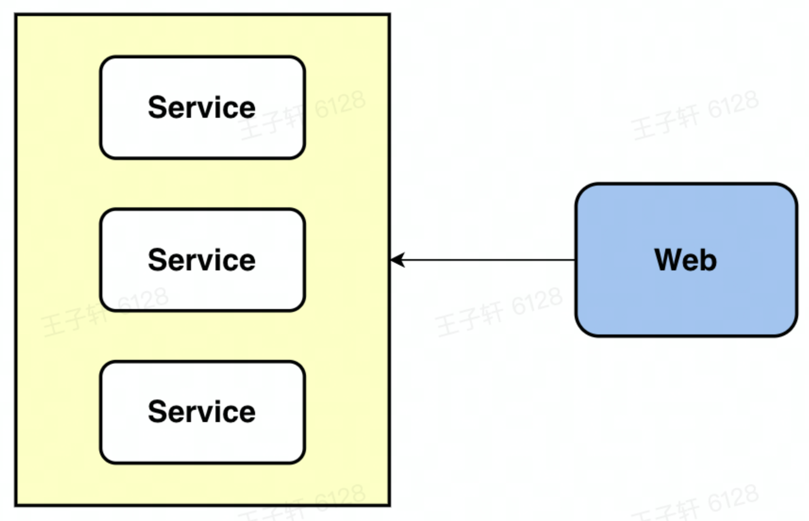
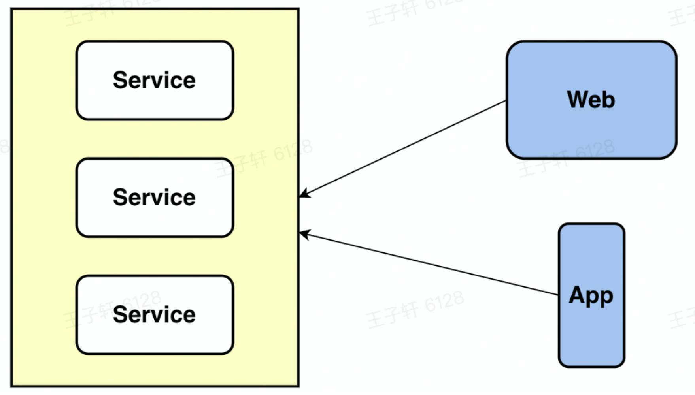
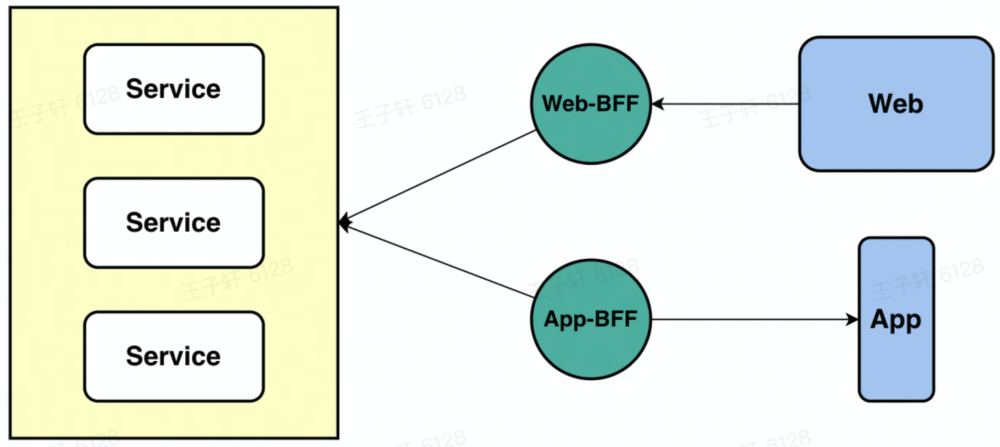

# BFF

## 简介

Backends for Frontends, BFF是一层nodejs，作为中间层能够进行请求转发和数据的处理。主要用于服务前端的后台应用程序，解决多访问终端业务耦合问题。

## 演化过程

### 单端调用

对于传统的应用程序，我们前端和后端是一个一对一的关系，一个接口给一种类型的终端使用。

因此在设计之初就是有业务针对性，高耦合决定其无法再给其他系统 复用。

### 多端直接调用

例如双端应用中，都需要调用接口，而不同终端对于数据的需求不相同，因此接口的复用度低，接口数量多

### 各端提供各自BFF

为每个终端都提供各自的bff层，这样对应的bff可以从基础服务接口获取数据，再根据自身的诉求出发，封装自身的业务逻辑，互不干预。

## 优缺点

BFF作为中间层，优点是：

- 前后端彻底分离，即便是后期有微服务迁移，也不需改动前端代码。
- 业务更向前靠拢，琐碎的api由前端开发自己决定，更适配前端框架。
- 留给后端更清晰的服务边界，只需要提供粗粒度的接口即可。

BFF作为中间层，缺点是：

- 中间层转发会增加请求延迟（服务如果是内网之间访问，延迟时间较低）。
- 需要保证端到端测试。
- 必须随时准备好后端异常请求，且要有全链路追踪等一系列容错以及排查的措施。
- BFF分成会增加开发成本，相关人员培养比较困难。

# RPC

前后端分离的项目中，前端通常要建立一层BFF，用来转发请求和数据转化，node BFF层和后端的通信可以采用http和rpc。

## RPC是什么

> RPC, 远程过程调用（Remote Procedure Call，RPC）是一个计算机通信协议，该协议允许运行于一台计算机的程序程调用另一台计算机的上的程序。通俗讲，RPC通过把网络通讯抽象为远程的过程调用，**调用远程的过程就像调用本地的子程序一样方便，从而屏蔽了通讯复杂性，使开发人员可以无需关注网络编程的细节**，将更多的时间和精力放在业务逻辑本身的实现上，提高工作效率。
>
> RPC本质上是一种 Inter-process communication（IPC）——进程间通信的形式。常见的进程间通信方式如管道、共享内存是同一台物理机上的两个进程间的通信，而RPC就是两个在不同物理机上的进程之间的通信。概括的说，RPC就是在一台机器上调用另一台机器上的方法，这种调用在远程机器上对代码的执行就像在本机上对代码的执行一样，只是迁移了一个执行环境而已。

rpc是远端过程调用，其调用协议通常包括：传输协议和序列化协议。

传输协议：tcp

序列化协议：二进制协议

## http和rpc的区别

- HTTP

现在的业务开发大部分HTTP请求的数据格式以JSON为主，还有一些是XML等其他数据结构，会使用DNS来进行寻址

- RPC

RPC调用采用二进制协议，这样带来的好处就是，数据体积更小，解码编码速度更快，因为前端node层和后端的调用使用的是RPC，所以绝大部分场景下会用到node的buffer库

**区别**

http定义的报文的头非常大，可能占到70%，因此有大部分时间是传输无用的废编码。

而自定义的rpc写的报文只有十几个字节，极大的精简了内容。

rpc库相对 http容器，更多的是封装了 “服务发现”，"负载均衡"，“熔断降级” 一类面向服务的高级特性

## 如何实现

为了实现上述RPC步骤，许多RPC工具被研发出来。这些RPC工具大多使用“接口描述语言” ——interface description language (IDL)来提供跨平台跨语言的服务调用。现在生产中用的最多的IDL是Google开源的protobuf。

在日常开发中通常有两种形式来使用RPC，一种是团队内部完全实现上述RPC的6个步骤，自己序列化数据，然后自己利用socket或者http传输数据，最常见的就是游戏开发了。另一种就是利用现成的RPC工具，这些RPC工具实现了底层的数据通信，开发人员只需要利用IDL定义实现自己的服务即可而不用关心数据是如何通信的，最常见的RPC工具是Facebook开源的Thrift RPC框架。本文将重点讲解Thrift RPC。

## Thrift

