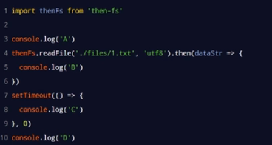
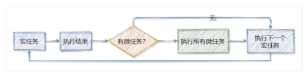
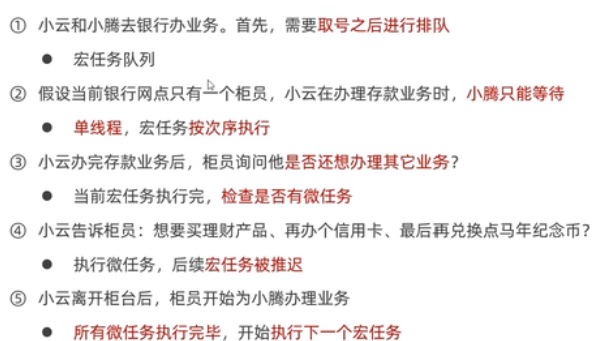
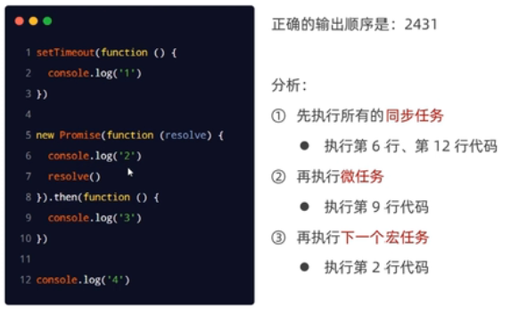

## （一）let和const

#### 1.let

- let 定义变量，变量不可以再次定义，但可以改变其值

*代码举栗：*

```jsx
let name = 'zhangsan';
name = 'lisi';
console.log(name); // lisi
let name = 'wangwu'; // 再次定义，报错：Identifier 'name' has already been declared
```

- 具有块级作用域。（即大括号）

*代码举栗：*


```jsx
{
    let age = 18;
    console.log(age); // 18
}
console.log(age); // 报错，此作用域中没有age的定义

for (let i = 0; i < 10; i++) {
    // i 只能在此范围内使用，因为有块级作用域
}
console.log(i);  // 报错，此作用域中没有i的定义
```

- 没有变量提升，必须先定义再使用

*代码举栗：*


```jsx
console.log(gender); // 报错，此时还没有定义gender
let gender = '男'; 
```

- let声明的变量不会压到window对象中，是独立的

*代码举栗：*


```jsx
let hobby = '吃饭';
console.log(window.hobby); // undefined
```

**如果使用var声明了变量，也不能再次用let声明了，反之也是不行的。原因也是这个变量已经被声明过了。**

#### 2.const

- 使用const关键字定义常量
- 常量是不可变的，一旦定义，则不能修改其值

*代码举栗：*


```cpp
// 1. 使用const关键字定义常量，常量名一般大写
// 2. 常量是不可变的，一旦定义，则不能修改其值
const PI = 3.1415926；
PI = 3.14; // 报错，常用一旦被初始化，则不能被修改
```

- 初始化常量时，必须给初始值

*代码举栗：*


```cpp
const PI; 
// 报错，Missing initializer in const declaration
```

- 具有块级作用域
- 没有变量提升，必须先定义再使用
- 常量也是独立的，定义后不会压入到window对象中

#### 3.总结


image.png

## （二）解构赋值

#### 1.数组解构


```jsx
// 情况1，变量和值一一对应
let arr = [5, 9, 10];
let [a, b, c] = arr;
console.log(a, b, c); // 输出 5 9 10

// 情况2，变量多，值少
let arr = [5, 9, 10];
let [a, b, c, d] = arr;
console.log(a, b, c, d); // 输出 5 9 10 undefined

// 情况3，变量少，值多
let arr = [5, 9, 10, 8, 3, 2];
let [a, b] = arr;
console.log(a, b); // 5, 9

// 情况4，按需取值
let arr = [5, 9, 10, 8, 3, 2];
let [, , a, , b] = arr; // 不需要用变量接收的值，用空位占位
console.log(a, b); // 10, 3 

// 情况5，剩余值
let arr = [5, 9, 10, 8, 3, 2];
let [a, b, ...c] = arr; // ...c 接收剩余的其他值，得到的c是一个数组
console.log(a, b, c); 
// 结果：
// a = 5, 
// b = 9, 
// c = [10, 8, 3, 2]

// 情况6，复杂的情况，只要符合模式，即可解构
let arr = ['zhangsan', 18, ['175cm', '65kg']];
let [, , [a, b]] = arr;
console.log(a, b); // 175cm 65kg
```

#### 2.对象解构


```jsx
// 情况1，默认要求变量名和属性名一样
let { foo, bar } = {foo: 'aaa', bar: 'bbb'};
console.log(foo, bar); // aaa, bbb
let {a, c} = {a: 'hello', b: 'world'};
console.log(a, c); // hello, undefined

// 情况2，可以通过:为变量改名
let {a, b:c} = {a: 'hello', b: 'world'};
console.log(a, c); // hello, world

// 情况3，变量名和属性名一致即可获取到值，不一定要一一对应
let {b} = {a: 'hello', b: 'world'};
console.log(b); // world
// 此时，没有定义变量a，所以使用a会报错

// 情况4，剩余值
let obj = {name:'zs', age:20, gender:'男'};
let {name, ...a} = obj;
console.log(name, a);
// 结果：
// name = zs
// a = {age: 20, gender: "男"};

// 情况5，复杂的情况，只要符合模式，即可解构
let obj = {
    name: 'zhangsan',
    age: 22,
    dog: {
        name: '毛毛',
        age: 3
    }
};
let {dog: {name, age}} = obj;
console.log(name, age); // 毛毛 3
```

## （三）函数和参数

#### 1.箭头函数

使用箭头定义函数 `=> goes to`，目的是**简化函数的定义**并且里面的this也比较特殊。

基本定义：


```jsx
// 非箭头函数
let fn = function (x) {
    return x * 2;
}
// 箭头函数，等同于上面的函数
let fn = (x) => {
    return x * 2;
}
```

- 形参只有一个可以省略小括号

```jsx
let fn = (x) => {
    return x * 2;
}
// 等同于
let fn = x => {
    return x * 2;
}
```

- 函数体只有一句话，可以省略大括号，并且表示返回函数体的内容

```jsx
let fn = (x, y) => {
    return x + y;
}
// 等同于
let fn = (x, y) => x + y;
```

- 箭头函数内部没有 arguments

```jsx
let fn = () => {
    console.log(arguments); // 报错，arguments is not defined
};
```

- 箭头函数内部的 `this` 指向外部作用域中的 `this` ，或者可以认为箭头函数没有自己的 `this`

```jsx
 // 这里必须用var，因为用let声明的变量不能使用window调用
    var name = 'lisi';
    let obj = {
        name: 'zhangsan',
        fn: () => {
            console.log(this); // window对象
            console.log(this.name); // lisi
        }
    };
    obj.fn();
```

- 箭头函数不能作为构造函数

```jsx
let Person = () => {
    
};
let obj = new Person(); // 报错，Person is not a constructor
// 箭头函数中都没有自己的this，不能处理成员，所以不能当构造函数
```

#### 2.参数的默认值

ES6中可以给函数的参数设置默认值

```rust
function fn(x, y = 'world') {
    console.log(x, y);
}
fn(2)
fn(2,3)
//打印结果
//2 “world”
//2 3
```

#### 3.rest参数

剩余参数，以 `…`修饰**最后**一个参数，把多余的参数都放到一个**数组**中。可以替代 **arguments** 的使用。
 **rest 参数只能是最后一个参数。**

*代码举栗：*

```jsx
// 参数很多，不确定多少个，可以使用剩余参数
function fn(...values) {
    console.log(values); // [6, 1, 100, 9, 10]
}
// 调用
console.log(fn(6, 1, 100, 9, 10)); //undefined
```

```jsx
function fn(a, b, ...values) {
    console.log(a); // 6
    console.log(b); // 1
    console.log(values); // [100, 9, 10]
}
// 调用
console.log(fn(6, 1, 100, 9, 10)); //undefined
```

## （四）内置函数的扩展

#### 1.扩展运算符：...

`...`可以把数组中的每一项展开

*代码举栗：*

```jsx
// 合并两个数组
let arr1 = [1, 2];
let arr2 = [3, 4];
let arr3 = [...arr1, ...arr2];
console.log(arr3); // [1, 2, 3, 4]
// 把数组展开作为参数，可以替代 apply
// 求数组的最大值
let arr = [6, 99, 10, 1];
let max = Math.max(...arr); // 等同于 Math.max(6, 99, 10, 1);
```

#### 2.Array.from()

把伪数组转成数组

- 伪数组必须有length属性，如果没有将返回一个空数组
- 转换后的数组长度，是根据伪数组的length决定的

*代码举栗：*

```jsx
let fakeArr = {
  0: 'a',
  1: 'b',
  2: 'c',
  length: 3
};
let arr = Array.from(fakeArr);
console.log(arr); // ['a', 'b', 'c']
// 转数组的对象必须有length值，因为得到的数组的成员个数是length指定的个数
// 上例中，如果length为2，则得到的数组为 ['a', 'b']
```

#### 3.find()方法和findIndex()方法

find()：用于查找数组中的值
 findIndex()：用于查找数组的下标，用法与find一样

*代码举栗：*

```jsx
    let value = [3, 5, -1, -4, 6].find((item, index, arr) => {
        console.log(item); //表示数组的每个值
        console.log(index); //表示数组的每个下标
        console.log(arr); //表示整个数组
        //如果需要查找，要用到return 条件；
        return item < 0; //find方法会返回第一个满足条件的值，-1
        //如果是findIndex方法，会返回第一个满足条件的值的下标，2
    });
    console.log(value);
```

- **find** 找到数组中第一个满足条件的成员并**返回该成员**，如果找不到返回**undefined**。
- **findIndex** 找到数组中第一个满足条件的成员并**返回该成员的索引**，如果找不到返回 **-1**。

#### 4.includes()方法

- 判断数组是否包含某个值，返回 true / false
- 参数1，必须，表示查找的内容
- 参数2，可选，表示开始查找的位置，0表示开头的位置

*代码举栗：*


```jsx
let arr = [1, 4, 3, 9];
console.log(arr.includes(4)); // true
console.log(arr.includes(4, 2)); // false， 从2的位置开始查，所以没有找到4
console.log(arr.includes(5)); // false
```

#### 5.includes(), startsWith(), endsWith()

- `includes(str, [position])`       返回布尔值，表示是否找到了参数字符串
- `startsWidth(str, [position])`         返回布尔值，表示参数字符串是否在原字符串的头部或指定位置
- `endsWith(str, [position])`            返回布尔值，表示参数字符串是否在原字符串的尾部或指定位置。


```jsx
console.log('hello world'.includes('e', 2)); // false 从位置2开始查找e，没有找到
console.log('hello world'.includes('e')); // true
console.log('hello world'.startsWith('h')); // 未指定位置，看开头是否是h，返回true
console.log('hello world'.startsWith('l', 2)); // 指定位置的字符是l，返回true
console.log('hello world'.endsWith('d')); // 未指定位置，结尾是d，返回true
console.log('hello world'.endsWith('r', 9)); // 指定位置的字符是r，返回true
```

#### 6.repeat()方法

`repeat`方法返回一个新字符串，表示将原字符串重复`n`次。


```bash
let html = '<li>itheima</li>';
html = html.repeat(10);
```

## （五）新增对象Set

数据结构 Set。它类似于数组，但是成员的值都是唯一的，没有重复的值。
 `Set`本身是一个构造函数，用来生成 Set 数据结构。
 Set的特点就是该对象里面的成员不会有重复。

**1.基本使用：**
 `let set = new Set();` 得到一个空的Set对象。

**2.Set的成员**

- `size`：属性，获取 `set` 中成员的个数，相当于数组中的 `length`
- `add(value)`：添加某个值，返回 Set 结构本身。
- `delete(value)`：删除某个值，返回一个布尔值，表示删除是否成功。
- `has(value)`：返回一个布尔值，表示该值是否为`Set`的成员。
- `clear()`：清除所有成员，没有返回值。


```csharp
    let set = new Set();
    //调用set对象内置的add方法，想set中添加数据。
    set.add(3);
    set.add(8);
    set.add(9);
    set.add(3); //添加失败但不报错，set中的成员不能重复
    console.log(set); // {3,8,9}
    console.log(set.size); //3
```

初始化Set的时候，也可以为其传入数组或字符串，得到的Set对象中的成员不会有重复。根据这个特点可以完成数组或字符串去重。


```tsx
    let set = new Set([4, 8, 9, 5, 4, 8, 4, 2]);
    console.log(set); //Set(5) {4,8,9,5,2}
    let arr = [...set]; //将set中的每个值展开，然后放到数组中
    console.log(arr); //(5) [4, 8, 9, 5, 2]
    let str = new Set('abcdacbdcbac'); 
    console.log(str); //Set(4) {"a", "b", "c", "d"}
    console.log([...str].join('')); //abcd
```

## （六）ES6模块化

在ES6模块化规范诞生之前，JavaScript 社区已经尝试并提出了AMD、CMD、Common]S等模块化规范。

但是，这些由社区提出的模块化标准，还是存在一定的差异性与局限性、并不是浏览器与服务器通用的模块化标准，例如:

- AMD和CMD适用于**浏览器端**的Javascript模块化
- commonJS适用于**服务器端**的Javascript模块化

太多的模块化规范给开发者增加了学习的难度与开发的成本。因此，大一统的ES6模块化规范诞生了!

#### 1.概念

ES6模块化规范是浏览器端与服务器端通用的模块化开发规范。它的出现极大的降低了前端开发者的模块化学习成本，开发者不需再额外学习AMD、CMD 或 Common]S等模块化规范。

ES6模块化规范中定义:

- 每个js文件都是一个独立的模块
- 导入其它模块成员使用import关键字
- 向外共享模块成员使用export关键字

#### 2.nodejs体验模块化

node.js 中默认仅支持Common]S模块化规范，若想基于node.js 体验与学习ES6的模块化语法，可以按照如下两个步骤进行配置:

- 确保安装了v14.15.1或更高版本的node.js

- 在package.json 的根节点中添加"type": "module"节点

ES6的模块化主要包含如下3种用法:

- 默认导出与默认导入

- 按需导出与按需导入

- 直接导入并执行模块中的代码

```js
//默认导出
let n1 = 10
let n2 = 20
function show() {}
export default {
    n1,
    show
}
//---------------------------------
//默认导入
import m1 from './默认导出.js'
console.log(m1)
//---------------------------------
//按需导出
export let s1 = 'aaa'
export let s2 = 'ccc'
export function say(){}
//--------------------------------------
import{s1,s2,say} from './03.按需导出.js'
console.log(s1)
console.log(s2)
console.log(say)
//--------------------------------------
for(let i =0;i<3;i++){
	console.log(i)
}
//--------------------------------------
import'./06.直接导出.js'
```

注意事项：

- 每个模块中，只允许使用唯一的一次export default，否则会报错!

- 每个模块中可以使用多次按需导出

- 按需导入的成员名称必须和按需导出的**名称保持一致**
- 按需导入时，可以使用**as 关键字进行重命名**

- 按需导入可以和默认导入一起使用

## （七）Promise

#### 1.回调地狱

多层回调函数的相互嵌套，就形成了回调地狱

回调地狱的缺点:

- 代码耦合性太强,牵一发而动全身，难以维护
- 大量冗余的代码相互嵌套，代码的可读性变差

#### 2.Promise基本概念

- Promise是一个构造函数

  - 我们可以创建Promise的实例const p = new Promise()

  - new出来的Promise实例对象，代表一个异步操作

- Promise.prototype上包含一个.then()方法
  - 每一次new Promise()构造函数得到的实例对象
  - 都可以通过原型链的方式访问到.then()方法，例如p.then(）

- .then()方法用来预先指定成功和失败的回调函数
  - p.then(成功的回调函数，失败的回调函数)
  - p.then(result => {}, error=>{})
  - 调用.then()方法时，成功的回调函数时必选的、失败的回调函数时可选的

实例：

```

```

**then-fs使用**

调用then-fs 提供的 readFile()方法，可以异步地读取文件的内容，它的返回值是Promise的实例对象。因此可以调用.then()方法为每个Promise 异步操作指定成功和失败之后的回调函数。示例代码如下;

```js
import thenFs from 'then.fs'
thenFs.readFile('./1.txt','utf-8').then(r1=>{},err1=>{})
thenFs.readFile('./2.txt','utf-8').then(r1=>{},err1=>{})
thenFs.readFile('./3.txt','utf-8').then(r1=>{},err1=>{})
```

Promise支持链式调用,从而来解决回调地狱的问题。示例代码如下:

```js
import thenFs from 'then.fs'
thenFs.readFile('./1.txt','utf-8')
    .then(r1=>{
    	console.log(r1)
		return thenFs.readFile('./2.txt','utf-8')
	},err1=>{})
	.then(r2=>{
    	console.log(r2)
		return thenFs.readFile('./3.txt','utf-8')
	},err1=>{})
	.then(r3=>{
    	console.log(r3)
	},err1=>{})
	.catch((err)=>{
    	console.log(err.message)
	})
```

promise.all()方法

promise.all()方法会发起并行的Promise异步操作，等所有的异步操作全部结束后才会执行下一步的.then操作（等待机制)。示例代码如下:

Promise.race()方法

Promise.race()方法会发起并行的Promise 异步操作，只要任何一个异步操作完成，就立即执行下一步的.then操作（赛跑机制)。示例代码如下:

基于promise封装读文件的方法

方法的封装要求:

- 方法的名称要定义为getFile

- 方法接收一个形参fpath，表示要读取的文件的路径

- 方法的返回值为Promise 实例对象

```js
import fs from 'fs'
function getFile(fpath) {
	return new Promise(function(resolve,reject){
		fs.readFile(fpath，'utf8',(err，datastr) =>{
			if(err) return reject(err)
            resolve(datastr)
        })
    })
})

getFile('./f.text')
    .then((r1)=>{console.log(r1)})
    .catch(err=>console.log(err.message))
```

**async/await**

ES8,简化Promise异步操作

如果在function中使用了await，则function必须被async修饰

在async方法中，第一个await之前的代码会同步执行，await之后的代码会异步执行

## （八）事件循环

为了防止某个耗时任务导致程序假死的问题，JavaScript把待执行的任务分为了两类:

1. 同步任务(synchronous)
   - 又叫做非耗时任务，指的是在主线程上排队执行的那些任务
   - 只有前一个任务执行完毕，才能执行后一个任务
2. 异步任务（ asynchronous)
   - 又叫做耗时任务，异步任务由JavaScript委托给宿主环境进行执行
   - 当异步任务执行完成后，会通知JavaScript主线程执行异步任务的回调函数

过程：

- 同步任务由JavaScript主线程次序执行

- 异步任务**委托**给宿主环境执行

- 已完成的异步任务对应的**回调函数**，会被加入到任务队列中等待执行

- JavaScript主线程的**执行栈**被清空后，会读取任务队列中的回调函数，次序执行

- JavaScript主线程不断重复上面的第4步

JavaScript主线程从“任务队列”中读取异步任务的回调函数，放到执行栈中依次执行。这个过程是循环不断的，所以整个的这种运行机制又称为EventLoop(事件循环)。



答案ADCB

**宏任务和微任务**

JavaScript把异步任务又做了进一步的划分，异步任务又分为两类，分别是:

- 宏任务( macrotask)
  - 异步Ajax请求、
  - setTimeout、setinterval
  - 文件操作
  - 其它宏任务
- 微任务( microtask)
  - Promise.then、.catch和.finally
  - process.nextTick
  - 其它微任务



每一个宏任务执行完之后，都会检查是否存在待执行的微任务，如果有，则执行完所有微任务之后，再继续执行下一个宏任务。



