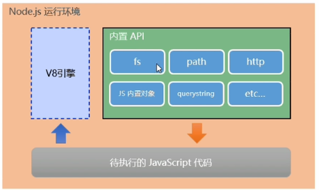
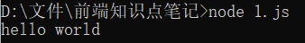
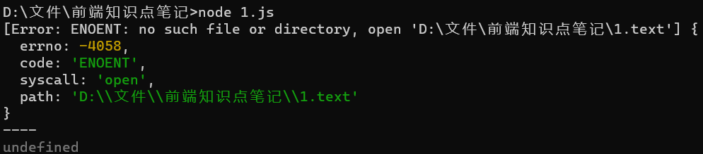
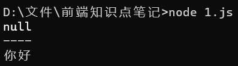
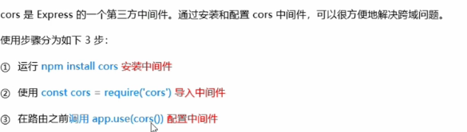
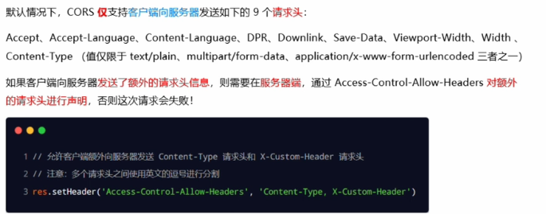
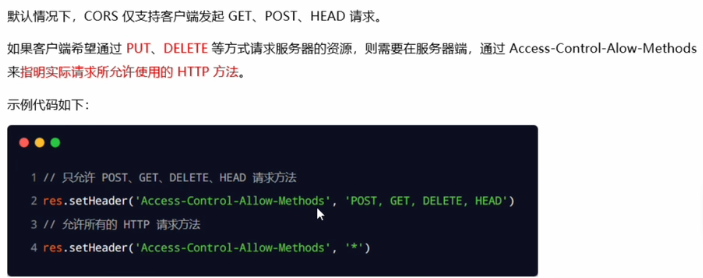
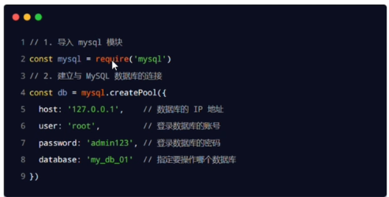
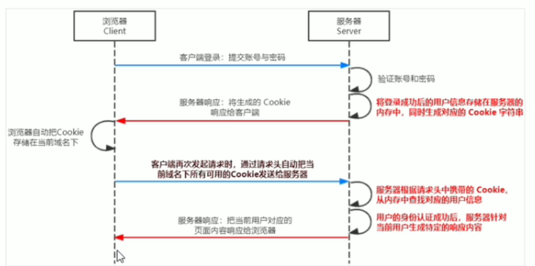
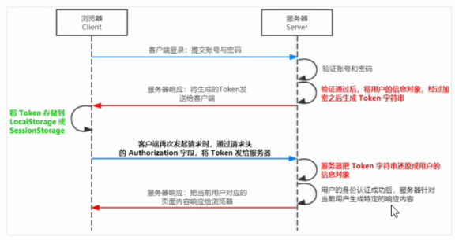

# **nodejs**

什么是 Node.js 这集主体内容就是这么多了。总结一下：首先，Nodejs 是基于 Chrome 的 V8 引擎开发的一个 C++ 程序，目的是提供一个 JS 的运行环境。最早 Nodejs 主要是安装在服务器上，辅助大家用 JS 开发高性能服务器代码，但是后来 Nodejs 在前端也大放异彩，带来了 Web 前端开发的革命。Nodejs 下运行 JS 代码有两种方式，一种是在 Node.js 的交互环境下运行，另外一种是把代码写入文件中，然后用 node 命令执行文件代码。Nodejs 跟浏览器是不同的环境，写 JS 代码的时候要注意这些差异。最后，我们介绍了 npm ，通过 npm 装包的方式，开发中我们再也不用重造轮子了。

### 简介

node.js是一个基于Chrome V8引擎的JavaScript运行环境

浏览器是JS的前端运行环境

nodejs是JS的后端运行环境

nodejs中无法调用dom和bom等浏览器的内置API



作用：

- 基于Express框架，快速构建web应用
- 基于Electron框架，可以构建跨平台的桌面应用
- 基于restify框架，可以快速构建API接口项目
- 读写和操作数据库，创建实用的命令行工具

学习路径：

js基础语法+nodejs内置API(fs\path\http)+第三方API模块(express\mysql)

### 终端运行

输入node要执行的路径



node+文件名

### fs文件系统模块

作用：用来操作文件

- 通过require导入就行

  ```js
  const fs = require('fs')
  ```

- fs.readFile()读入

  ```js
  fs.readFile(path[,option],callback)
  ```

  参数1：必选，路径

  参数2：可选，编码格式

  参数3：必选，回调函数拿到读取结果
  - 实例

  ```js
  const fs = require('fs')
  fs.readFile('./files/1.text','utf8',function(err,dataStr){
      console.log(err)
      console.log('---')
      console.log(dataStr)
  })
  ```

  失败：

  

  成功：

  

  ```js
  const fs = require('fs')
  fs.readFile('./files/1.text','utf8',function(err,dataStr){
      if(err)
      	return console.log('失败')
      console.log(dataStr)
  })
  ```

- fs.writeFile()写入

  ```js
  fs.writeFile(path[,option],callback)
  ```

  参数1：必选，路径

  参数2：必选，写入内容

  参数3：必选，回调函数拿到读取结果

  - 实例

  ```js
  const fs = require('fs')
  fs.writeFile('./files/1.text','Nihao',function(err){
      console.log(err)
      console.log('---')
      console.log(dataStr)
  })
  ```

  失败：

  

  成功：

  

  ```js
  const fs = require('fs')
  fs.writeFile('./files/1.text','utf8',function(err){
      if(err)
      	return console.log('失败')
      console.log('success')
  })
  ```

### path路径模块

作用：用来处理路径

- 引入

  ```js
  const path = require('path')
  ```

- path.join()：多个路径拼接成一个完整的路径字符串
- path.basename()：用来从路径字符串中将文件名解析出来：index.html
- path.extname(path)：获取扩展名：.html

**路径动态拼接**

路径：`__dirname + '/files/1.txt'`(绝对路径)

### 文件模块例子

将html文件拆分成html、css、js三种文件

### http模块

什么是客户端，什么是服务器

http模块是创建web服务器的模块，通过http.createServer()方法，就能方便的把一台普通的电脑，变成一台web服务器，从而对外提供Web资源

**创建基本web服务器**

1. 导入http模块

   ```js
   const http = require('http')
   ```

2. 创建web服务器

   ```js
   const server = http.createServer()
   ```

3. 为服务器实例绑定request事件，监听客户端的请求

   ```js
   //使用服务器实例的.on方法，为服务器绑定一个request事件
   server.on('request',(req,res)=>{
       //只要有客户端请求我们自己的服务器，就会触发request事件，从而调用这个事件处理函数
       console.log('Someone visit our web server.')
   })
   ```

4. 启动服务器

   ```js
   //参数：端口号，回调函数
   server.listen(80,()=>{
   	console.log('http server running at http://127.0.0.1')
   })
   ```

**req请求对象**

只要服务器接收到了客户端的请求，就会调用通过server.on（)为服务器绑定的request事件处理函数。

如果想在事件处理函数中，访问与客户端相关的**数据**或**属性**，可以使用如下的方式:

```js
server.on('request',req=>{
	const str = 'Your request url is ${req.url},and request method is ${req.method}'
	console.log(str)
})
```

**res相应对象**

在服务器的request事件处理函数中，如果想访问与服务器相关的**数据**或**属性**，可以使用如下的方式:

```js
server.on('request',(req,res)=>{
    const str = `Your request url is ${req.url}, and request method is ${req.method}`
    console.log(str)
    //调用res.end()方法，向服务器相应一些内容
    res.end(str)
})
```

**中文乱码**

当调用res.end()方法，向客户端发送中文内容的时候，会出现乱码问题，此时，需要手动设置内容的编码格式:

```js
//调用res.setHeader()方法，设置Content-Type响应头，解决中文乱码的问题
res.setHeader("Content-Type'，'text/html;charset=utf-8')
// res.end()将内容响应给客户端
res.end(str)
```

**根据不同的url响应不同的html内容**

核心实现步骤

- 获取请求的url地址

- 设置默认的响应内容为404 Not found

- 判断用户请求的是否为/或/index.html首页

- 判断用户请求的是否为/about.html 关于页面

- 设置Content-Type响应头，防止中文乱码

- 使用res.end)把内容响应给客户端

### 模块化

把大文件拆成多个小文件

复用性，可维护性，按需加载

**分类**

- 内置模块：fs、path、http
- 自定义模块：自己写的每个js文件
- 第三方模块：npm下载的

**模块加载**

```js
//内置
const fs =require('fs')
//自定义
const custom = require('./custom.js')
//第三方模块
const moment = require('moment')
```

使用require方法加载，会自动执行

**模块作用域**

和函数作用域类似，在自定义模块中定义的变量、方法等成员，只能在当前模块内被访问，这种模块级别的访问限制，叫做模块作用域。

好处：防止全局变量污染

向外共享模块作用域的成员

**module对象**

存放路径

module.exports可以共享成员

在这个属性上挂载属性即可共享

module.exports和exports是同一个东西

但得到的永远是module.exports指向的对象

### npm和包

- 创建package.json

  npm init -y

- 引入所有的依赖包

  npm install

- 卸载包

  npm uninstall

**devDependencies** 

如果某些包**只在项目开发阶段**会用到。在项目上线之后不会用到，则建议把这些包记录到devDependencies 节点中。

与之对应的，如果某些包在**开发**和**项目上线之后**都需要用到，则建议把这些包记录到dependencies 节点中。

npm install vue -D

### 解决下包速度慢

淘宝npm镜像服务器

淘宝在国内搭建了一个服务器，专门把国外官方服务器上的包同步到国内的服务器，然后在国内提供下包的服务。从而极大的提高了下包的速度。

镜像(Mirroring)是一种文件存储形式，一个磁盘上的数据在另一个磁盘上存在一个完全相同的副本即为镜像。

```java
npm config get registry//获取下包镜像源
npm config set registry=https://registry.npm.taobao.org/ //修改
```

**nrm**

为了更方便的切换下包的镜像源，我们可以安装nrm这个小工具，利用 nrm提供的终端命令，可以快速查看和切换下包的镜像源。

```js
npm i nrm -g//安装nrm
nrm ls//查看所有镜像源
nrm use taobao//切换当前镜像源
```

### 包的分类

**项目包**

- 开发依赖包(被记录到devDependencies 节点中的包，只在开发期间会用到)

  npm i 包名 -D

- 核心依赖包（被记录到dependencies节点中的包，在开发期间和项目上线之后都会用到)

  npm i 包名

**全局包**

- 在执行npm install命令时，如果提供了-g参数，则会把包安装为全局包。

- 全局包会被安装到C:\Users\用户目录\AppData\Roaming\npm\node_modules目录下。

  npm i 包名 -g

  npm uninstall 包名 -g

注意：

- 只有**工具性质**的包，才有全局安装的必要性。因为它们提供了好用的终端命令。

- 判断某个包是否需要全局安装后才能使用，可以参考官方提供的使用说明即可。

**i5ting_toc**

i5ting_toc是一个可以把 md文档转为 html 页面的小工具，使用步骤如下

```js
npm install -g i5ting_toc
i5ting_toc -f 要转化的md文件路径 -o
```

### 模块的加载机制

**模块在第一次加载后会被缓存**。这也意味着多次调用require(不会导致模块的代码被执行多次。

注意:不论是内置模块、用户自定义模块、还是第三方模块，它们都会优先从缓存中加载，从而提高模块的加载效率。

**内置模块加载优先级最高**

### express

Express是基于Nodejs平台，快速、开放、极简的**Web开发框架**

Express的作用和内置的http模块类似，是专门用来创建Web服务器的

Express是基于http模块进一步封装出来的

快速创建Web服务器和API接口服务器

#### **托管静态资源**

express 提供了一个非常好用的函数，叫做 express.static()，通过它，我们可以非常方便地创建一个静态资源服务器例如，通过如下代码就可以将public目录下的图片、CSS文件、JavaScript文件对外开放访问了:

app.use(express.static('public'))

#### **dnomon**

可以监听代码的动态改变，并自动重启

#### **express路由**

在Express 中，路由指的是客户端的请求与服务器处理函数之间的映射关系。

Express中的路由分3部分组成，分别是请求的类型、请求的URL地址、处理函数，格式如下:

```
app.METHOD(PATH,HANDLE)
```

每当一个请求到达服务器之后，需要先经过路由的匹配，只有匹配成功之后，才会调用对应的处理函数。
在匹配时，会按照路由的顺序进行匹配，如果请求类型和请求的URL同时匹配成功，则 Express 会将这次请求，转交给对应的function函数进行处理。

#### 模块化管理

模块化路由

为了方便对路由进行模块化的管理，Express 不建议将路由直接挂载到app 上，而是推荐将路由抽离为单独的模块。将路由抽离为单独模块的步骤如下:

- 创建路由模块对应的.js文件

- 调用express.Router)函数创建路由对象
- 向路由对象上挂载具体的路由

#### **中间件**

作用：对请求进行预处理

本质上就是一个function处理函数

```js
function（req,res,next）{
	next();
}
```

next函数的作用

next函数是实现多个中间件连续调用的关键，它表示把流转关系转交给下一个中间件或路由。

**全局生效中间件**

app.use(function(req,res,next){})

**局部中间件**

不使用app.use

在app.get('/',中间件1,中间件2,...,中间件n,(req,res)=>{})

**注意事项**

- 一定要在路由之前注册中间件

- 客户端发送过来的请求，可以连续调用多个中间件进行处理
- 执行完中间件的业务代码之后，不要忘记调用next()函数

- 为了防止代码逻辑混乱，调用next()函数后不要再写额外的代码
- 连续调用多个中间件时，多个中间件之间，共享req和res 对象

**分类**

- 应用级别的中间件

  app.use(),app.get(),app.post()，绑定在app实例上的中间件

- 路由级别的中间件

  绑定在router实例上

- 错误级别的中间件

  错误级别中间件的作用:专门用来捕获整个项目中发生的异常错误，从而防止项目异常崩溃的问题。

  格式:错误级别中间件的 function处理函数中，必须有4个形参，形参顺序从前到后，分别是(err, req,res, next).

  ```js
  app.get('/ ", function (req,res) {
      //人为制造错误
  	throw new Error( '服务器内部发生了错误!')//抛出一个自定义的错误
  	res.send( 'Home Page.')
  })
  app.use( function (err,req,res,next)=> // 2．错误级别的中何件
  	console.1og('发生了错误:'+ err.message)// 2.1在服务器打印错误彩息
  	res.send( 'Error!' + err.message)// 2.2向客户端响应错误相关的内容
  })
  ```

  注意：必须注册在所有路由之后

- Express内置的中间件

  自Express 4.16.0版本开始，Express 内置了3个常用的中间件，极大的提高了Express项目的开发效率和体验:

  - express.static快速托管静态资源的内置中间件，例如: HTML文件、图片、CSS样式等（无兼容性)

  - express.json解析JSON格式的请求体数据（有兼容性，仅在4.16.0+版本中可用)

  - express.urlencoded解析URL-encoded格式的请求体数据（有兼容性，仅在4.16.0+版本中可用)

- 第三方的中间件

#### 写接口

**跨域问题**

1. CORS

   主流解决方案

2. JSONP

   只支持get请求

解决方案



**cors响应头**

1. Access-Control-Allow-Origin

   `res.setHeader('Access-Control-Allow-Origin','*')`

2. Access-Control-Allow-Headers

   

3. Access-Control-Allow-methods

   

**简单请求和预检请求**

简单请求只会发生一次请求

预检请求会发生两次请求，option预检请求成功之后，才会发起真正的请求

#### JSONP接口

概念：浏览器端通过\<script>标签的 src属性，请求服务器上的数据，同时，服务器返回一个函数的调用。这种请求数据的方式叫做JSONP。

**特点**

- JSONP 不属于真正的Ajax请求，因为它没有使用XMLHttpRequest这个对象。

- JSONP仅支持GET请求，不支持POST、PUT、DELETE 等请求。

**实现JSONP接口的步骤**

- 获取客户端发送过来的回调函数的名字

- 得到要通过JSONP形式发送给客户端的数据

- 根据前两步得到的数据，拼接出一个函数调用的字符串

- 把上一步拼接得到的字符串，响应给客户端的\<script>标签进行解析执行

### MySQL模块

安装：npm i mysql

配置：



1. 在workbench中输入select @@basedir as basePath from dual查找路径

2. 找到MYSQL的安装路径下的bin目录

3. 登录mysql数据库。即继续在命令行工具输入：`mysql -u root -p`。然后输入自己数据库的密码，进入数据库

4. 输入ALTER USER 'root'@'localhost' IDENTIFIED WITH mysql_native_password BY '123456';

5. FLUSH PRIVILEGES;

### **身份验证**

对于服务端渲染和前后端分离这两种开发模式来说，分别有着不同的身份认证方案:

- 服务端渲染推荐使用**Session认证机制**

- 前后端分离推荐使用**JWT认证机制**

**session认证**

HTTP协议的无状态性，指的是客户端的每次HTTP请求都是独立的，连续多个请求之间没有直接的关系，服务器不会主动保留每次HTTP请求的状态。

**cookie**

客户端第一次请求服务器的时候，服务器通过响应头的形式，向客户端发送一个身份认证的Cookie，客户端会自动将Cookie 保存在浏览器中。

随后，当客户端浏览器每次请求服务器的时候，浏览器会自动将身份认证相关的Cookie，通过请求头的形式发送给服务器，服务器即可验明客户端的身份。

cookie是不具有安全性的

由于Cookie 是存储在浏览器中的，而且浏览器也提供了读写Cookie的API，因此Cookie很容易被伪造，不具有安全性。因此不建议服务器将重要的隐私数据，通过Cookie的形式发送给浏览器。

session刷卡认证cookie是否为真



安装express-session中间件

**jwt认证**

Session认证机制需要配合Cookie 才能实现。由于Cookie默认不支持跨域访问，所以，当涉及到前端跨域请求后端接口的时候，需要做很多额外的配置，才能实现跨域Session认证。

- 当前端请求后端接口不存在跨域问题的时候，推荐使用Session身份认证机制。
- 当前端需要跨域请求后端接口的时候，不推荐使用Session身份认证机制，推荐使用JWT认证机制。



JWT 的三个组成部分，从前到后分别是 Header、Payload、Signature。其中:

- Payload部分才是真正的用户信息，它是用户信息经过加密之后生成的字符串。
- Header 和Signature是安全性相关的部分，只是为了保证Token的安全性。

