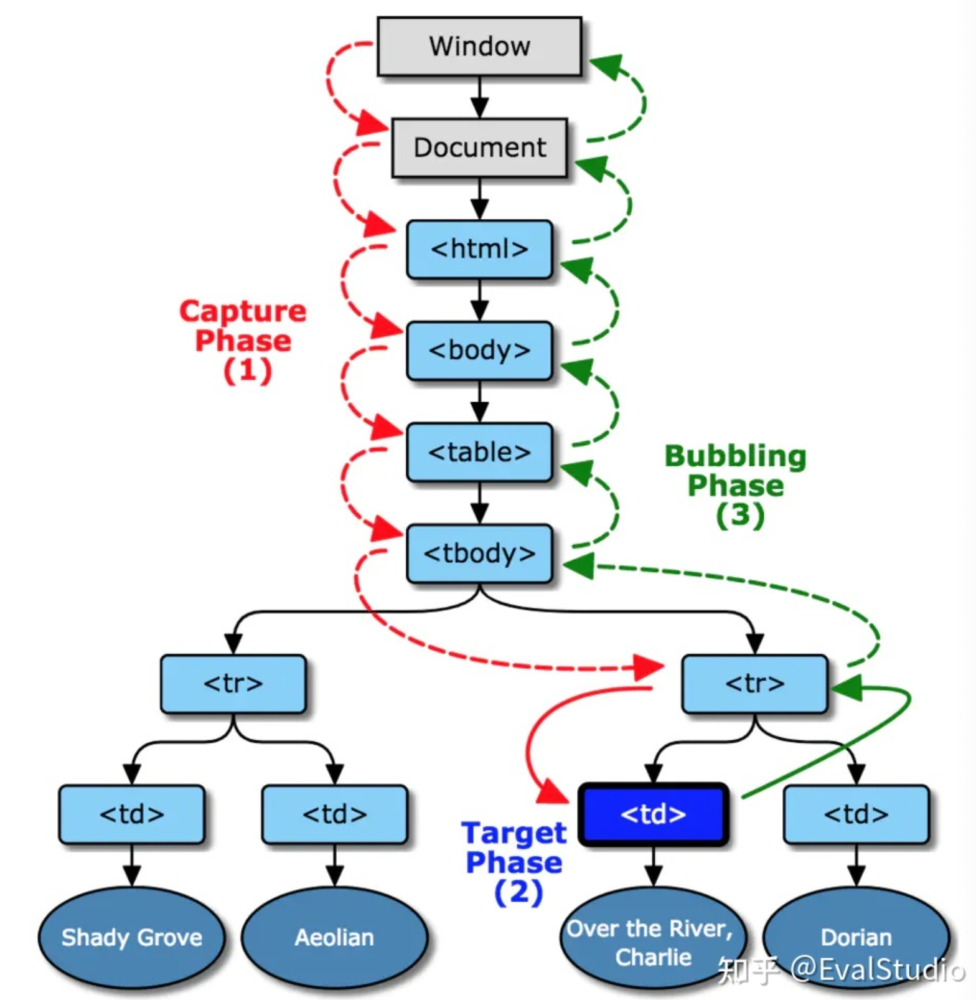
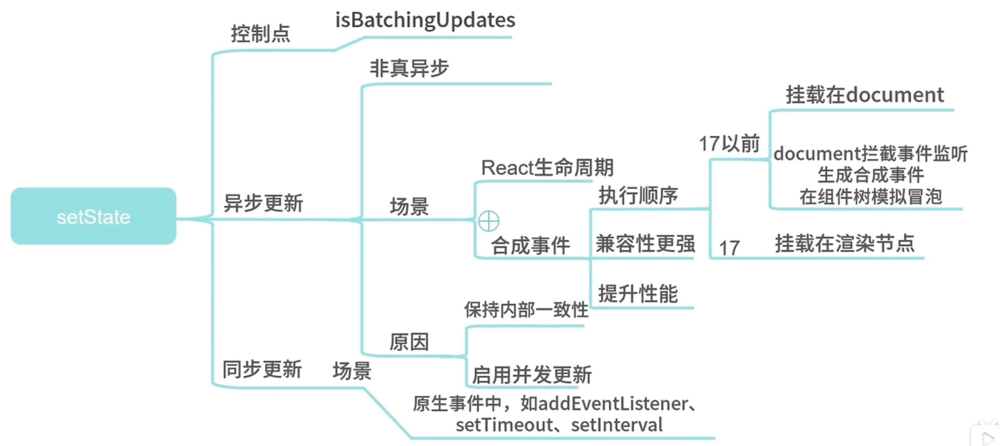
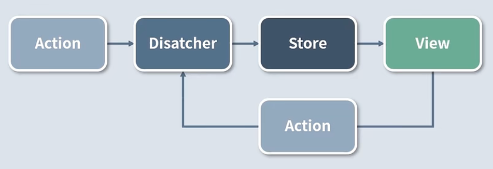
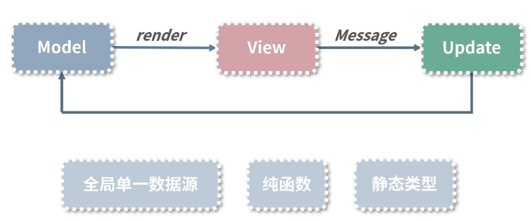

# React面试题

## 1 React是什么

非线性结构化模式阐述答案

讲概念、说用途、理思路、优缺点

React是一个网页UI框架

组织代码结构，提高复用率

**优点**

声明式 一目了然便于组合

组件化 高内聚低耦合

通用性 虚拟dom不局限web开发

**缺点**

不是一个一揽子框架 

技术选型和学习成本较高

开发大型项目时需要想社区寻找解决方案

## 2 为什么使用JSX

jsx是一个JavaScript的语法拓展，语法糖

设计的初衷是并不希望引入太多的标准

react并不强制使用jsx，可以用reader函数中createElement进行渲染

关注点分离(将复杂问题做合理的拆分，分别研究问题的不同关注点，最后综合各个方面的结果，合成一个整体的解决方案)

babel进行编译

## 3 生命周期

https://www.jianshu.com/p/4079eca2c857

生命周期是一个抽象的概念

挂载 更新 卸载

### **Mounting**

**（加载阶段：涉及4个钩子函数）**

1.`constructor()`
 加载的时候调用一次，可以初始化state，不建议使用

2.`static getDerivedStateFromProps(props, state)`
 组件每次被rerender的时候，包括在组件构建之后(虚拟dom之后，实际dom挂载之前)；

每次获取新的props或state之后；

每次接收新的props之后都会返回一个对象作为新的state，返回null则说明不需要更新state；

配合componentDidUpdate，可以覆盖componentWillReceiveProps的所有用法

3.`render()`
 react最重要的步骤，创建虚拟dom，进行diff算法，更新dom树都在此进行

4.`componentDidMount()`
 组件渲染之后调用，只调用一次

### **Updating**

**（更新阶段：涉及5个钩子函数)**

1.`static getDerivedStateFromProps(props, state)`
 组件每次被rerender的时候，包括在组件构建之后(虚拟dom之后，实际dom挂载之前)，每次获取新的props或state之后；每次接收新的props之后都会返回一个对象作为新的state，返回null则说明不需要更新state；配合componentDidUpdate，可以覆盖componentWillReceiveProps的所有用法

2.`shouldComponentUpdate(nextProps, nextState)`
 组件接收到新的props或者state时调用，return true就会更新dom（使用diff算法更新），return false能阻止更新（不调用render）

3.`render()`
 react最重要的步骤，创建虚拟dom，进行diff算法，更新dom树都在此进行

4.`getSnapshotBeforeUpdate(prevProps, prevState)`
 触发时间: update发生的时候，在render之后，在组件dom渲染之前；返回一个值，作为componentDidUpdate的第三个参数；配合componentDidUpdate, 可以覆盖componentWillUpdate的所有用法

5.`componentDidUpdate()`
 组件加载时不调用，组件更新完成后调用

### **Unmounting**

**（卸载阶段：涉及1个钩子函数）**

 1.`componentWillUnmount()`

**Error Handling(错误处理)**
 1.`componentDidCatch(error，info)`
 任何一处的javascript报错会触发

**组件的基本写法**

```jsx
import React, { Component } from 'react'

export default class NewReactComponent extends Component {
    constructor(props) {
        super(props)
        // getDefaultProps：接收初始props
        // getInitialState：初始化state
    }
    state = {

    }
    static getDerivedStateFromProps(props, state) {
        return state
    }
    componentDidCatch(error, info) { // 获取到javascript错误

    }
    render() {
        return (
            <h2>New React.Component</h2>
        )
    }
    componentDidMount() { // 挂载后
        
    }   
    shouldComponentUpdate(nextProps, nextState) { // 组件Props或者state改变时触发，true：更新，false：不更新
        return true
    }
    getSnapshotBeforeUpdate(prevProps, prevState) { // 组件更新前触发
         return null;
    }
    componentDidUpdate() { // 组件更新后触发

    }
    componentWillUnmount() { // 组件卸载时触发

    }
}
```

请求在哪里调用？

异步请求放在componentDidMount

## 4 函数组件和类组件区别

对两者编写模式的了解

合适场景下选用合适的技术

### 相同点

使用方式和最终呈现效果上是完全一致的

### 不同点

代表两种不同设计思想和心智模型：

类组件OOP面向对象

函数组件FP函数式编程

函数组件更加纯粹、简单、易测试

优化方式：

- 类组件靠shouldComponentUpdate函数阻断渲染

- 函数组件靠React.memo优化

类组件可以继承，但组合优于继承

### 为什么未来趋势是函数组件？

1. this的模糊性
2. 业务逻辑散落在生命周期中
3. 类组件代码缺乏标准的拆分方式

## 5 如何设计React组件

设计模式考量

如何组合、如何将核心主题以更好的形式展示出来

组件分类：

- 无状态组件：只展示、独立运行、不额外增加功能
- 有状态组件：处理业务逻辑和数据状态

**代理组件**

隔绝组件库，仅是一个组件Props API层的交互

**样式组件**

处理样式领域

**布局组件**

不需要更新

**高阶组件**

一种特定的设计模式

高阶组件的参数是组件，返回值是新组件的函数

逻辑复用、链式调用、渲染劫持、缺陷（丢失静态函数、refs属性不能透传）

## 6 React事件

### 合成事件

react将原生的事件自己合成一个react事件，目的是实现全浏览器的一致性，提高兼容性。

```js
const handleClick = (e) => {e.preventDefault();}
// 原生事件
<div onclick="handleClick()"></div>
// React合成事件
<div onClick={HandleCilck}></div>
```

React事件处理函数使用**事件对象**形式，原生事件使用字符串的形式。

**事件流**



事件捕获、目标阶段、事件冒泡

在React17之前，React是把事件委托在document上的，React17及以后版本不再把事件委托在document上，而是委托在挂载的容器上了

React17之前，先处理原生事件，然后当冒泡到document对象后，再处理React事件。

```
document原生事件捕获
父元素原生事件捕获
子元素原生事件捕获
子元素原生事件冒泡
子元素原生事件冒泡
父元素React事件捕获
子元素React事件捕获
子元素React事件冒泡
父元素React事件冒泡
document原生事件冒泡
```

### 为什么setState是异步的

保持内部的一致性，props就是异步的

后续架构升级启用并发更新



```jsx
class Test extends React.Component{
	state={
		count:0
	}
  componentDidMount(){
    this.setState({count:this.state.count+1});
    console.log(this.state.count);//0
    this.setState({count:this.state.count+1});
    console.log(this.state.count);//0
    setTimeout(()=>{
      this.setState({count:this.state.count+1});
      console.log(this.state.count);//2
      this.setState({count:this.state.count+1});
      console.log(this.state.count);//3
    }，0)；
  }
}
```

## 跨组件通信

### 父与子通信

在props中传参，适合展示组件

### 子与父通信

回调函数callback

### 无直接关系

conetxt

## 状态管理框架

flux redux mobx

### flux

单向数据流



### redux

单一数据源、纯函数reducer、state只读



## 虚拟dom

设计初衷是提高性能，防止xss，跨平台成本更低

如果大量直接操作dom容易引起网页性能下降

diff算法与批处理操作可以降低dom的操作与频次，提升页面性能

缺点：内存占用较高、高性能优化难

### diff算法

真实dom映射为虚拟dom

虚拟dom变化后根据差距计算生产patch（patch使结构化的数据包含增删改）

根据patch去更新真实dom

**更新时机**

setState等

**遍历算法**

深搜，广度可能导致组件生命周期时序错乱

优化：分治

策略：

1. 忽略节点跨层级操作场景，提升比对效率（如果节点已经不存在了，直接删除它和子节点）
2. 如果组件的class一致，则默认为相似树结构，否则默认不同树结构
3. 同一层级子节点，可以通过标记key的方式进行列表对比

fiber双链表双缓冲

## hooks

### 限制

不要在循环，条件或嵌套函数中调用hook

在函数组件中调用hook

### 设计初衷

组件之间难以复用状态逻辑

复杂组件变得难以理解

this问题，类难以优化

### 实现

hook实现上是链表

### useEffect和useLayoutEffect

大多数场景下直接使用useEffect，如果操作dom或引起dom样式更新的场景更推荐使用useLayoutEffect

useEffect异步操作

useLayoutEffect同步操作，避免大量计算，造成堵塞