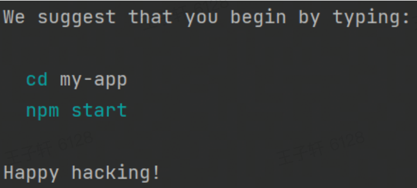
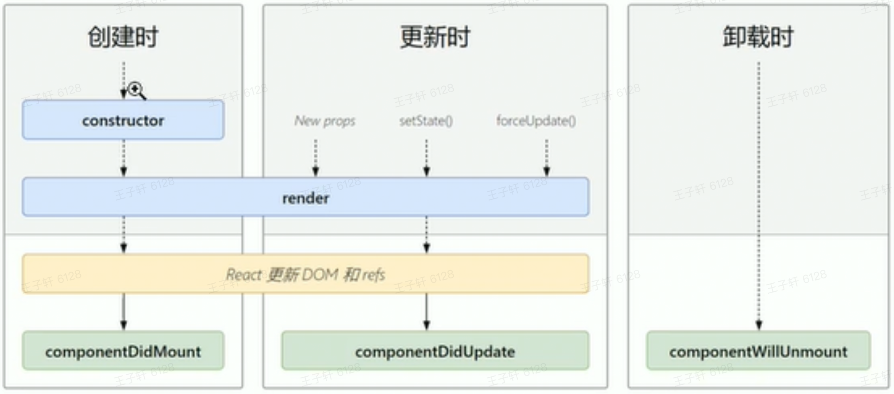
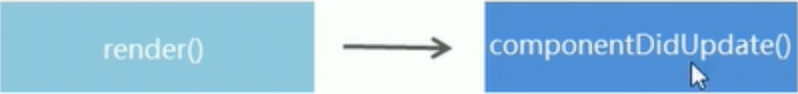
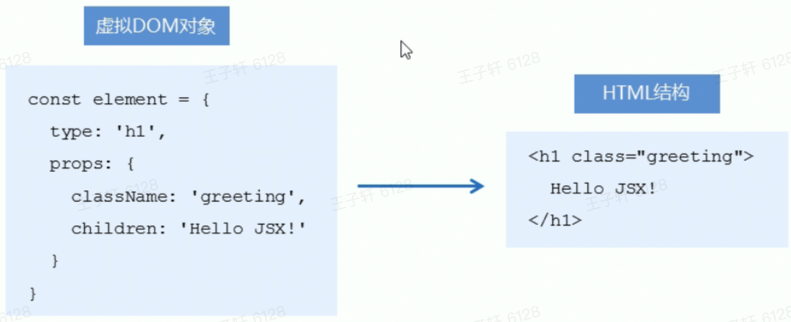

# React

## 1 概述

### 1.1 什么是react

react是一个js库

facebook做的

### 1.2 特点

- 声明式

- 基于**组件**

- 学习一次，随处使用
  - 开发Web应用
  - 移动端原生（react-native）
  - VR(react360)

## 2 基本使用

### 2.1 安装

```JavaScript
 npm i react react-dom
```

### 2.2 方法说明

- React.createElement()

```JavaScript
//2.创建react元素
// 参数一：元素名称
// 参数二：元素属性
// 参数三：元素的子节点
const title = React.createElement('h1', {title:'标题'}, 'hello react')
```

- ReactDOM.render()

```JavaScript
// 3.渲染react元素
// 参数一：要渲染的react元素
// 参数二：挂载点
ReactDOM.render(title, document.getElementById('root'))
```

## 3 React脚手架

### 3.1 React脚手架意义

1. 脚手架是开发现代Web应用的必备。

1. 充分利用Webpack、Babel、ESLint等工具辅助项目开发。

1. 零配置，无需手动配置繁琐的工具即可使用。

1. 关注业务，而不是工具配置。

### 3.2 使用React脚手架初始化项目

1. 初始化项目，命令: npx create-react-app my-app

1. npx命令介绍

- npm v5.2.0引入的一条命令

- 目的：提升包内提供的命令行工具的使用体验

- 原来：先安装脚手架包，再使用这个包中提供的命令

- 现在：无需安装脚手架包，就可以直接使用这个包提供的命令

3. 成功提示

 

4. 补充说明

- 推荐使用：npx create-react-app my-app

- npm init react-app my-app

- yarn create react-app myapp

### 3.3 在脚手架中使用React

1. 导入react和react-dom两个包。 import React from 'react ' import ReactDOM from 'react-dom'

1. 调用React.createElement(方法创建react元素。

1. 调用ReactDOM.render(方法渲染react元素到页面中。

1. 启动：npm start

## 4 JSX

JSX是react的核心内容

### 4.1 createElement()的问题

- 繁琐不简洁

- 不直观

- 不优雅

### 4.2 JSX 简介

JSX是JavaScript XML的简写，表示在JavaScript代码中写XML ( HTML）格式的代码。

优势︰声明式语法更加直观、与HTML结构相同，降低了学习成本、提升开发效率

### 4.3 JSX使用

1. 使用JSX语法创建react元素

```JavaScript
const title = <h1>Hello</h1>
```

1. 使用ReactDOM.render()方法渲染react元素到页面上

```JavaScript
ReactDOM.render(title,document.getElementById("root"))
```

1. 为什么脚手架可以使用JSX语法
   1. JSX不是标准的ECMAScript语法，它是 ECMAScript的语法扩展。
   2. 需要使用babel编译处理后，才能在浏览器环境中使用。
   3. create-react-app脚手架中已经默认有该配置，无需手动配置。

### 4.3 JSX使用注意点

1. React元素的属性名使用驼峰命名法

1. 特殊属性名:
   1. class -> className
   2. for - > htmlFor
   3. tabindex-> tablndex

1. 没有子节点的React元素可以用/>结束。

1. 推荐:使用小括号包裹JSX，从而避免JS中的自动插入分号陷阱。

1. 使用小括号包裹Jsx

### 4.4 JSX条件渲染

```JavaScript
const isLoading = true
const data = ()=>{
    if(isLoading){
        return <div>loading...</div>
    }
    return <div>数据加载完成</div>
}
```

### 4.5 JSX列表渲染

```JavaScript
const songs = [
    {id:1,name:'痛心疾首'}
]
const list = {
    <ul>
        {songs.map(item => <li key={item.id}>{item.name}</li>)}
    </ul>
}
```

### 4.6 样式处理

1. 行内style

```JavaScript
const h1 = <h1 style={{color:red}}></h1>
```

2. 类名className

```JavaScript
const h2 =  <h2 className="title"></h2>
```

### 4.7 JSX总结

1. JSX是React的核心内容。

1. JSX表示在JS代码中写HTML结构，是React声明式的体现。

1. 使用JSX配合嵌入的JS表达式、条件渲染、列表渲染，可以描述任意U结构。

1. 推荐使用className的方式给JSX添加样式。

1. React完全利用S语言自身的能力来编写Ul，而不是造轮子增强HTML功能。

## 5 React组件基础

### 5.1 组件介绍

- 组件是一等公民

- 组件表示页面的部分内容

- 组合多个组件实现完整的页面功能

- 特点：可复用、独立、可组合

### 5.2 创建方式

1. 函数创建组件

- 使用js的函数船舰的组件

- 约定1：函数名称必须以**大写字母开头**

- 约定2：函数组件**必须有返回值**，表示该组件的结构

- 如果返回值为null，表示不渲染任何内容

```JavaScript
// 函数组件
function Hello(){
    return(
        <div>这是我的第一个函数组件</div>
    )
}
const Hi = ()=><div>这是我的第二个函数组件</div>
// 渲染组件
ReactDOM.render(<Hello/>,document.getElementById('root'))
```

### 5.3 使用类创建的组件

- 类组件：使用ES6的class创建组件

- 约定1：类名称也必须以大写字母开头

- 约定2：类组件应该继承React.Component父类，从而可以使用父类中提供的方法或属性

- 约定3：类组件必须提供render()方法

- 约定4：render0方法必须有返回值,表示该组件的结构

### 5.4 抽离为独立JS文件

```JavaScript
import React from "react";
class Hello extends React.Component {
    render(){
        return (
            <div> 这是我的一个抽离到js文件的组件</div>
        )
    }

}
export default Hello
```

### 5.5 事件处理

#### 5.5.1 事件绑定

- React事件绑定语法与DOM事件语法相似

- 语法：on+事件名称={事件处理程序}，比如：onClick={()=>()}

- 注意：React事件采用驼峰命名法，比如：onMouseEnter、onFocus

```JavaScript
// 类组件
class Hello extends React.Component {
    // 事件处理程序
    handleClick(){
        alert(1)
    }
    render(){
        return (
            // 这里要写this
            <button onClick={this.handleClick}></button>
        )
    }
}
// 在函数组件中绑定事件
function Hi(){
    function handleClick(){
        console.log('单击')
    }
    return(
        // 函数组件不写this
        <button onClick={handleClick}></button>
    )
}
```

#### 5.5.2 事件对象

- 可以通过**事件处理程序的参数**获取到事件对象

- React中的事件对象叫做：**合成事件**(对象)

- 合成事件：兼容所有浏览器，无需担心跨浏览器兼容性问题

```JavaScript
class Hello extends React.Component {
    handleClick(e){
        e.preventDefault()
        alert(1)
    }
    render(){
        return (
            <a href="https://www.baidu.com" onClick={this.handleClick}>标签</a>
        )
    }
}
```

### 5.6 有状态组件和无状态组件

- 函数组件无状态

- 类组件有状态

- 函数组件只负责数据展示

- 类组件负责更新UI，让页面"动"起来

### 5.7 组件中的state和setState

#### 5.7.1 state基本使用

- 状态（state）即数据，是组件内部私有数据，只能在组件内部使用

- state的值是对象，表示一个组件有多个数据

```JavaScript
lass Hello extends React.Component {
    // 初始化
    /*constructor() {
        super();
        this.state = {
            count:10
        }
    }*/
    // 简化语法
    state = {
        count:10
    }
    handleClick(e){
        e.preventDefault()
        alert(1)
    }
    render(){
        return (
            <div>
                <h1>计数器{this.state.count}</h1>
            </div>
        )
    }
}
```

- 获取状态：this.state
  - 状态就是数据
  - 状态是私有的，只能在组件内部使用
  - 通过this.state获取

- setState()修改状态
  - 状态是可变的
  - 语法：this.state({要修改的数据})
  - 注意：不要直接修改state的值，这是错误的
  - setState()的作用：1.修改state 2.更新UI
  - **数据驱动视图**

```JavaScript
// 正确
this.setSate({
    count: this.state.count + 1
})
// 错误
this.state.count += 1
```

#### 5.7.2 从JSX中抽离事件处理程序

- JSX中掺杂过多JS逻辑代码，会显得非常混乱

- 推荐：将逻辑抽离到单独的方法中，保证JSX结构清晰

- this指针指向实例（render方法中的this即为组件实例）

- 改变this指向
  - 箭头函数
  - ```JavaScript
    class Hello extends React.Component {
        state = {
            count:10
        }
        onIncrement() {
            this.setState({
                count: this.state.count+1
            })
        }
        render(){
            return (
                <div>
                    <h1>计数器{this.state.count}</h1>
                    <button onClick={()=>this.onIncrement()}>+1</button>
                </div>
            )
        }
    }
    ```

  - bind改变this指向
  - ```JavaScript
    class Hello extends React.Component {
        constructor() {
            super();
            this.state = {
                count:10
            }
            this.onIncrement = this.onIncrement.bind(this)
        }
        onIncrement() {
            this.setState({
                count: this.state.count+1
            })
        }
        render(){
            return (
                <div>
                    <h1>计数器{this.state.count}</h1>
                    <button onClick={this.onIncrement}>+1</button>
                </div>
            )
        }
    }
    ```

  - 推荐：class的实例方法
  - ```JavaScript
    class Hello extends React.Component {
        constructor() {
            super();
            this.state = {
                count: 10
            }
        }
        // 改成箭头函数
        onIncrement = () => {
            this.setState({
                count: this.state.count + 1
            })
        }
        render() {
            return (
                <div>
                    <h1>计数器{this.state.count}</h1>
                    <button onClick={this.onIncrement}>+1</button>
                </div>
            )
        }
    }
    ```

### 5.8 表单处理

- HTML中的表单元素是可输入的，也就是有自己的可变状态

- React中可变状态通常在state中，并只能通过setState()方法来修改

- React将state与表单值value绑定到一起，由state的值来控制表单元素的值

**5.8.1 受控组件**

1. 在state中添加一个状态，作为表单元素的value值（控制表单元素值的来源）

1. 给表单元素绑定change事件，将表单元素的值设置为state 的值(控制表单元素值的变化)

```JavaScript
class Hello extends React.Component {
    state = {
        count: 10,
        txt: '你好',
        content: '',
        city: 'bj',
        isChecked: false
    }
    handleChange = (e) => {
        this.setState({
            txt: e.target.value
        })
    }
    handleContent = (e) => {
        this.setState({
            content: e.target.value
        })
    }
    handleCity = (e) => {
        this.setState({
            city: e.target.value
        })
    }
    handleChecked = (e) => {
        this.setState({
            isChecked:e.target.checked
        })
    }

    render() {
        return (
            <div>
                <input type="text" value={this.state.txt} onChange={this.handleChange}/>
                <br/>
                <textarea value={this.state.content} onChange={this.handleContent}></textarea>
                <br/>
                <select value={this.state.city} onChange={this.handleCity}>
                    <option value="sh">上海</option>
                    <option value="bj">北京</option>
                </select>
                <br/>
                <input type="checkbox" checked={this.state.isChecked} onChange={this.handleChecked}/>
            </div>
        )
    }
}
```

#### 5.8.2 多表单优化

步骤：

1. 给表单元素添加name属性，名称和state相同

1. 根据表单类型获取对应值

1. 在change事件处理程序中通过[name]来修改对应的state

```JavaScript
handleForm = e => {
    const target = e.target
    const value = target.type === 'checkbox' ? target.checked : target.value
    const name = target.name
    this.setState({
        [name]: value
    })
}
```

#### 5.8.3 非受控组件

1. 调用React.createRef()方法创建一个ref对象

1. 将创建好的ref对象获取

```JavaScript
constructor() {
    super();
    this.txtRef = React.createRef()
}
getTxt = () => {
    alert('文本框的值'+ this.txtRef.current.value)
}
render() {
    return (
        <input type="text" ref={this.txtRef}/>
        <button onClick={this.getTxt}>获取文本框的值</button>
)}
```

### 5.9 实例分析

 

```JavaScript
import React from "react";
import './comment.css'

class Comment extends React.Component {
    // 状态
    state = {
        comments: [
            {id: 1, name: 'jack', content: '沙发'},
            {id: 2, name: 'rock', content: '沙发'}
        ],
        userName: '',
        userContent: ''
    }
    // 列表单独渲染，结构清晰
    renderList() {
        const {comments, userName, userContent} = this.state
        // 条件渲染
        if (comments.length === 0)
            return <div className="no-comment">暂无评论，快去评论吧</div>
        return (
            <ul>
                {
                    comments.map(item => (
                        <li key={item.id}>
                            <h3>{item.name}</h3>
                            <p>{item.content}</p>
                        </li>
                    ))
                }
            </ul>
        )
    }
    // 表单事件绑定
    handleForm = e => {
        const {name, value} = e.target
        this.setState({
            [name]: value
        })
    }
    // 添加评论
    addComment = () => {
        // 解构
        const {comments, userName, userContent} = this.state
        if (userName.trim() === '' || userContent.trim() === '') {
            alert('输入内容不能为空')
            return
        }
        const newComment = [{
            id: Math.random(),
            name: userName,
            content: userContent
        }, ...comments]
        
        this.setState({
            comments: newComment,
            userName: '',
            userContent: ''
        })
    }

    render() {
        const {userName, userContent} = this.state
        return (
            <div className="app">
                <div>
                    <input type="text"
                           className="user"
                           placeholder="请输入评论者"
                           name="userName"
                           value={userName}
                           onChange={this.handleForm}
                    />
                    <br/>
                    <textarea className="content"
                              cols="30"
                              rows="10"
                              placeholder="请输入评论内容"
                              name="userContent"
                              value={userContent}
                              onChange={this.handleForm}
                    ></textarea>
                    <br/>
                    <button onClick={this.addComment}>发表评论</button>
                </div>
                {this.renderList()}
            </div>
        )
    }
}

export default Comment
```

## 6 组件通信

### 6.1 props

- 组件是封闭的，要接收外部数据应该通过props来实现

- props的作用:接收传递给组件的数据

- 传递数据︰给组件标签添加属性

- 接收数据∶函数组件通过参数props接收数据，类组件通过this.props接收数据

```JavaScript
// 1.函数组件
function Hello(props){
    console.log(props)
    return(
        <div>这是我的第一个函数组件</div>
    )
}
ReactDOM.render(<Hello name={1}/>,document.getElementById('root'))
// 2.类组件
class Comment extends React.Component {
    render(){
        console.log(this.props)
    }
}
ReactDOM.render(<Comment name={1}/>,document.getElementById('root'))
```

**props特点**

- 可以给组件传递任意类型的数据

- props是只读的对象，只能读取属性的值，无法修改对象

- 注意︰使用类组件时，如果写了构造函数，应该将props传递给super()，否则，无法在构造函数中获取到props !

```JavaScript
class Comment extends React.Component {
    constructor(props){
        // 推荐
        super(props)
        console.log(props)
    }
}
```

### 6.2 父传子

正常props

### 6.3 子传父

**思路**

利用回调函数，父组件提供回调，子组件调用，将要传递的数据作为回调函数的参数。

1. 父组件提供一个回调函数（用于接收数据)

1. 将该函数作为属性的值，传递给子组件

```JavaScript
class Father extends React.Component{
     state = { msg:'' }
     getChildMsg = data =>{
         console.log(data)
         this.setSate({
             state:data
         })
     }
     render(){
         return {
             <Child getMsg={this.getChildMsg} />
         }
     }
}

class Child extends React.Component{
     state = { childMsg:'React' }
     handleClick = () => {
         this.props.getMsg(this.state.childMsg)
     }
     render(){
         return {
             <button onChange={this.handleClick}> click <button/>
         }
     }
}
```

### 6.3 兄弟组件传参

- 将共享状态提升到最近的公共父组件中，由公共父组件管理这个状态

- 思想∶状态提升

- 公共父组件职责
  - 1.提供共享状态
  - 2.提供操作共享状态的方法

- 要通讯的子组件只需通过props接收状态或操作状态的方法

```JavaScript
class Counter extends React.Component{
    // 提供共享状态
    state = {
        count:0
    }
    // 提供修改状态的方法
    onIncrement = () => {
        this.setState({
            count:this.state.count + 1
        })
    }
    render(){
        return{
            <div>
                <Child1 count={this.state.count} />
                <Child2 onIncrement={this.onIncrement} />
            </div>
        }
    }
}

const Child1 = props => {
    return <h1>计数器：{props.count}</h1>
}
const Child2 = props => {
    return <button onClick={()=>props.onIncrement()}>+1</button>
}
ReaderDOM.(<Counter />,document.getElementById('root'))
```

### 6.4 Context

思考:App组件要传递数据给Child组件，该如何处理?

- 更好的姿势: 使用Context

- 作用: 跨组件传递数据（比如:主题、语言等)

```JavaScript
// provider提供数据 Consumer消费数据
const { Provider, Consumer } = React.createContext()
<Provider value="pink">
    <div className="App"}>
        <Child1 />
    <div/>
</Provider>

<Consumer>
    {data => <span>data参数表示接受的数据--{data}</span>}
</Consumer>
```

### 6.5 children

- children属性:表示组件标签的子节点。当组件标签有子节点时，props就会有该属性

- children属性与普通的props一样，值可以是任意值(文本、React元素、组件，甚至是函数)

### 6.6 props深入

**props校验**

- props校验:允许在创建组件的时候,就指定props的类型、格式等

- 作用:捕获使用组件时因为props导致的错误，给出明确的错误提示，增加组件的健壮性

**使用**

npm i prop-types

```JavaScript
import PropType from 'prop-types'
function App(props){
    return {
        <h1>Hi,{props.colors}</h1>
    }
}
App.propTypes = {
    // 约定 colors 为array类型
    // 如果类型不对，则报出明确错误，便于分析错误原因
    colors:PropTypes.array
}
```

**约束规则**

可以指定类型和默认值

详见官方文档

## 7 组件生命周期

- 意义：组件的生命周期有助于理解组件的运行方式、完成更复杂的组件功能、分析组件错误原因等

- 组件的生命周期：组件从被创建到挂载到页面中运行，再到组件不用时卸载的过程

- 生命周期的每个阶段总是伴随着一些方法调用，这些方法就是生命周期的钩子函数。

- 钩子函数作用：为开发人员在不同阶段操作提供了时机。

- 只有类组件才有生命周期

### 7.1 三个阶段

 

1. 创建时（挂载阶段）

- 执行时机：组件创建时（页面加载时）

- 执行顺序：

  

  - ```JavaScript
    class App extends React.Component{
        constructor(props) {
            super(props);
            this.state = {
                count=0
            }
            console.log('生命周期钩子函数：constructor')
        }
        // 1.进行dom操作
        // 2.发送请求   
        componentDidMount() {
            console.log('生命周期钩子函数：componentDidMount')
        }
        render(){
            console.log('生命周期钩子函数：render')
            return (
                <div>
                    <h1>统计豆豆北大的次数：</h1>
                    <button id="btn">打豆豆</button>
                </div>
            )
        }
    }
    ```

  - | **钩子函数**      | **触发时机**              | **作用**                           |
    | :---------------- | ------------------------- | ---------------------------------- |
    | constructor       | 创建组件时，最先执行      | 初始化state为事件处理程序绑定this  |
    | render            | 每次组件渲染都会触发      | 渲染UI（注意：不能调用setState()） |
    | componentDidMount | 组件挂载（完成DOM渲染）后 | 发送网络请求DOM操作                |

> 注意：不能在render中调用this.setState
>
> 因为这个setState会更新UI也就是重新渲染，即再次调用render，出现循环调用的情况，导致程序报错

1. 更新时（更新阶段）

- 执行时机：
  - setSate()
  - forceUpdate()
  - 组件接收到props

- 说明：

以上三者任意一种变化，组件就会重新渲染

- 执行顺序：

 	

| **钩子函数**      | **触发时机**              | **作用**                                                |
| ----------------- | ------------------------- | ------------------------------------------------------- |
| render            | 每次组件渲染都会触发      | 渲染UI（与挂在阶段时同一个render）                      |
| componentDidMount | 组件挂载（完成DOM渲染）后 | 发送网络请求DOM操作如果要setState()必须放在一个if条件中 |

> 注意：不能在render中调用this.setState
>
> 因为这个setState会更新UI也就是重新渲染，即再次调用render，render结束后会再次调用componentDidUpdate()出现循环调用的情况，导致程序报错

正确做法：

```JavaScript
componentDidUpdate(prevProps){
    if(this.props.count===prevProps.count){
        // this.setState({})
        // 发送ajax请求的代码
    }
}
```

1. 卸载时（卸载阶段）

- 执行时机：组件从页面中消失

| **钩子函数**         | **触发时机**             | **作用**                           |
| -------------------- | ------------------------ | ---------------------------------- |
| componentWillUnmount | 组件卸载（从页面中消失） | 执行清理工作（比如：清理定时器等） |

## 8 rander props和高阶组件概述

概述：

复用什么？

1. State

1. 操作state的方法（组件状态逻辑）

两种方式

1. render props模式

1. 高阶组件（HOC）

### 8.1 render-props模式

思路：将要复用的state和操作state的方法封装到一个组件中

1. 在使用组件时，添加一个值为函数的prop，通过函数参数来获取（需要组件内部实现）

1. 将复用的状态作为props.render(state)方法的参数

1. 使用props.render()的返回值作为要渲染的内容

```JavaScript
import React from "react";

class Mouse extends React.Component{
    // 鼠标位置
    state = {
        x:0,
        y:0
    }
    // 鼠标移动事件的事件处理函数
    handleMouseMove = e => {
        this.setState({
            x:e.clientX,
            y:e.clientY
        })
    }
    // 监听鼠标移动事件
    componentDidMount() {
        window.addEventListener('mousemove',this.handleMouseMove)
    }
    render() {
        return this.props.render(this.state)
    }
}

class App extends React.Component{
    constructor(props) {
        super(props);
    }

    render() {
        return (
            <div>
                <h1>render props 模式</h1>
                <Mouse render={(mouse)=>{
                    return <p>鼠标位置:{mouse.x} {mouse.y}</p>
                }}> </Mouse>
            </div>
        );
    }
}
export default App
```

children代替render属性

1. 注意:并不是该模式叫render props就必须使用名为render的prop ,实际上可以使用任意名称的prop

1. 把prop是一个函数并且告诉组件 要渲染什么内容的技术叫做: render props模式

1. 推荐:使用children代替render属性

```JavaScript
import React from "react";

class Mouse extends React.Component{
    // 鼠标位置
    state = {
        x:0,
        y:0
    }
    // 鼠标移动事件的事件处理函数
    handleMouseMove = e => {
        this.setState({
            x:e.clientX,
            y:e.clientY
        })
    }
    // 监听鼠标移动事件
    componentDidMount() {
        window.addEventListener('mousemove',this.handleMouseMove)
    }
    render() {
        return this.props.children(this.state)
    }
}

class App extends React.Component{
    constructor(props) {
        super(props);
    }

    render() {
        return (
            <div>
                <h1>render props 模式</h1>
                <Mouse>
                    {
                        mouse=>{
                            return (
                             <p>鼠标位置{mouse.x} {mouse.y}</p>
                            )
                        }
                    }
                </Mouse>
            </div>
        );
    }
}
export default App
```

代码优化

推荐给render props模式推荐props校验

```JavaScript
Mouse.propTypes = {
 children:PropTypes.func.isRequired
}
```

在组件卸载时移除事件绑定

```JavaScript
componentWillUnmount(){
    window.removeEventListener('mousemove',this.handleMouseMove)
}
```

### 8.2 高阶组件

- 目的：实现状态逻辑复用

- 采用包装模式，比如手机壳

- 手机：获取保护功能

- 手机壳：提供保护功能

- 高阶组件就相当于手机壳

高阶组件( HOC , Higher-Order Component )是一个函数 ,接收要包装的组件,返回增强后的组件

高阶组件内部创建一个类组件 ,在这个类组件中提供复用的状态逻辑代码,通过prop将复用的状态传递给被包装组件WrappedComponent

**步骤：**

1. 创建一个函数,名称约定以with开头

1. 指定函数参数,参数应该以**大写字母开头**(作为要渲染的组件)

1. 在函数内部创建一个类组件 ,提供复用的状态逻辑代码,并返回

1. 在该组件中,渲染参数组件,同时将状态通过prop传递给参数组件

1. 调用该高阶组件,传入要增强的组件,通过返回值拿到增强后的组件,并将其渲染到页面中

```JavaScript
import React from "react";
function withMouse(WrappedComponent){
    class Mouse extends React.Component{
        // 鼠标位置
        state = {
            x:0,
            y:0
        }
        // 鼠标移动事件的事件处理函数
        handleMouseMove = e => {
            this.setState({
                x:e.clientX,
                y:e.clientY
            })
        }
        // 监听鼠标移动事件
        componentDidMount() {
            window.addEventListener('mousemove',this.handleMouseMove)
        }
        componentWillUnmount() {
            window.removeEventListener('mousemove',this.handleMouseMove)
        }
        render(){
            return <WrappedComponent {...this.state}></WrappedComponent>
        }
    }
    return Mouse
}

const Position = props =>(
    <p>
        鼠标位置：(x:{props.x}, y:{props.y})
    </p>
)
const MousePosition = withMouse(Position)
class App extends React.Component{
    render() {
        return(
            <div>
                <h1>高阶组件</h1>
                <MousePosition></MousePosition>
            </div>
        )
    }
}
export default App
```

设置displayName

- 使用高阶组件存在的问题:得到的两个组件名称相同

- 原因:默认情况下, React使用组件名称作为displayName

- 解决方式:为高阶组件设置displayName便于调试时区分不同的组件

- displayName的作用:用于设置调试信息( React Developer Tools信息)

设置方式:

```JavaScript
Mouse.displayName = `WithMouse${getDisplayName(WrappedComponent)}`
function getDisplayName(wrappedComponent){
    return WrappedComponent.displayName||WrappedComponent.name||'Component';
}
```

传递props

```JavaScript
render(){
            return <WrappedComponent {...this.state}{...this.props}></WrappedComponent>
        }
```

## 9 react 原理深入

### 9.1 setState

> 说明：setState(updater,callback)

 

第一个参数是更新状态

第二个参数是回调函数立即执行某个操作

异步更新

```JavaScript
class App extends React.Component{
    state = {
        count:1
    }
    handleClick() = ()=>{
        // 调用页面上的值
        this.setState({
            count: this.state.count + 1
        })
        // 推荐写法（state是最新的状态,即上一次setState后的数据）
        this.setState((state,props)=>{
            return {
                count:state.count + 1
            }
        },
        ()=>{
            document.title = '更新'+this.state.count
        })
    }
    render(){
        // 这里是异步执行，因此输出的是更新前的结果
        console.log(this.state.count)// 1
        return <div>你好</div>
    }
}
```

### 9.2 JSX语法的转化过程

1. jsx仅仅是createElement()方法的语法糖(简化语法)

1. jsx语法背@babel/preset-react插件编译为createElement()

1. React元素：是一个对象，用于描述你希望在屏幕上看到的内容


```JavaScript
// jsx语法
const element = (
    <h1 className="greeting">
        你好
    </h1>
)

// creatElement
const element = React.createElement(
    'h1',
    {className:'greeting'},
    '你好'
)
// react元素
const element = {
    type:'h1',
    props:{
        className:'greeting',
        children:'你好'
    }
}
```

### 9.3 组件更新机制

父组件更新时，只会重新渲染子组件，但只会渲染**当前组件的子树**（当前组件及其所有子组件）

### 9.4 组件性能优化

1. 减轻state

- 减轻state :只存储跟组件渲染相关的数据(比如: count/列表数据/ loading等)

- 注意:不用做渲染的数据不要放在state中,比如定时器id等

- 对于这种需要在多个方法中用到的数据,应该放在**this**中

1. 避免不必要的重新渲染

- 组件更新机制:父组件更新会引起子组件也被更新,这种思路很清晰

- 问题:子组件没有任何变化时也会重新渲染

- 如何避免不必要的重新渲染呢?

- 解决方式:使用钩子函数**shouldComponentUpdate(nextProps, nextState)**

- 作用:通过返回值决定该组件是否重新渲染,返回true表示重新渲染, false表示不重新渲染

### 9.5 虚拟dom和diff算法

**虚拟dom**：本质上是一个js对象

 

执行过程：

1. 初次渲染时, React会根据初始state ( Model) ,创建一个**虚拟****DOM****对象(树)**。

1. 根据虚拟DOM生成真正的DOM ,渲染到页面中。

1. 当数据变化后( setState0) ,重新根据新的数据,创建新的虚拟DOM对象(树)。

1. 与上一次得到的虚拟DOM对象,使用**Diff** **算法**对比(找不同) , 得到需要更新的内容。

1. 最终, React只将**变化的内容**更新( patch )到DOM中,重新渲染到页面。

>  注意：render不代表重新渲染所有，还需要根据diff算法进行比较后才能重新渲染不同的地方

## 10 react 路由

#### 10.1 基本使用

1. 引入

```Apache
npm i react-router-dom
```

2. 导入组件
3. 使用Router组件包裹整个应用
4. 指定路由入口和出口

```JavaScript
import React from 'react';
import ReactDOM from 'react-dom';
import './index.css'
// 导入组件
import {BrowserRouter as Router, Route, Routes, Link} from "react-router-dom";

const First = () => <p>页面一的内容</p>

//使用Router组件包裹整个应用
const App = () => (
    <Router>
        <div>
            <h1>React路由基础</h1>
            {/*指定路由入口*/}
            <Link to="/first">页面一</Link>
            {/*指定路由出口*/}
            <Routes><Route path="/first" element={<First/>}></Route></Routes>
        </div>
    </Router>
)
ReactDOM.render(<App/>, document.getElementById('root'
```

### 10.2 说明

- Router组件:包裹整个应用,一个React应用只需要使用一次

- 两种常用Router : HashRouter 和 BrowserRouter

- HashRouter :使用URL的哈希值实现(`localhost:3000/#/first` )

- BrowserRouter：使用HTML5的api

- Link组件：用于指定导航链接（a标签）

- Router组件：指定路由展示组件相关信息

### 10.3 路由执行过程

1. 点击Link组件( a标签) , 修改了浏览器地址栏中的url。

1. React路由监听到地址栏url的变化。

1. React路由内部遍历所有Route组件,使用路由规则( path )与pathname进行匹配。

1. 当路由规则( path )能够匹配地址栏中的pathname时,就展示该Route组件的内容。

### 10.4 编程式导航

- 通过js代码来实现页面的跳转

- history是React路由提供的，用于获取浏览器历史记录的相关信息

- push(path)：跳转到某个页面，参数path表示要跳转的路径

```JavaScript
this.props.history.push('/home')
this.props.history.go(-1)
// 高版本 useNavigate
import { useNavigate } from "react-router-dom";
const navigate = userNavigate();
navigate("../success", { replace: true });
```

### 10.4 匹配模式

模糊匹配模式：只要是以摸某个path开头的都会匹配到

精确匹配模式：给router组件添加一个exact属性

```HTML
<Router exect path="/" ···>
```

默认是模糊匹配