在线练习网站

https://learngitbranching.js.org/?locale=zh_CN 😊

# 前置准备

#### Git 安装

通常mac电脑自带git

使用`git --verison`查看git版本来判断是否已安装完成

没有的话可以去官网下载: [git下载链接](https://git-scm.com/download)

#### 主流工具

vscode + git graph

 

在vscode扩展工具中下载Git Graph


至此就可以实现Git的可视化操作

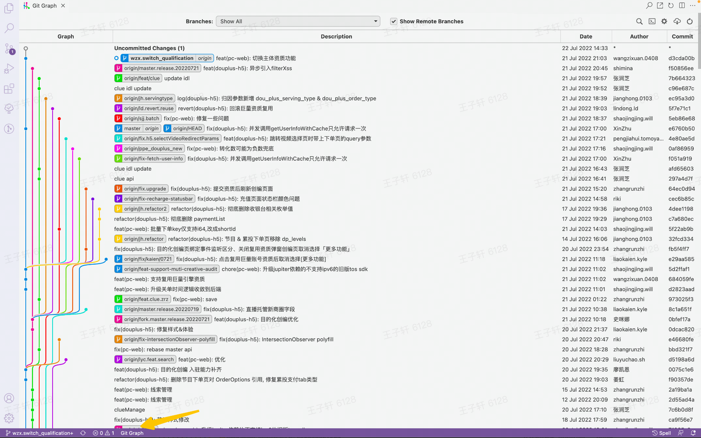

# 配置攻略

#### 配置用户名和邮箱

```Shell
// 以我为例
git config --global user.name "xxx"
git config --global user.email "xxx@xxx.com"
```

可以通过`git config --list`查看配置

#### 配置SSH

不管是 gitlab 还是 github 都可以通过 ssh 的协议对远程仓库进行操作。这时需要配置本地的 ssh key。

cmd中输入以下命令

```undefined
ssh-keygen -t rsa -b 4096 -C "your_email@example.com"
```

一直回车

之后就会在 `~/.ssh` 目录下生成一对免密的 ssh key 公钥(id_rsa.pub)和私钥(id_rsa)。

> 我们只需要公钥 id_rsa.pub

运行一下代码

```undefined
cat ~/.ssh/id_rsa.pub
```

会输出公钥的内容，复制这些内容，然后添加到 gitlab 设置里面

按上述步骤添加即可完成，现在就可以愉快的在终端通过 ssh 协议对代码仓库进行操作了 💪

# 开发攻略

## 1 克隆项目

开发第一步：克隆项目到本地

#### 克隆是什么

项目代码保存在远程仓库，我们需要在本地复制一份来开发，这时就需要克隆

克隆后，我们就在本地有了一份代码，我们把远程的代码成为origin，在Git Graph中可以看到各种状态

> 注意一点，我们只能在本地看到自己的本地分支和所有的远程分支，远程分支带有 **origin/** 前缀

1. 远程和本地同步
   1.  

1. 远程和本地不同步
   1. 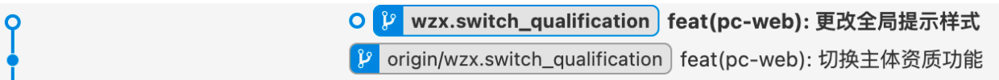

#### 实际操作 

将 gitlab 上的代码克隆到本地

> 这里要注意需要在仓库成员中添加自己，否则会clone失败

##### 方法一：命令行

```Bash
git clone git@xxx.git
```

等待一段时间，项目就会保存在当前目录下的某个目录下（**目录名**取决于**项目名称）**

##### 方法二：vscode

快捷键 `cmd+shift+n` 可以在已有的vscode窗口中重新打开一个新的窗口


在新的窗口点击克隆git仓库，输入复制过来的ssh

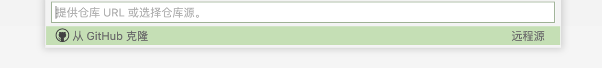

选择要存放的文件夹位置

点击确定，等待一段时间就成功啦

## 2 创建属于自己的开发分支

#### 分支作用和介绍

每一个分支用于一个需求开发

当我们拿到代码接手一个全新的需求时，需要在本地滴创建的自己的分支，在写代码过程中将自己的分支同步到远程对应的分支，最后完成需求后，将自己的分支汇入主分支。

- master分支是主分支，即带边着最终上线的代码
  - 

如下图所示，每条线代表不同的分支

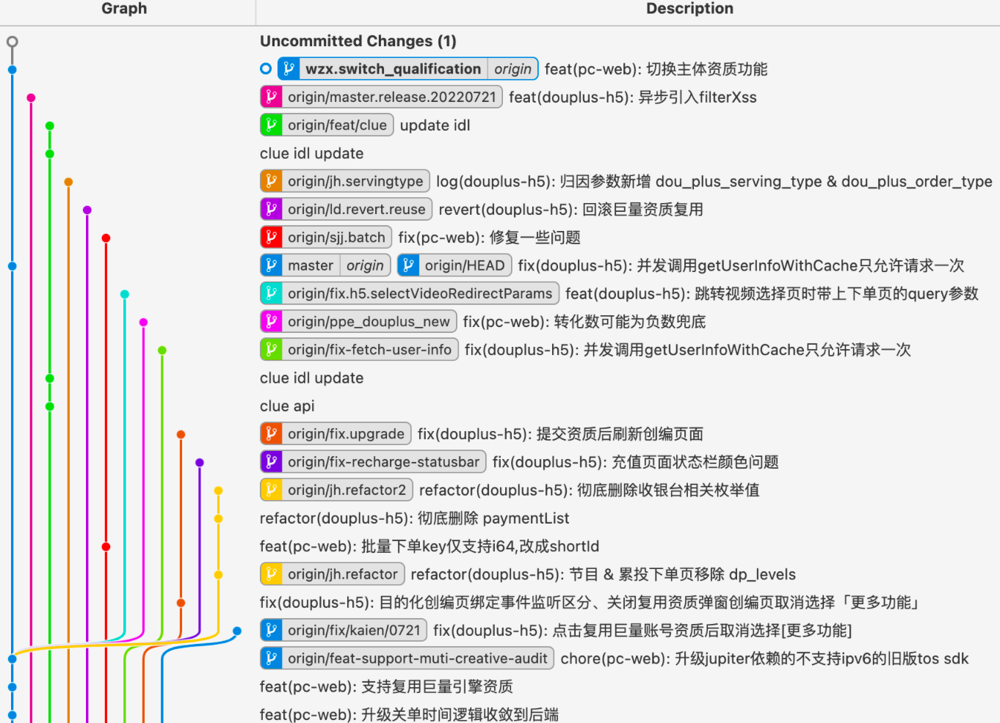

远程分支以`origin`开头，我们可以看到所有的远程分支

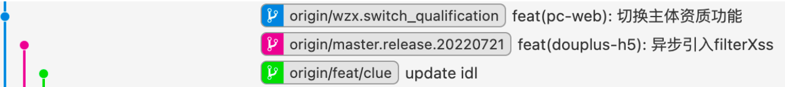

#### 实际操作

##### 创建本地分支

代码仓库下载到本地之后，会进入主分支（默认是 master或main），我们首先创建自己的分支

###### 方法一：命令行

```undefined
git checkout -b mybranch

// 上面的单行命令等于下面两行命令
git branch mybranch
git checkout mybranch
```

此时就会创建名为 mybranch 的开发分支，并切换到该分支

###### 方法二：图形界面

右击要复制的分支所在的行，点击Create Branch...

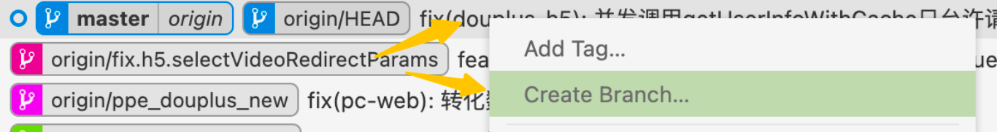

输入对应的名称，下面的checkout代表着切换到创建后立刻切换到此新分支

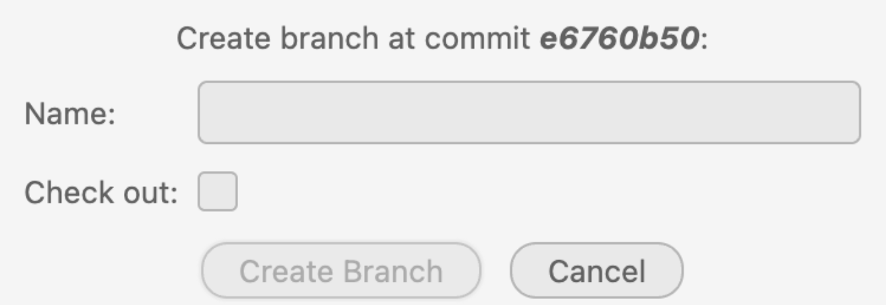

此时就完成了本地分支的创建！

##### 在远程创建对应分支

在这里点击发布分支即可

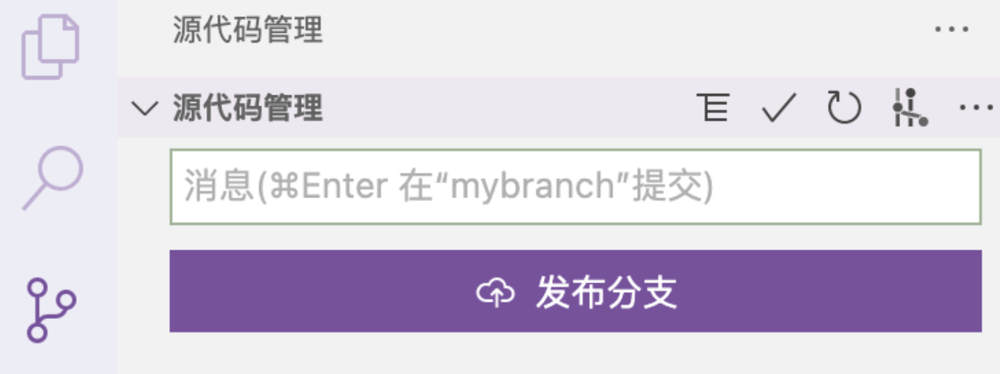

现在就可以放心大胆的在自己的分支上开发啦💛

## 3 将更改提交到本地版本库

每写一部分代码，我们可以将代码保存起来以便下次继续开发

这里不得不提到几个概念：工作区、暂存区、本地版本库、远程分支

#### 基础操作

1. 工作区

我们写代码时cmd+s保存时的代码会保存在工作区

- 此时如下图显示有几个文件发送更改

- - 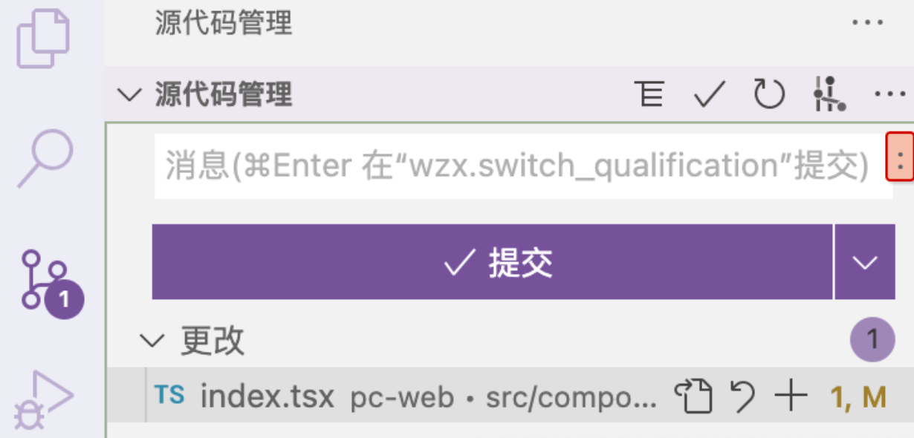

1. 暂存区

通过点上图的‘+’号可以将文件加入到暂存区中

点击弯箭头可以撤销本次更改

- 点击文件本身可以查看更改的对比

- - 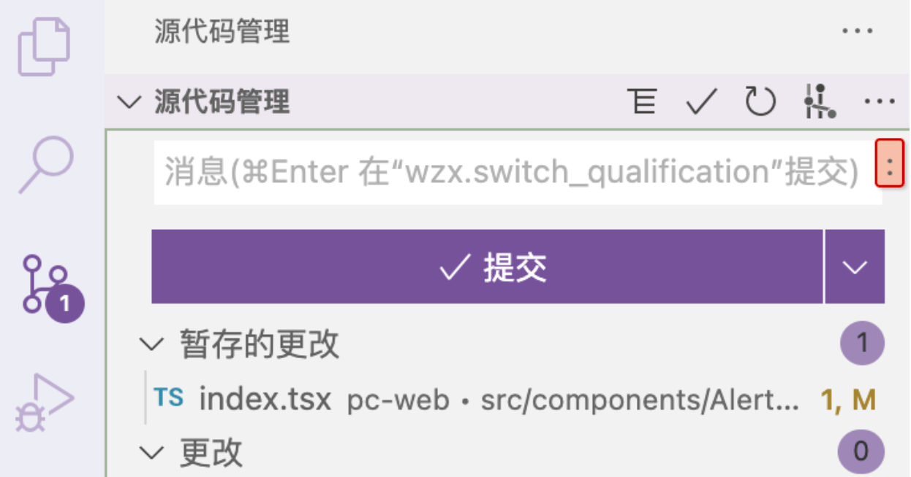

当然也可以通过`git add .`命令将工作区的更改添加到暂存区

暂存区的文件也可以通过弯箭头按钮撤销

1. 本地版本库

在我们的文件夹下会有一个.git的隐藏文件记录每次提交的版本

- 这就是本地版本库

- -  **方法一：图形界面**

  -  在上图的白框中输入提交信息，点击提交按钮即可提交

  -  **方法二：命令行**

  -  在命令行输入git commit -m "提交信息"即可完成提交

#### 追加提交

用于我们想在上一个提交上追加提交，简言之就是不想再写一遍commit的信息和上一次提交放一起

> 这里要注意需要将要提交的文件放在暂存区，否则无法提交

```Shell
git commit --amend
```

#### 修改上次提交信息

在上面的命令输入后会在命令行出现一个文本，按i键可以输入，修改上次的commit信息

#### 重置提交

如果我们想要撤回到历史某个状态，可以进行如下操作

在Git Graph中想要撤回到的目的状态上点击右键

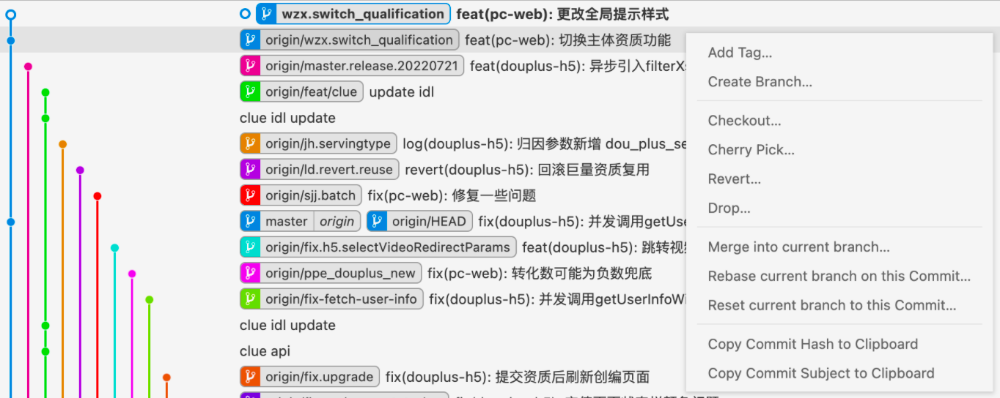

选择Reset current branch on this Commit...

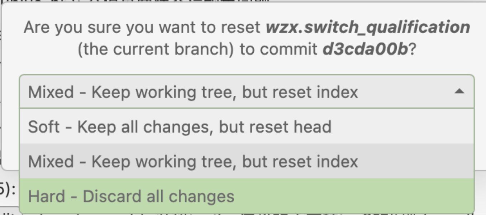

选择Hard即可无痕回退到想要的地方

#### 将多个提交合成一个（重点☄️）

过多的提交看起来比较杂乱，因此我们想要叫多个提交很成一个，此时我们就需要squash大法

##### 如何squash

1. 方法一：使用Git Graph
   1. 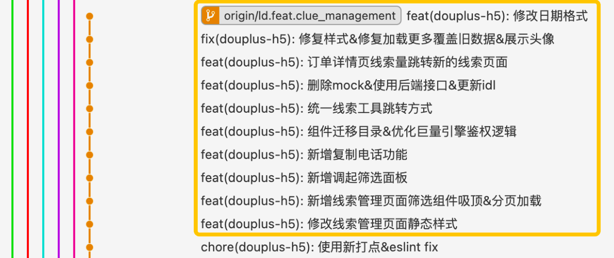

   2. 在要合并的所有commit的前一个commit上点击右键
   3. 点击 Rebase current branch on this Commit...
      1. 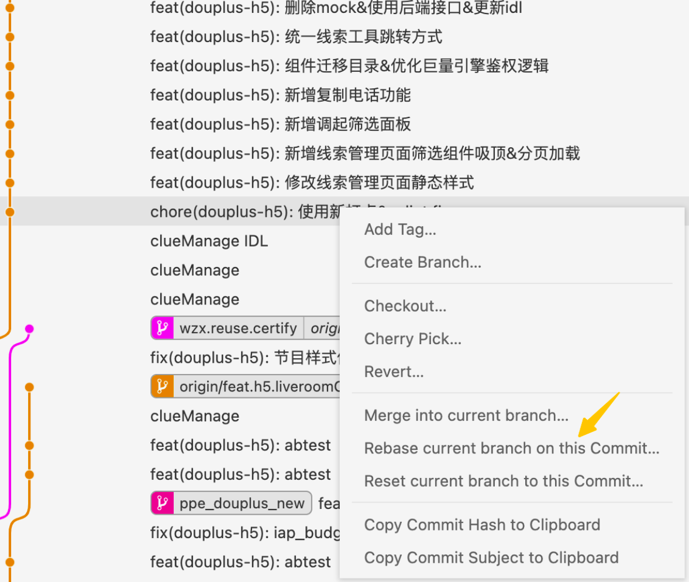
   4. 勾选 Lauch Interactive Rebase in new Terminal
      1. 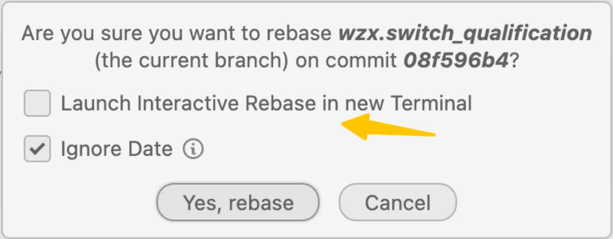
   5. 在终端修改相应内容

1. 方法二：命令行
   1. 使用命令：git rebase -i 对应的前一个commit的哈希
   2. 在终端修改相应内容

终端修改内容

```Shell
// 提交信息
pick b0e6655 Delete .lock
pick f4e3f09 Delete .log 
pick da66e6a Delete version.ini
pick 25c38c4 remove .class files

# Commands:
# p, pick = use commit
# r, reword = use commit, but edit the commit message
# e, edit = use commit, but stop for amending
# s, squash = use commit, but meld into previous commit
# f, fixup = like "squash", but discard this commit's log message
# x, exec = run command (the rest of the line) using shell
# d, drop = remove commit
// 最上面的r，其余的s

// 修改后的信息
pick b0e6655 Delete .lock
s f4e3f09 Delete .log 
s da66e6a Delete version.ini
s 25c38c4 remove .class files

// 之后会跳转到一个新的地方要输入新的提交信息
# This is a combination of 4 commits. The first commit's message is:
Delete .lock
# This is the 2nd commit message:
Delete .log 
# This is the 3rd commit message:
Delete version.ini
# This is the 4th commit message:
remove .class files
```

## 4 同步到远程分支

当我们想要将代码给他人看时，就需要将本地的提交上传到远程，可以进行如下操作

#### **情况一：**

正常情况下，我们本地的分支都是领先远程的分支的

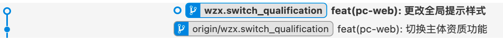

##### 方法一：图形化操作

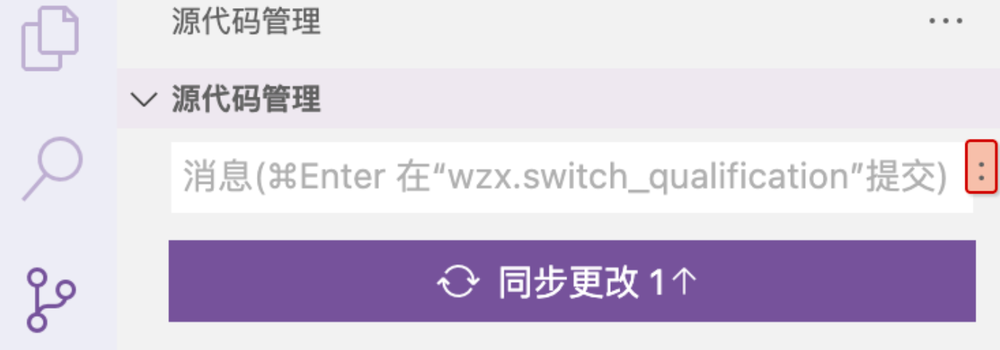

##### 方法二：命令行

```Shell
git push
```

#### 情况二：

由于某种原因（大概率是rebase ）远程分支和本地分支不在同一条路线上了，我们又想以本地的分支为主

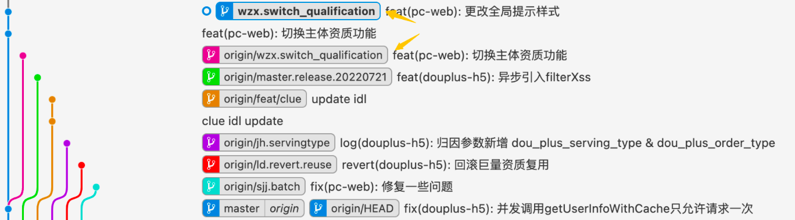

此时只需要用本地分支强制覆盖远程分支

```Shell
git push -f
```


## 5 在和主分支前完成变基（重点☄️）

当我们完成本地的开发，想要合入主分支时，发现主分支早已不是原先那个主分支

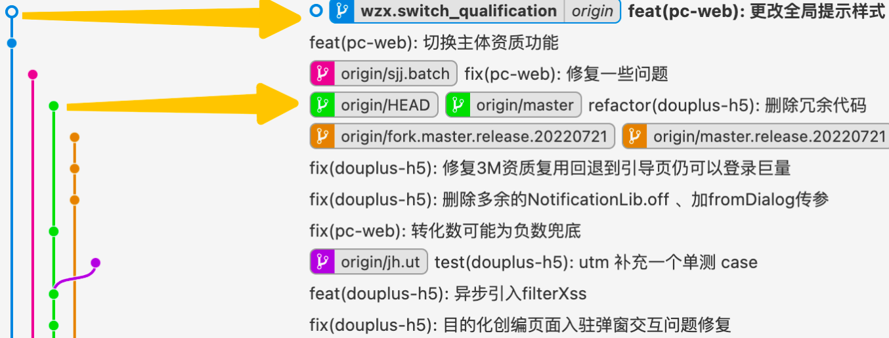

因此我们需要在本地完成变基操作并解决可能产生的冲突

变基，顾名思义就是把我wzx.switch_qualification分支的根基改变到master上，然后把master的相对于我的分支新增的地方也添加到我的分支里，不同的地方由我们手动解决冲突，最后就变成了同一条线上，这是合入主分支就相当于push新的东西，不会再有冲突啦。

上面这段话我想了一个例子：

我和小李共同写一本书，我们当时一起写了一半稿子，还差2个章节就完成了，然后我们各自基于这一半继续创造（想到于基于这半个稿子创造了两个分支），而我写完一个章节后再看原来的一半稿子发现小李已经写好他的一章并提前合入其中了，目前的稿子除了已有的一半内容又包括了小李写的一个章节，此时我只能基于新稿子重新合入，这时我首先将小李新写的内容添加到我这里，其中发现和我新的剧情有出入的地方，我对比后决定一部分采用我的版本，一部分采用他的版本，最后解决了剧情冲突，完成了我们共同的版本。

具体操作方法如下：

#### 方法一：命令行

```Shell
// 首先将本地的master分支拉成最新，再切换到我的分支完成变基
$ git checkout master 
$ git pull origin master  //从master的远程分支拉取代码；
$ git checkout wzx.switch_qualification //切换到我的本地分支；
$ git rebase master  //变基
```

有冲突时，需要解决冲突

```Shell
// 解决冲突后
$ git add .(把冲突后的加入暂存区)
$ git rebase continue(继续rebase)
$ git push -f(推向远端)
```

#### 方法二：图形界面

首先将本地的master分支拉成最新，再切换到我的分支完成变基

双击master分支


点击同步更改

> 注意下箭头是pull，上箭头是push，对master分支一定只能有下箭头

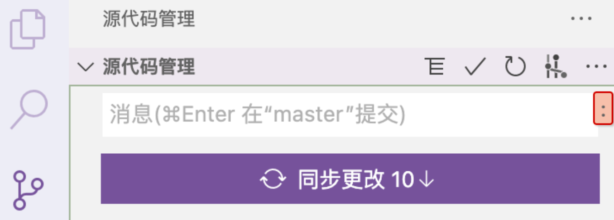

双击我的分支

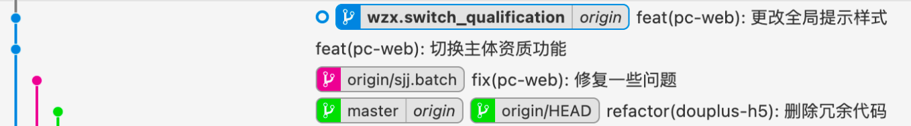

此时右击master分支，点击Rebase current branch on this Commit...

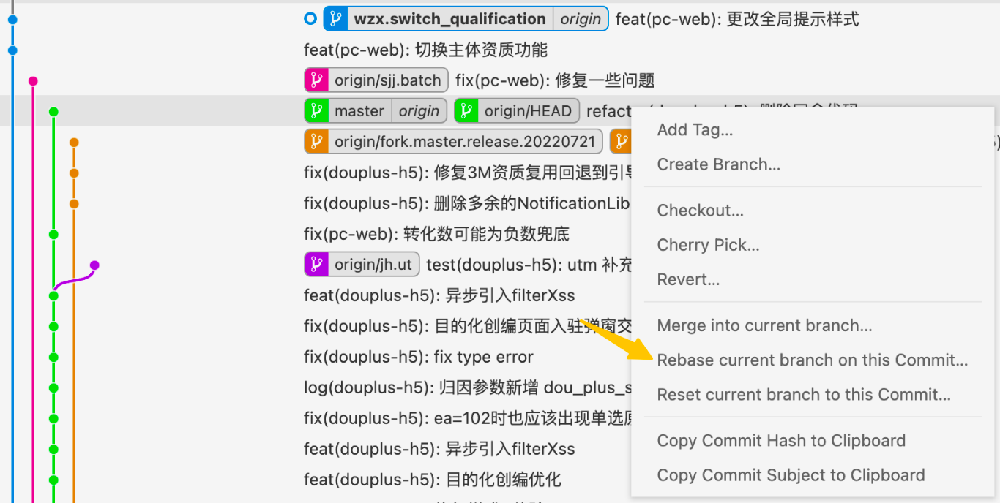

 这次**不能**选Lanch Interactive Rebase in new Terminal

直接点击确定

解决冲突后可以看到，此时本地分支已经和master在同一条线（同基）上了。

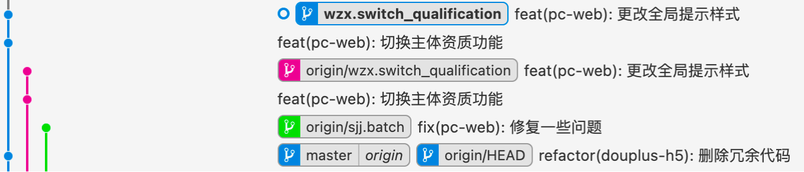

之后git push -f即可

## 6 Marge Request

略