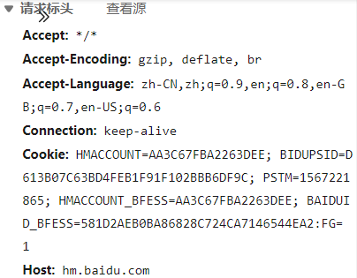

# 1. HTTP 0.9

- 只能发get请求
- 不支持请求头
- 只支持纯文本
- 网页仍然支持用HTML语言格式化，同时无法插入图片

HTTP 0.9具有典型的**无状态性**，每个事务独立进行处理，事务结束时就释放这个连接。由此可见，HTTP协议的无状态特点在其第一个版本0.9中已经成型。一次HTTP 0.9的传输首先要建立一个由客户端到Web服务器的TCP连接，由客户端发起一个请求，然后由Web服务器返回页面内容，然后连接会关闭。如果请求的页面不存在，也**不会返回任何错误码**。

# 2.HTTP 1.0

- 指定HTTP版本号
- 请求和响应支持头域
- 响应对象不限于超文本
- 开始支持客户端通过POST方法向Web服务器提交数据，支持GET、HEAD、POST方法
- 短连接）每一个请求建立一个TCP连接，请求完成后立马断开连接。这将会导致2个问题：连接无法复用，head of line blocking。连接无法复用会导致每次请求都经历**三次握手**和**慢启动**。三次握手在高延迟的场景下影响较明显，慢启动则对文件类请求影响较大。head of line blocking会导致带宽无法被充分利用，以及后续健康请求被阻塞。

# 3.HTTP 1.1

目前最广泛的版本

优化：

- keepalive连接：Persistent Connection

  允许HTTP设备在事务处理结束之后将TCP连接保持在打开的状态，以便未来的HTTP请求重用现在的连接，直到客户端或服务器端决定将其关闭为止。

  在HTTP1.0中使用长连接需要添加请求头 Connection: Keep-Alive，而在HTTP 1.1 所有的连接默认都是**长连接**，除非特殊声明不支持（ HTTP请求报文首部加上Connection: close ）。服务器端按照FIFO原则来处理不同的Request。

  

- chunked编码传输

  该编码将实体分块传送并逐块标明长度，直到长度为0块表示传输结束，这在实体长度未知时特别有用(比如由数据库动态产生的数据)

- 字节范围请求

  HTTP1.1支持传送内容的一部分。比方说，当客户端已经有内容的一部分，为了节省带宽，可以只向服务器请求一部分。该功能通过在请求消息中引入了range头域来实现，它允许只请求资源的某个部分。在响应消息中Content-Range头域声明了返回的这部分对象的偏移值和长度。如果服务器相应地返回了对象所请求范围的内容，则响应码206（Partial Content）

- 请求流水线

另外，HTTP 1.1还新增了如下特性：

- 请求消息和响应消息都支持Host头域：在HTTP1.0中认为每台服务器都绑定一个唯一的IP地址，因此，请求消息中的URL并没有传递主机名（hostname）。但随着虚拟主机技术的发展，在一台物理服务器上可以存在多个虚拟主机（Multi-homed Web Servers），并且它们共享一个IP地址。因此，Host头的引入就很有必要了。
- 新增了一批Request method：HTTP1.1增加了OPTIONS,PUT, DELETE, TRACE, CONNECT方法
- 缓存处理：HTTP/1.1在1.0的基础上加入了一些cache的新特性，引入了实体标签，一般被称为e-tags，新增更为强大的Cache-Control头。

# 4.HTTP 2.0

HTTP 2.0是下一代HTTP协议，目前应用还非常少。主要特点有：

- 多路复用（二进制分帧）。HTTP 2.0最大的特点：不会改动HTTP 的语义，HTTP 方法、状态码、URI 及首部字段，等等这些核心概念上一如往常，却能致力于突破上一代标准的性能限制，改进传输性能，实现低延迟和高吞吐量。而之所以叫2.0，是在于新增的**二进制分帧层**。在二进制分帧层上， HTTP 2.0 会将所有传输的信息**分割为更小的消息和帧**，并对它们**采用二进制格式的编码** ，其中HTTP1.x的首部信息会被封装到Headers帧，而我们的request body则封装到Data帧里面。

  

- HTTP 2.0 通信都在一个连接上完成，这个连接可以承载任意数量的双向数据流。相应地，每个数据流以消息的形式发送，而消息由一或多个帧组成，这些帧可以乱序发送，然后再根据每个帧首部的流标识符重新组装。
- 头部压缩：当一个客户端向相同服务器请求许多资源时，像来自同一个网页的图像，将会有大量的请求看上去几乎同样的，这就需要压缩技术对付这种几乎相同的信息。
- 随时复位：HTTP1.1一个缺点是当HTTP信息有一定长度大小数据传输时，你不能方便地随时停止它，中断TCP连接的代价是昂贵的。使用HTTP2的RST_STREAM将能方便停止一个信息传输，启动新的信息，在不中断连接的情况下提高带宽利用效率。
- 服务器端推流：Server Push。客户端请求一个资源X，服务器端判断也许客户端还需要资源Z，在无需事先询问客户端情况下将资源Z推送到客户端，客户端接受到后，可以缓存起来以备后用。
- 优先权和依赖：每个流都有自己的优先级别，会表明哪个流是最重要的，客户端会指定哪个流是最重要的，有一些依赖参数，这样一个流可以依赖另外一个流。优先级别可以在运行时动态改变，当用户滚动页面时，可以告诉浏览器哪个图像是最重要的，你也可以在一组流中进行优先筛选，能够突然抓住重点流。

# 5.HTTP 3.0

HTTP3.0，也称作HTTP over QUIC。HTTP3.0的核心是QUIC(读音quick)协议，由Google在 2015年提出的SPDY v3演化而来的新协议，传统的HTTP协议是基于传输层TCP的协议，而QUIC是基于传输层UDP上的协议，可以定义成:HTTP3.0基于UDP的安全可靠的HTTP2.0协议


# TLS

## 背景

在SSL/TLS出现之前，很多应用层协议（http、ftp、smtp等）都存在着网络安全问题，例如大家所熟知的http协议，在传输过程中使用的是明文信息，传输报文一旦被截获便会泄露传输内容；传输过程中报文如果被篡改，无法轻易发现；无法保证消息交换的对端身份的可靠性。为了解决此类问题，人们在应用层和传输层之间加入了SSL/TLS协议。

## 概念

TLS（Transport Layer Security，安全传输层)，TLS是建立在传输层TCP协议之上的协议，服务于应用层，它的前身是SSL（Secure Socket Layer，安全套接字层），它实现了将应用层的报文进行加密后再交由TCP进行传输的功能。

## 作用

TLS协议主要解决如下三个网络安全问题。

1. 保密(message privacy)，保密通过加密encryption实现，所有信息都加密传输，第三方无法嗅探；
2. 完整性(message integrity)，通过MAC校验机制，一旦被篡改，通信双方会立刻发现；
3. 认证(mutual authentication)，双方认证,双方都可以配备证书，防止身份被冒充；

## 实现

TLS协议可以分为两部分

1. 记录协议（Record Protocol）
    通过使用客户端和服务端协商后的秘钥进行数据加密传输。
2. 握手协议（Handshake Protocol）
    客户端和服务端进行协商，确定一组用于数据传输加密的秘钥串。

**TLS握手过程**


1. ClientHello – 客户端发送所支持的 SSL/TLS 最高协议版本号和所支持的加密算法集合及压缩方法集合等信息给服务器端。

2. （可选）ServerHello – 服务器端收到客户端信息后，选定双方都能够支持的 SSL/TLS 协议版本和加密方法及压缩方法，返回给客户端。

3. （可选）SendCertificate – 服务器端发送服务端证书给客户端。

4. （可选）RequestCertificate – 如果选择双向验证，服务器端向客户端请求客户端证书。

步骤 5. ServerHelloDone – 服务器端通知客户端初始协商结束。

6. （可选）ResponseCertificate – 如果选择双向验证，客户端向服务器端发送客户端证书。

7. ClientKeyExchange – 客户端使用服务器端的公钥，对客户端公钥和密钥种子进行加密，再发送给服务器端。

8. （可选）CertificateVerify – 如果选择双向验证，客户端用本地私钥生成数字签名，并发送给服务器端，让其通过收到的客户端公钥进行身份验证。

9. CreateSecretKey – 通讯双方基于密钥种子等信息生成通讯密钥。

10. ChangeCipherSpec – 客户端通知服务器端已将通讯方式切换到加密模式。

11. Finished – 客户端做好加密通讯的准备。

12. ChangeCipherSpec – 服务器端通知客户端已将通讯方式切换到加密模式。

13. Finished – 服务器做好加密通讯的准备。

14. Encrypted/DecryptedData – 双方使用客户端密钥，通过对称加密算法对通讯内容进行加密。

15. ClosedConnection – 通讯结束后，任何一方发出断开 SSL 连接的消息。

**TLS记录协议**


# SSL

SSL证书，用于加密HTTP协议，也就是HTTPS。随着淘宝、百度等网站纷纷实现全站Https加密访问，搜索引擎对于Https更加友好，加上互联网上越来越多的人重视隐私安全，站长们给网站添加SSL证书似乎成为了一种趋势。

SSL(Secure Sockets Layer 安全套接层),及其继任者传输层安全（Transport Layer Security，TLS）是为网络通信提供安全及数据完整性的一种安全协议。TLS与SSL在传输层对网络连接进行加密。

SSL协议位于TCP/IP协议与各种应用层协议之间，为数据通讯提供安全支持。SSL协议可分为两层： SSL记录协议（SSL Record Protocol）：它建立在可靠的传输协议（如TCP）之上，为高层协议提供数据封装、压缩、加密等基本功能的支持。 SSL握手协议（SSL Handshake Protocol）：它建立在SSL记录协议之上，用于在实际的数据传输开始前，通讯双方进行身份认证、协商加密算法、交换加密密钥等。

# HTTP协议与TCP/IP协议的关系

HTTP的长连接和短连接本质上是TCP长连接和短连接。HTTP属于应用层协议，在传输层使用TCP协议，在网络层使用IP协议。 IP协议主要解决网络路由和寻址问题，TCP协议主要解决如何在IP层之上可靠地传递数据包，使得网络上接收端收到发送端所发出的所有包，并且顺序与发送顺序一致。TCP协议是可靠的、面向连接的。

# HTTP协议无状态性

HTTP协议是无状态的，指的是协议对于**事务处理没有记忆能力**，服务器不知道客户端是什么状态。也就是说，打开一个服务器上的网页和上一次打开这个服务器上的网页之间没有任何联系。HTTP是一个无状态的面向连接的协议，无状态不代表HTTP不能保持TCP连接，更不能代表HTTP使用的是UDP协议（无连接）。

# 长连接、短连接

在HTTP/1.0中默认使用短连接。也就是说，客户端和服务器每进行一次HTTP操作，就建立一次连接，任务结束就中断连接。当客户端浏览器访问的某个HTML或其他类型的Web页中包含有其他的Web资源（如JavaScript文件、图像文件、CSS文件等），每遇到这样一个Web资源，浏览器就会重新建立一个HTTP会话。

而从HTTP/1.1起，默认使用长连接，用以保持连接特性。使用长连接的HTTP协议，会在响应头加入这行代码：

```makefile
Connection:keep-alive
```

在使用长连接的情况下，当一个网页打开完成后，客户端和服务器之间用于传输HTTP数据的TCP连接不会关闭，客户端再次访问这个服务器时，会继续使用这一条已经建立的连接。Keep-Alive不会永久保持连接，它有一个保持时间，可以在不同的服务器软件（如Apache）中设定这个时间。实现长连接需要客户端和服务端都支持长连接。

HTTP协议的长连接和短连接，实质上是TCP协议的长连接和短连接。

#  面试回答：

- 0.9：只有get请求，传输的文本，没有请求头，没有错误码，但是体现了http的无状态性
- 1.0：短连接，支持请求头和响应头，有post等请求，指定版本号
- 1.1：默认长连接，控制缓存策略，host指定主机名，因为有虚拟机，添加put等方法，range允许请求一部分
- 2.0：多路复用，二进制分帧，首部压缩，服务器推送

http连接过程

DNC解析域名

建立tcp

发送请求指令

发送请求头

发送响应头

传输数据

关闭连接