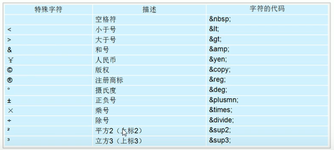
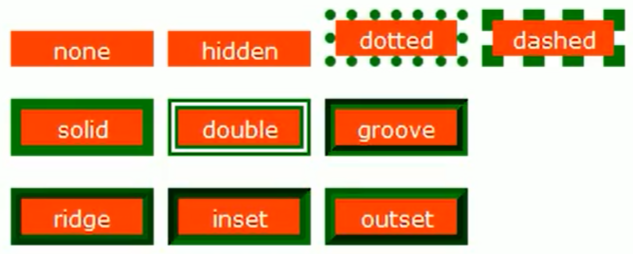

## Web标准（W3C）

- Web标准是由W3C组织和其他标准化组织制定的一系列标准的集合。
- W3C(万维网联盟)是国际最著名的标准化组织

**为什么需要Web标准？**

- 浏览器不同，显示页面和排版存在差异，让页面标准化和规范化

- 优点
  - 让web的发展前景更广阔
  - 内容能被广泛的设备访问
  - 更容易被搜索引擎搜索
  - 降低网站流量费用
  - 使网站更易于维护
  - 提高页面的浏览速度
- 构成
  - 结构、表现、行为
  - 结构->标签：对网页元素进行分类整理HTML
  - 表现->外观：版式、颜色、大小CSS
  - 行为->交互：网页模型的定义Javascript
- 最佳方案
  - 结构、样式、行为分离
  - 分别写在不同文件中

## HTML

### 标签

- 尖括号
- 通常成对出现，双标签
- 也可以单标签，`<br />`
- 标签的包含关系和并列关系

**基本结构标签（骨架标签）**

- HTML页面也叫HTML文档

```html
<html>
    <head>
        <title>导航栏标题</title>
    </head>
    <body>
    	主题内容
    </body>
</html>
```

- 文件后缀：.html

- \<!DOCTYPE>
  - 文档类型声明标签
  - 作用是告诉浏览器HTML版本
  - 必须写在最开头
- \<html lang="en">
  - 语言种类
  - en英语
  - zh-CN中文
  - 仅提示作用
- \<meta charset="UTF-8">
  - 字符集
  - UTF-8万国码
  - 防止出现乱码

#### **常用标签**一

- \<h1>~\<h6>
  - 标题标签
  - 一共6级
  - 文字加粗
  - 由大到小

- \<p>
  - 段落标签
  - 根据浏览器大小自动换行
  - 有缝隙
- \<br/>
  - 换行（break）
  - 没有缝隙
- 文本格式化标签
  - \<b>\</b>加粗
  - \<em>\</em>倾斜
  - \<del>\</del>删除线
  - \<ins>\</ins>下划线

- \<div>
  - 没有实际语义，用来布局网页，装内容
  - 一行只能放一个div，大盒子
- \<span>
  - 没有实际语义，用来布局网页，装内容
  - 一行可以放多个span，小盒子

- \图像标签

  - ``

  - 图片必须和网页文件放在一起

    | 属性   | 属性值 | 说明                             |
    | ------ | ------ | -------------------------------- |
    | alt    | 文本   | 替换文本，图像不能显示的文字     |
    | title  | 文本   | 提示文本，鼠标放到图像上显示文字 |
    | width  | 像素   | 宽度                             |
    | height | 像素   | 高度                             |
    | border | 像素   | 边框                             |

  - 单独修改一个高或宽另一个等比例压缩

### **路径**

- 相对路径
  - 同级路径：直接写文件名
  - 下一级：同级文件夹/文件名
  - 上一级：../
- 绝对路径
  - 盘符:\Users\\....
  - 直接完整网址http://...

### **超链接**

- \<a>
- herf="跳转目标"

- target="目标窗口的弹出方式" _self默认值、\_\_blank在新窗口打开
- 链接分类
  - 外部http://...
  - 内部链接：直接写文件的名称
  - 空链接：#
  - 下载链接：地址链接是文件.exe或.zip等压缩包格式
  - 网页元素的链接
  - 锚点链接
    - \<a href="#名字">
    - 给目标标签加上id="名字"

### **注释**

- \<!--    -->
- ctrl+/

### **特殊字符**

在html中，一些特殊的符号很难直接使用，我们可以使用下面的字符来代替



#### **常用标签二**

- 表格标签
  ```html
  <table>
      <tr><!--行-->
          <td>单元格内的文字</td>
          <td>单元格内的文字</td>
      </tr>
      <tr><!--行-->
          <td>单元格内的文字</td>
          <td>单元格内的文字</td>
      </tr>
  </table>
  ```

  - 表头\<th>
  - 结构标签：\<thead>头部和\<tbody>主体
  - 合并单元格
    - 跨行：rowspan=”  “
    - 跨列：colspan=”   “
    - 步骤：先确定跨行还是跨列，再找到目标单元格，最后删除多余的单元格

- 列表标签

  - 无序列表（重要）

    - ul+li

  - 有序列表

    - ol+li

  - 自定义列表

    - dl+dt+dd

      ```html
      <dl>
          <dt></dt>
          <dd></dd>
          <dd></dd>
      </dl>
      ```

- 表单标签

  - \<form action="url" method="提交方式" name="表单域名称">\</form>

  - | 属性   | 属性值   | 作用                |
    | ------ | -------- | ------------------- |
    | action | url地址  | 指定接收的服务器url |
    | method | get/post | 提交方式            |
    | name   | 名称     | 区分不同表单域      |

  - \<input>

    - type属性值，样式：text、button、hidden、password(专门输密码)、radio(单选)、checkbox(多选)、submit(提交按钮)、reset(重置按钮)、file(上传文件按钮)
    - name：区分表单元素的名字：多个单选按钮一定要有相同的name值才能实现单选功能
    - value：输入框中的值
    - checked：规定默认选中的单选框或多选框的值。
    - maxlength：最大长度

  - \<lable>

    - 增加用户体验
    - label的for属性对应input里的name属性

  - \<select>下拉表单

    - option选项：selected默认选中

  - \<textarea>文本域

    - cols每行字符数rows行数

## CSS

样式表或者级联样式表

### 语法规范

- 选择器+样式

- 位置在head标签最后
- 使用\<style>

### 代码风格

- 样式格式书写：展开式的风格

- 空格规范：冒号后面写个空格，括号前面写空格

### **选择器**

选择标签

- 基础选择器：标签选择器
- 类选择器：
  - class
  - 用法：.+类名
  - 可以多个用
  - 开发最常用
  - 可用横线为选择器命名
  - 命名大全：头header、尾footer、导航nav、侧栏sidebar、栏目column、标志logo、广告banner、主体main、新闻news、下载download、子导航subnav、搜索search、菜单menu
  - 多类名：多类名之间用空格隔开，方便，减少代码量
- id选择器
  - #id名
  - 只允许一次
- 通配符选择器
  - *
  - 一般设置边距

### 字体属性

- font-family字体：
  - 微软雅黑(Microsoft Yahei)、新罗马(Times New Roman)
  - 可以直接给body指定字体
- font-size大小：
  - 单位是px
  - 标题标签特殊，需要单独指定大小
  - 默认16px
- font-weight粗细
  - bold加粗，700
  - normal正常不加粗，400
  - 700不加单位
  - 实际开发中常用数字
- font-style斜体
  - italic斜体
  - 斜体em不倾斜normal
- line-hight行高
- 一行写完：`font：font-style font-weight font-size/line-hight font-family`

### **文本属性**

- color文本颜色
- text-align水平对齐方式：left、right、center
- text-decoration装饰文本：**none**(可以用于去掉下划线)、underline、overline、lin-throngh
- text-indent缩进效果：10px当然最好用的是2em（两个文字的大小）
- line-height行间距：26px

### 引入方式

- 内部样式表\<style>标签：理论上可以放在任何位置，我们一般放head里的最后

- 行内样式表：style=”  “

- 外部样式表：单独css文件，后缀名.css，文件里只有样式，没有标签

  - 引入：

    `<link rel="stylesheet" href="css文件路径">`

### Emmet语法

**快速生成HTML**

- 生成标签：直接输入标签名按tab即可
- 生成多个相同的标签：div*3按tab
- 生成父子级联标签：ul>li按tab
- 生成兄弟关系标签：p+div按tab
- 生成带有类名或者id名字：直接写.demo或#two按tab即可
- 生成类名有顺序：.demo$*5按tab
- 默认带内容：div{内容}按tab

**快速生成CSS**

- 采取简写形式即可
- w200按tab可生成width: 200px；
- h200按tab可生成height: 200px；
- lh26按tab课生成line-height: 26px；
- ti对应text-indent
- ta对应text-align
- td对应text-decoration

### 复合选择器

- 后代选择器：ul li{}

- 子选择器：选亲儿子元素：.nav>a

- 并集选择器：div，p{}

  - 约定的语法规范：并集选择器竖着写
  - 最后一个选择器不需要加逗号

- 伪类选择器：

  - 用”：“表示

  - 链接伪类：

    ```css
    a:link//为访问过
    a:visited//访问过
    a:hover//鼠标覆盖，最常用
    a:active//鼠标选中没有弹起时
    ```

    - 按照LVHA顺序，确保生效

  - :focus伪类：

    - 获得焦点，得到光标

    ```css
    input:focus{
    	background-color:blue;
    }
    ```

### 元素显示模式

#### 三种模式

- 块元素

  - \<h>、\<p>、\<div>、\<ul>、\<ol>、\<li>
  - 独占一行
  - 宽度、高度和内外边距可以设置
  - 宽度默认和父元素一样
  - 里面可以放行内元素或块级元素

  - 注意：
    - p标签里不允许放div
    - 文字类标签也不允许放块级元素

- 行内元素

  - \<a>\<strong>\<b>\<em>\<i>\<del>\<s>\<ins>\<u>**\<span>**
  - 一行可以放多个
  - 高度宽度设置是无效的，默认宽度就是他本来的宽度
  - 只能放行内元素或文本
  - 注意：
    - 链接里不能再放链接
    - 特殊情况下\<a>里面可以放块级元素，但是给\<a>转换一下块级模式最安全

- 行内块元素

  - \\<input>\<td>
  - 一行放多个、能调宽度、高度和内外边距

#### **显示元素转化**

- 转化为块元素：display:block；
- 转化为行内元素：display:inline;
- 转化为行内块元素：display:inline-block;

### **snipaste截图工具使用**

- F1截图，可以测量大小，设置箭头，书写文字
- F3桌面置顶显示
- 点击图片alt可以取色（按shift可以切换去色模式）
- 按esc取消图片显示

### **CSS垂直居中**

- height和line-height一样，行高等于盒子高度

### CSS背景

- 背景颜色：transparent透明
- 背景图片：background-image：url()
  - 非常容易控制位置
- 背景平铺：background-repeat：no-repeat；
  - repeat-x；repeat-y；
- 背景图片位置：background-position：x y；
  - 方位：center，top，left，bottom，right和顺序没有关系，只写一个默认居中
  - 精确：20px，20px先写x再写y
  - **小的装饰性图片一般不用img，用背景图片容易调位置**

- 背景图像固定：background-attachment：scroll(滚动)、fixed

- 复合属性：背景颜色、背景图片地址、背景平铺、背景图像滚动、背景图片位置；
  - background： transparent url(image.jpg) repeat-y fixed top;

- 半透明：background: rgba(0,0,0,0.3);最后一个是透明的（alpha透明度）

### CSS三大特性

- 层叠性（覆盖性）冲突样式
- 继承性（子标签继承父标签的样式）
  - body可以直接嘿嘿嘿
  
  - 继承的主要是文字相关的
  
  - font：12px/1.5代表行高是当前元素的1.5倍
  
  - 优先级
    - !important
    - 行内style
    - id选择器
    - 类选择器，伪类选择器
    - 元素选择器
    - 继承或*
    
  - 权重叠加
    
    - ul li权重大于li
    
  - 权重计算规则：
  
    1、第一优先级：无条件优先的属性只需要在属性后面使用!important。它会覆盖页面内任何位置定义的元素样式。（ie6支持上有些bug）。
     2、第一等：内联样式，如：style="color:red;"，权值为1000.（该方法会造成css难以管理，所以不推荐使用）
     3、第二等：ID选择器，如：#header，权值为0100.
     4、第三等：类、伪类、属性选择器如：.bar， 权值为0010.
     5、第四等：标签、伪元素选择器，如：div ::first-line 权值为0001.
     6、通配符，子选择器，相邻选择器等。如*，>,+, 权值为0000.
     7、继承的样式没有权值。

### CSS盒子模型

- 组成：border边框、content内容、padding内边距、margin外边距

- border属性

  - border-width

  - border-style样式：最常用实线solid

    

  - border-color

  - 复合：border：1px solid red；

  - border-top、border-bottom、border-left、border-right

  - 表格边框

    - table td{border：}
    - border-collapse：collapse(边框合并)

  - width的大小不包括border；

- padding内边距

  - 1个值：上下左右
  - 2个值：上下、左右
  - 3个值：上、左右、下
  - 4个值：上、右、下、左
  - padding会影响盒子的实际大小，width不包含padding
  - 导航栏字数不同：可以不给width只给padding

- margin外边距

  - 使块盒子水平居中：首先必须设置width，把左右margin设置成auto
  - 行内元素或行内块元素水平居中：给父元素添加text-align：center

- 嵌套块元素垂直外边距的塌陷

  - 解释：子元素的margin会使父元素跟随
  - 方法：
    - 为父元素定义上边框
    - 为父元素指定内边距
    - 为父元素添加overflow：hidden

- 清除网页元素的内外边距

  ```
  * {
  	margin: 0;
  	padding: 0;
  }
  ```

- **行内元素**未来照顾兼容性，尽量只设置左右内外边距，不设置上下内外边距。

- border-radius圆角边框：
  - length或百分比
  - 1个数值：所有
  - 2个数值：对角
  - 4个数值：左上开始顺时针
- box-shadow盒子阴影：
  
  - h-shadow(水平) v-shadow(垂直) blur(虚实) spread(大小) color(颜色) inset(可选，改为内部阴影)

#### 总结

- 别只想着用div，每个标题都是有语义的，再不同的地方用不同的标签
- 多用类名，便于维护
- margin和padding，各有优缺点

### 浮动float

三种布局方式

**网页布局的第一准则**：多个块级元素纵向排列找标准流，多个块级元素横向排列找浮动

#### 标准流

- 块元素和行内元素

#### **为什么需要浮动**

- 行内块转化很难控制中间的缝隙
- 如何实现两个盒子的左右对齐

#### 写法

- float：属性；
  
- none、left、right
  
- 浮动特性

  - 脱离标准流、不再保留原来的位置
  - 如果盒子都设置了浮动，会一个贴着一个
  - 一行站不下就另起一行
  - 具有行内块元素特性：例span都可以变成行内块，浮动后宽度由内容觉得

  > 注：
  >
  > 1. 一般先搞一个标准流的父元素在一行，在父元素里搞多个浮动的子元素
  > 2. 浮动盒子只会影响浮动盒子后面的标准流，不会影响前面的标准流

- 清除浮动
  - clear：left、right、both

  - 清除浮动条件：父级没高度、子盒子浮动了，影响下面的布局了

  - 清除浮动的四种方法：

    - 额外标签法

      在浮动元素末尾添加一个空的标签，例如\<div style="clear:both">\</div>，注意必须使块级元素

    - 父级添加overflow:hidden

    - 父级添加after伪元素

      ```css
      .clearfix:after {
      	content:"",
      	display:block;
      	height: 0;
      	clear:both;
      	visibility:hidden;
      }
      .clearfix {
      	*zoom: 1;
      }
      ```

    - 父级元素添加双伪元素

      ```css
      .clearfix:before,
      .clearfix:after{
          content:"";
          display:table;
      }
      .clearfix:after {
          clear:both;
      }
      .clearfix {
          *zoom: 1;
      }
      ```

### 定位

定位组成=边偏移+定位模式

#### 定位模式

- static静态

- relative相对：自恋

  - 参照自己原来的位置
  - 原来的位置不变，不脱标

- absolute绝对：拼爹

  - 跟父元素有关系
  - 如果没父元素或父亲没定位，以document为准
  - 父元素有定位，以最近带有定位的父元素为准
  - 绝对定位不占有原来的位置，脱标
  - 子绝父相，相对定位就是给绝对定位当爹的

- fixed固定：

  - 以浏览器的可视窗口为参照点

  - 跟父元素没有任何关系

  - 固定定位不占有原来的位置，脱标

  - 小技巧：固定到版心一侧

    ```
    left:50%+版心的一半
    ```

- sticky粘性

  - 以浏览器可视窗口为参照点
  - 占有原来位置
  - 必须添加top、bottom、left、right其中的一个才有用
  - 兼容性差

- z-index叠放次序

  - 不能加单位
  - 必须有定位的盒子才能生效

#### **注意点**

- 绝对定位盒子居中：自己使用算法：

  ```css
  positon: absolute;
  left: 50%;
  margin-left:-(自身宽度)/2;
  ```

- 绝对定位(固定定位)会完全压住盒子里的所有内容、浮动不会压住文字

### 显示与隐藏

#### **重点**

- display

  - none隐藏：位置不保留
  - block显示

- visibility

  - visible显示
  - hidden隐藏：位置保留

- overflow溢出

  - visible显示
  - hidden隐藏
  - scroll显示滚动条
  - auto在需要的时候显示滚动条

  > 注意：有定位的盒子想露出一部分就要慎用

### 精灵图

- 图片整合一次请求返回

- 主要用在背景图
- background-positon：基本都是负值

### 字体图标iconfont

- 开起来是图标
- 本质是文字
- 轻量级
- 灵活性：产生阴影，旋转
- 兼容性

### **三角形做法**

```css
.box{
	width:0;
	height:0;
    line-height:0;//照顾兼容性
    font-size:0;//照顾兼容性
	border:10px solid transparent;
	border-top-color:pink;
	margin:100px auto;
}
```

