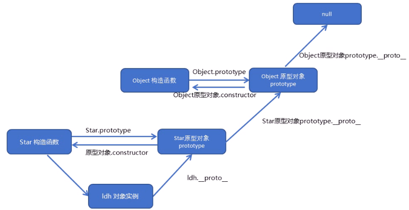
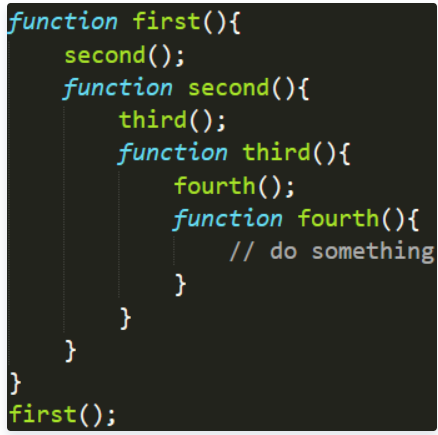

#### xml

XML 指可扩展标记语言

XML 被设计用来传输和存储数据。

- XML 指可扩展标记语言（*EX*tensible *M*arkup *L*anguage）
- XML 是一种*标记语言*，很类似 HTML
- XML 的设计宗旨是*传输数据*，而非显示数据
- XML 标签没有被预定义。您需要*自行定义标签*。
- XML 被设计为具有*自我描述性*。
- XML 是 W3C 的推荐标准

**XML 与 HTML 的主要差异**

- XML 不是 HTML 的替代。
- XML 和 HTML 为不同的目的而设计：
- XML 被设计为传输和存储数据，其焦点是数据的内容。
- HTML 被设计用来显示数据，其焦点是数据的外观。
- HTML 旨在显示信息，而 XML 旨在传输信息。

**没有任何行为的 XML**

XML 是不作为的。

也许这有点难以理解，但是 XML 不会做任何事情。XML 被设计用来结构化、存储以及传输信息。

**XML 仅仅是纯文本**

XML 没什么特别的。它仅仅是纯文本而已。有能力处理纯文本的软件都可以处理 XML。

不过，能够读懂 XML 的应用程序可以有针对性地处理 XML 的标签。标签的功能性意义依赖于应用程序的特性。

**XML与JSON的区别？** 

- 数据体积方面。JSON相对于XML来讲，数据的体积小，传递的速度更快些。 

- 数据交互方面。JSON与JavaScript的交互更加方便，更容易解析处理，更好的数据交互。

- 数据描述方面。JSON对数据的描述性比XML较差。 
- 传输速度方面。JSON的速度要远远快于XML。

#### **数据类型**

数据类型主要包括两部分：

- 基本数据类型： Undefined、Null、Boolean、Number 和 String
- 引用数据类型： Object (包括 Object 、Array 、Function)

#### null 和 undefined 的区别

null 表示一个对象被定义了，值为“空值”；
undefined 表示不存在这个值。

- 变量被声明了，但没有赋值时，就等于undefined。 
- 调用函数时，应该提供的参数没有提供，该参数等于undefined。 
- 对象没有赋值的属性，该属性的值为undefined。 
- 函数没有返回值时，默认返回undefined。

#### 判断类型的方法

- typeof 运算符
  - typeof主要用来判断基础数据类型
- instanceof 运算符
  - instanceof则是用来判断引用数据类型
- Object.prototype.toString.call() 方法

#### 数组对象的原生方法

pop、push、shift、unshift、splice、reverse、sort、concat、join、slice、toString、indexOf、lastIndexOf、reduce、reduceRight forEach、map、filter、every、some

#### 如何判断一个对象是否属于某个类

使用instanceof 即if(a instanceof Person){alert('yes');}

#### “ ===”、“ ==”的区别

- \==：当且仅当两个运算数相等时，它返回 true，即不检查数据类型
- ===：只有在无需类型转换运算数就相等的情况下，才返回 true，需要检查数据类型

#### “eval“是做什么的

- 它的功能是把对应的字符串解析成 JS 代码并运行；
- 应该避免使用 eval，不安全，非常耗性能（2次，一次解析成 js 语句，一次执行）。

#### 构造函数

用来初始化对象，为对象成员变量赋初始值，总和new一起使用。类似于java 的类

静态成员和实例成员

实例成员可以通过对象来访问

静态成员直接在构造函数添加

#### **原型**

构造函数存在浪费空间的问题（每一个方法都需要开辟新的空间）

每一个构造函数都有一个prototype属性（对象），我们可以把不变的方法直接定义在prototype对象上，对象实例就可以**共享这些方法**

```js
function Star(name, age){
	this.name = name;
	this. age = age;
}
Star.prototype.sing=function(){
	console.log("我会唱歌");
}
```

对象身上系统自己添加了一个\_proto_指向我们构造函数的原型对象

```js
ldh.__proto__===Star.prototype
```

如果我们修改了原来的原型对象，给原型对象赋值的是一个对象，则必须手动的利用constructor指回原来的构造函数

```js
Star.prototype = {
	constructor:Star,
	sing:function(){
		console.log('我会唱歌')；
	}，
    movie:function(){
		console.log('我会演电影')；
    }
}
```

#### 原型链



​	    \__proto__属性在js中是相当重要的概念，面向对象编程和委托设计都是围绕它展开的。但同时它在js的内部实现中，却十分的复杂，这里我们好好讨论下这个独特的属性。
​        首先这个属性是什么？在官方的es5中，定义了一个名叫[[prototype]]的属性，每个对象都拥有这样一个属性，这个属性是一个指针，它指向一个名叫原型对象的内存堆。而原型对象也是对象，因此又含有自己的[[prototype]]的属性，又指向下一个原型对象。 那么终点是哪? 当然是我们的Object.prototype对象。

- 每一个对象里都有一个\__proto__，它的指向形成了一条链子，这就是原型链。

- 比如说一个对象实例的某个属性没有，它就会向上一层一层查找原型对象的这个属性

- 可以给原型以点的方法追加函数，不能以大括号的形式追加

#### **this指向**

在构造函数里，里面的this指向的是对象实例ldh

在原型对象函数里的this指向的是实例对象ldh

只有调用了构造函数才能确定this的指向

#### call方法

ES6之前并没有给我们提供extends继承。我们可以通过构造函数+原型对象模拟实现继承，成为组合继承

- call()可以调用函数

  ```js
  function fn(){
  	console.log('woyaoni');
  }
  
  fn.call();
  ```

- call()可以改变this指针的指向

  ```js
  function fn(x,y){
  	console.log('woyaoni');
      console.log(this);
  }
  var o = {
  	name:'andy'
  };
  fn.call(o,1,2);//this指向andy
  ```

#### **apply方法**

- 改变函数内部this指向

- 但参数必须是数组

  ```js
  function fn(arr){
  	console.log(arr);
      console.log(this);
  }
  var o = {
  	name:'andy'
  };
  fn.apply(o，['pink']);//必须传数组
  ```

- apply主要应用：借助数学内置对象求最大值

#### bind方法

- bind()不会调用函数，可以改变原函数内部的this指向

- 返回的是原函数改变this之后产生的新函数

  ```js
  var o= {
  	name:'andy'
  }
  function fn(a,b){
  	console.log(this);
  	console.log(a+b);
  }
  var f = fn.bind(o,a,b);//不调用fn，但是将新函数赋给f；
  ```

- 如果有些函数我们不需要立即使用，但是又想改变函数内部的this指向，既可以用bind

  ```js
  var btn = document.querySelector('button');
  btn.onclick = function(){
  	this.disabled = true;
      setTimeout(function(){
  		this.disable=false;//定时器里的this指向window
      }.bind(btn),3000)
  }
  ```

#### call、apply和bind总结

- 都可以改变函数内部的this指向

- 传递的参数不一样，call传递参数以一个一个的，apply是以数组形式
- call经常用来做继承
- apply经常个数组有关系，比如借助数学对象求数组最值
- bind不调用函数，但是还想改变this指向，比如改变定时器内部的this指向

#### 高阶函数

高阶函数是对其他函数进行操作的函数，它接收函数作为参数或将函数作为返回值输出。

最典型的是回调函数

```html
<script>
	function fn(callback){
		callback&&callback();
    }
    fn(function() {alert('hi')})
</script>		
```

#### 箭头函数有哪些特点？

- 不需要function关键字来创建函数
- 省略return关键字
- 没有自己的构造函数
- 改变this指向：内部的this对象，指向定义时所在的对象，而不是使用时所在的对象。
  
- 箭头函数中的this指向是**固定化**的，并不是因为箭头函数内部有绑定this的机制，实际原因是箭头函数根本没有自己的this，导致内部的this就是外层代码块的this。
  
- 格式

  ```js
  let 函数名 = （形参1，...形参n）=>{
      // 函数体
  }
  ```

  ```js
  // 1. 函数声明式
  function f(x) {
      return x * 2;
  }
  // 2. 函数表达式
  let f2 = function (x) {
      return x * 2;
  }
  // 3. 箭头函数
  let f3 = (x) => {
      return x * 2;
  }
  ```

- 优先级：箭头函数> 表达式 > 声明式

#### 变量提升和函数提升

JavaScript 在执行任何代码段之前，将函数声明放入内存中的优点之一是，你可以在声明一个函数之前使用该函数。

- js执行步骤：代码解析--代码允许
- 在解析过程中，将变量和函数进行提升，提前到代码块的最前面
- 注意只能提升声明，不能提升初始化
- 函数表达式类型的相当于只提升变量声明，不提升后面的函数

#### var、let、const 区别

- var 存在变量提升。
- let 只能在块级作用域内访问
  - 在块作用域中两者的区别较为明显， let只在for()循环中可用，而 var是对于包围for循环的整个函数可用
- let声明的变量不会作为全局对象window的属性，而被var声明的变量却可以
- var允许在同一作用域中声明同名的变量，而let不可以
- const 用来定义常量，必须初始化，不能修改（对象特殊）
- let优势：let 在块作用域中有效，有的时候，我们为了降低变量污染的风险，在块作用域中使用let来代替var，这样不会污染块作用域的外部作用域，降低 bug率，使代码更安全

#### new操作符具体干了什么

- 创建了一个空的js对象（即{}）
- 将空对象的原型prototype指向构造函数的原型
- 将空对象作为构造函数的上下文（改变this指向）
- 对构造函数有返回值的判断
  - 如果返回值是基础数据类型，则忽略返回值；
  - 如果返回值是引用数据类型，则使用return 的返回，也就是new操作符无效；

#### JSON 的了解

- JSON(JavaScript Object Notation) 是一种轻量级的数据交换格式。
- 它是基于JavaScript的一个子集。数据格式简单, 易于读写, 占用带宽小
- {'age':'12', 'name':'back'}

#### document.write 和 innerHTML 的区别

- document.write 只能重绘整个页面
- innerHTML 可以重绘页面的一部分

#### window对象和document对象

- window对象代表浏览器中打开的一个窗口。
- document对象代表整个html文档。实际上。
- document对象是window对象的一个属性。

#### 阻止冒泡

- 事件冒泡：

  当一个元素接收到事件的时候 会把他接收到的事件传给自己的父级，一直到window 。（注意这里传递的仅仅是事件并不传递所绑定的事件函数。所以如果父级没有绑定事件函数，就算传递了事件 也不会有什么表现 但事件确实传递了。）

- 事件捕获（event  capturing）
  当鼠标点击或者触发dom事件时，浏览器会从根节点开始由外到内进行事件传播，即点击了子元素，如果父元素通过事件捕获方式注册了对应的事件的话，会先触发父元素绑定的事件。

- 阻止事件冒泡

  event.stopPropagation()

  移动端click.stop

#### 闭包

闭包只有权访问另一个函数作用域中变量的函数

下面的init应该是一个闭包

一个函数和对其周围状态的引用捆绑在一起（或者说函数被引用包围），这样的组合就是**闭包**（**closure**）。也就是说，闭包让你可以在一个内层函数中访问到其外层函数的作用域。在 JavaScript 中，每当创建一个函数，闭包就会在函数创建的同时被创建出来。

```javascript
function init() {
  var name = "Mozilla"; // name 是一个被 init 创建的局部变量
  function displayName() { // displayName() 是内部函数，一个闭包
      alert(name); // 使用了父函数中声明的变量
  }
  displayName();
}
init();
```

闭包很有用，因为它允许将函数与其所操作的某些数据（环境）关联起来。这显然类似于面向对象编程。在面向对象编程中，对象允许我们将某些数据（对象的属性）与一个或者多个方法相关联。

主要作用：延伸了变量的作用范围

通过return的方法来操作

```js
function fn(){
	var num=10;
	return function(){
		console.log(num);
	}
}
var f=fn();
f();
```

- 优点：避免全局变量污染。
- 缺点：容易造成内存泄漏。

#### 立即执行函数

也称为小闭包

```
(function(){})()
或者
(function(){}())
```

  立即执行函数的作用：

1. 解决闭包中的状态保存问题；（常见的一个函数内部返回多个函数，调用这些函数，打印父函数内部变量的问题）
2. 模块化开发中，定义私有变量，防止污染全局；
3. 初始化数据和页面


为了避免解析上的歧义，JS引擎规定，如果function出现在行首，一律解析成语句。因此JS引擎看到行首是function关键字以后，认为这一段都是函数定义，不应该以`括号结尾`，在它看来`括号`只是分组操作符。

#### 浅拷贝

只拷贝一层，用地址拷贝

```
Object.assign(o,obj)
```

**深拷贝**

拷贝多层，每层递归拷贝

函数递归

```js
function deepCopy(newobj, oldobj){
	for(var k in oldobj){
		var item = oldobj[k];
		if(item instanceof Array){
			newobj[k] = [];
			deepCopy(newobj[k],item)
		}else if(item instanceof Object){
			newobj[k]={};
			deepCopy(newobj[k],item)
		}else{
			newobj[k]=item;
		}
	}
}
```

#### 对象解构

```js
let person = {name:'a',age:20}
let {name,age} = person
console.log(name);//a
console.log(age);//20
let {name:myName,age:myAge} = person
console.log(myName);//a
console.log(myAge);//20
```


#### 内存泄漏

全局变量、闭包、DOM清空或删除时，事件未清除、子元素存在引用

#### 正则表达式

```js
//利用RegExp对象来创建正则表达式
var regexp = new RegExp(/123/);
console.log(regexp);
//利用字面量来创建正则表达式
var rg=/123/;
//测试test
console.log(rg.test(123));//true
console.log(rg.test('abc'));//false
```

**边界符**

```js
var rg = /^abc/  //^开头
var rg = /abc$/  //$结尾
var rg = /^abc$/
```

**字符类**

```js
var rg = /[abc]/  //只要包括a 或者 b或者 c就行
var rg = /^[a-z]$/  //小写字母任何一个
var rg = /^[a-zA-Z0-9]$/	//所有大小写字母和数字
var rg = /^[^a-zA-Z0-9]$/	//[]里的^表示取反
```

**量词符**

```js
var rg = /^a*$/	//0次或多次
var rg = /^a+$/	//1次或多次
var rg = /^a?$/	//0次或1次
var rg = /^a{3}$/	//3次
var rg = /^a{3,6}$/	//3次到6次
```


#### JS垃圾回收机制

1) 标记清除： 这个算法把“对象是否不再需要”简化定义为“对象是否可以获得”。 这个算法假定设置一个叫做根（root）的对象（在Javascript里，根是全局对象）。定期的，垃圾回收器将从根开始，找所有从根开始引用的对象，然后找这些对象引用的对象。从根开始，垃圾回收器将找到所有可以获得的对象和所有不能获得的对象。

2) 引用计数： 这是最简单的垃圾收集算法。此算法把“对象是否不再需要”简化定义为“对象有没有其他对象引用到它”。如果没有引用指向该对象（零引用），对象将被垃圾回收机制回收。 该算法有个限制：无法处理循环引用。两个对象被创建，并互相引用，形成了一个循环。它们被调用之后不会离开函数作用域，所以它们已经没有用了，可以被回收了。然而，引用计数算法考虑到它们互相都有至少一次引用，所以它们不会被回收。

#### ajax过程

- 创建XMLHttpRequest(XHR)对象,也就是创建一个异步调用对象
- 创建一个新的HTTP请求,并指定该HTTP请求的方法、URL及验证信息
- 设置响应HTTP请求状态变化的函数
- 发送HTTP请求
- 获取异步调用返回的数据
- 使用JavaScript和DOM实现局部刷新

#### XHR

XMLHttpRequest（XHR）对象用于与服务器交互。通过 XMLHttpRequest 可以在不刷新页面的情况下请求特定 URL，获取数据。这允许网页在不影响用户操作的情况下，更新页面的局部内容。XMLHttpRequest在 [AJAX](https://developer.mozilla.org/zh-CN/docs/Glossary/AJAX) 编程中被大量使用。

尽管名称如此，XMLHttpRequest 可以用于获取任何类型的数据，而不仅仅是 XML。它甚至支持 HTTP以外的协议（包括 file:// 和 FTP），尽管可能受到更多出于安全等原因的限制。

#### **栈和堆的区别**

- 栈（stack）：由编译器自动分配释放，存放函数的参数值，局部变量等；

- 堆（heap）：一般由程序员分配释放，若程序员不释放，程序结束时可能由操作系统释放。

#### HTTP

HTTP协议定义Web客户端如何从Web服务器请求Web页面，以及服务器如何把Web页面传送给客户端。HTTP协议采用了请求/响应模型。客户端向服务器发送一个请求报文，请求报文包含请求的方法、URL、协议版本、请求头部和请求数据。服务器以一个状态行作为响应，响应的内容包括协议的版本、成功或者错误代码、服务器信息、响应头部和响应数据。

 **HTTP 请求/响应的步骤**

- 客户端连接到Web服务器：

  一个HTTP客户端，通常是浏览器，与Web服务器的HTTP端口（默认为80）建立一个TCP套接字连接。

- 发送HTTP请求：

  通过TCP套接字，客户端向Web服务器发送一个文本的请求报文，一个请求报文由请求行、请求头部、空行和请求数据4部分组成。

- 服务器接受请求并返回HTTP响应：

  Web服务器解析请求，定位请求资源。服务器将资源复本写到TCP套接字，由客户端读取。一个响应由状态行、响应头部、空行和响应数据4部分组成。

- 释放连接TCP连接：

  若connection 模式为close，则服务器主动关闭TCP连接，客户端被动关闭连接，释放TCP连接;若connection 模式为keepalive，则该连接会保持一段时间，在该时间内可以继续接收请求;

- 客户端浏览器解析HTML内容：

  客户端浏览器首先解析状态行，查看表明请求是否成功的状态代码。然后解析每一个响应头，响应头告知以下为若干字节的HTML文档和文档的字符集。客户端浏览器读取响应数据HTML，根据HTML的语法对其进行格式化，并在浏览器窗口中显示。

【举例】在浏览器地址栏键入URL，按下回车之后会经历以下流程：

- 浏览器向 DNS 服务器请求解析该 URL 中的域名所对应的 IP 地址
- 解析出 IP 地址后，根据该 IP 地址和默认端口 80，和服务器建立TCP连接
- 浏览器发出读取文件(URL 中域名后面部分对应的文件)的HTTP 请求，该请求报文作为 TCP 三次握手的第三个报文的数据发送给服务器
- 服务器对浏览器请求作出响应，并把对应的 html 文本发送给浏览器
- 释放 TCP连接
- 浏览器将该 html 文本并显示内容; 

**无状态保存**

虽然是无状态协议,但为了实现期望的保持状态功能, 于是引入了Cookie技术。有了Cookie再用HTTP协议通信,就可以管 理状态了。

#### JavaScript 的同源策略

一个域名地址由 **协议、域名、端口、请求资源地址** 等部分组成。

- 同源：如果两个 URL 的协议、域名和端口都相同，我们就称这两个 URL 同源

- 浏览器默认两个相同的源之间是可以相互访问资源和操作 DOM 的。两个不同的源之间若想要相互访问资源或者操作DOM，那么会有⼀套基础的安全策略的制约，我们把这称为 **同源策略**。**它的存在可以保护用户隐私信息，防止身份伪造等(读取Cookie)。**

- 同源策略主要表现在 DOM、web 数据 和 网络 这三个层面。

  - Dom

    同源策略限制了来⾃不同源的 JavaScript 脚本对当前 DOM 对象读和写的操作。

    打开两个同源的 网站，我们可以通过控制台 在 某个页面中控制 另外一个页面，比如获取操纵页面的 DOM 结构；对于不同源的网站，它们是 无法相互操作的。

    在实际过程中，我们有时候需要两个不同源的 DOM 之间进行通信（典型的例子是 iframe 窗口和 window.open 方法打开的窗口，它们与父窗口无法通信。），于是浏览器提供了 **跨文档消息机制，** 可以通过 **window.postMessage** 的 JavaScript 接口来和不同源的 DOM 进行通信。

  - web数据

    同源策略限制了不同源的站点读取当前站点的Cookie、IndexDB、LocalStorage等数据。由于同源策略，我们依然⽆法通过第⼆个页面来访问第⼀个页⾯中的Cookie、IndexDB或者LocalStorage等内容。

    想想，如果没有同源策略，那么我们就可以通过 js 代码，来获取重要网站的 cookie， input 中 输入的账号密码， 比如 银行网站，那么就会产生严重的后果。

  - 网络层面

    同源策略限制了通过 XMLHttpRequest 等方式将站点的数据发送给不同源的站点。比如我们经常遇到的**跨域**问题。

    跨域并不是请求发不出去，请求能发出去，服务端能收到请求并正常返回结果，只是结果被浏览器拦截了。

    之所以会跨域，是因为受到了同源策略的限制，同源策略要求源相同才能正常进行通信，即协议、域名、端口号都完全一致。

    在实际过程中，我们有时候需要跨源 进行接口请求，比如我们在本地开发请求接口的时候，经常会请求出现跨域，最常用的解决方法就是 **跨域资源共享（CORS）**，使用该机制可以进行跨域访问。

    在 node 中的设置响应头 Access-Control-Allow-Origin 为 指定同源策略的地（请求接口的站点）或者干脆来者不拒 设置为 *，同源策略默认地址是网页的本身。**只要浏览器检测到响应头带上了CORS，并且允许的源包括了本网站，那么就不会拦截请求响应**。

    还有一种解决跨域的方法：**Websocket**是HTML5的一个持久化的协议，它实现了浏览器与服务器的全双工通信，同时也是跨域的一种解决方案。
    
    JSONP、postMessage、window.name + iframe、location.hash + iframe、动态创建script、document.domain + iframe

- 但是有三个标签是允许跨域加载资源：

  - \

  - \<link href=''>

  - \<script src=‘’>

#### webpack

- 面向过程开发

  这种面向过程的代码整合方式，使得所有JS代码都"挤"在一个地方，代码混乱，不具备代码层次化，难于调试

- 面向对象开发

  所谓面向对象的前端开发，就是将整块混合的代码分割成一块一块，使得代码模块化，从而一个代码模块负责一部分的页面逻辑。

  这样将代码模块化后，使得代码的逻辑变得清晰，更能呈现出业务场景。

  但是，这种方式的模块化也存在缺点：

  - 页面加载速度变慢：

    由于增加了js文件的数量，所以网页需要发起更多次的http请求，导致了页面加载速度变慢。

  - 无法直接在js代码中看出js文件之间相互的存储位置的关系，必须要通过dist.html文件才能查看。
  - js文件必须按规定顺序加载：

- 使用webpack打包器

  通过上面的示例，我们应该可以很清楚的知道webpack是一个**打包器（bundler）**，它能将多个js文件打包成一个文件（其实不止能打包js文件，也能打包其他类型的文件，比如css文件，json文件等）。

#### cookie和session的区别

- cookie数据保存在客户端，session数据保存在服务端。


- session
  简单的说，当你登陆一个网站的时候，如果web服务器端使用的是session，那么所有的数据都保存在服务器上，客户端每次请求服务器的时候会发送当前会话sessionid，服务器根据当前sessionid判断相应的用户数据标志，以确定用户是否登陆或具有某种权限。由于数据是存储在服务器上面，所以你不能伪造。

- cookie
  sessionid是服务器和客户端连接时候随机分配的，如果浏览器使用的是cookie，那么所有数据都保存在浏览器端，比如你登陆以后，服务器设置了cookie用户名，那么当你再次请求服务器的时候，浏览器会将用户名一块发送给服务器，这些变量有一定的特殊标记。服务器会解释为cookie变量，所以只要不关闭浏览器，那么cookie变量一直是有效的，所以能够保证长时间不掉线。

- 如果你能够截获某个用户的cookie变量，然后伪造一个数据包发送过去，那么服务器还是 认为你是合法的。所以，使用cookie被攻击的可能性比较大。

  如果cookie设置了有效值，那么cookie会保存到客户端的硬盘上，下次在访问网站的时候，浏览器先检查有没有cookie，如果有的话，读取cookie，然后发送给服务器。

  所以你在机器上面保存了某个论坛cookie，有效期是一年，如果有人入侵你的机器，将你的cookie拷走，放在他机器下面，那么他登陆该网站的时候就是用你的身份登陆的。当然，伪造的时候需要注意，直接copy cookie文件到 cookie目录，浏览器是不认的，他有一个index.dat文件，存储了 cookie文件的建立时间，以及是否有修改，所以你必须先要有该网站的 cookie文件，并且要从保证时间上骗过浏览器

  两个都可以用来存私密的东西，session过期与否，取决于服务器的设定。cookie过期与否，可以在cookie生成的时候设置进去
  

[前端面试题汇总大全（含答案）-- 持续更新 - Z_Hero - 博客园 (cnblogs.com)](https://www.cnblogs.com/zheroXH/p/11578738.html#13-请解释一下-javascript-的同源策略)

#### 全局作用域、局部作用域、块级作用域

全局：不在任何一个函数内的作用域

局部：在函数内的作用域

块级：在一个基本语句块内的作用域

var不支持块级作用域，let和const支持

#### 上下文 vs 作用域

[JavaScript-作用域、块级作用域、上下文、执行上下文、作用域链 - 云+社区 - 腾讯云 (tencent.com)](https://cloud.tencent.com/developer/article/1402536)

（1）首先需要说明的是**上下文和作用域是不同的概念**。

（2）每个函数调用都有与之相关的作用域和上下文。从根本上说，作用域是基于**函数**，而上下文是基于**对象**。

（3）作用域是和每次**函数调用时变量的访问有关**，并且**每次调用都是独立的**。上下文总是关键字 **this 的值**，是调用当前可执行代码的对象的引用。

#### this上下文

- 上下文通常是**取决于**一个函数如何被调用。当**函数作为对象的方法**被调用时，this 指向**调用方法的对象**。

- 当调用一个函数时，通过 **new** 操作符创建一个对象的实例，当以这种方式调用时，this 指向**新创建的实例**。

- 当调用一个**未绑定函数**，this 默认指向**全局上下文**或者**浏览器中的window对象**。然而如果函数在**严格模式**下被执行(“use strict”)，this 默认指向 **undefined**。

#### 作用域链



（1）运行示例代码将会导致嵌套的函数被**从上倒下执行**，一直到 fourth 函数，此时作用域链从上到下为： fourth, third, second, first, global。

（2）fourth 函数能够访问**全局变量**和任何定义在**first,second和third函数中的变量**（和访问自己的变量一样）。

（3）一旦fourth函数**执行完成**，其就会从作用域链顶部**移除**，并且**执行权会返回到third函数**。这个过程一直持续到所有代码完成执行。

**攀爬作用域链**

（1）当不同执行上下文之间存在 **变量命名冲突**，可以通过攀爬作用域链解决（从顶部到底部）。这也就是说 在最内层函数（执行栈顶部的执行上下文）中，具有相同变量名称的变量将具有较高优先级。

（2）简单的说，每次试图访问函数执行上下文中的变量时，查找进程总是从**自己的变量对象开始**。如果在自己的变量对象中没发现要查找的变量，继续搜索作用域链。他将攀爬作用域链检查每一个执行上下文的变量对象，去寻找和**变量名称匹配的值**。

[前端实习面试的一些建议（已过腾讯） - 知乎 (zhihu.com)](https://zhuanlan.zhihu.com/p/113715009)

#### 路由跳转

如何改变url不让界面刷新

**hash模式** 

这个我们应该不陌生，比如在用超链接制作锚点跳转的时候，就会发现，url后面跟了"#id"，hash值就是url中从"#"号开始到结束的部分

hash值变化浏览器不会重新发起请求，但是会触发window.hashChange事件，假如我们在hashChange事件中获取当前的hash值，并根据hash值来修改页面内容，则达到了前端路由的目的。

html：菜单中href设置为hash形式，id为app中放置页面内容

```html
<ul id="menu">
    <li>
        <a href="#index">首页</a>
    </li>
    <li>
        <a href="#news">资讯</a>
    </li>
    <li>
        <a href="#user">个人中心</a>
    </li>
</ul>
<div id="app"></div>
```

js：在window.onhashchange中获取hash值，根据不同的值，修改app中不同的内容，起到了路由的效果

上面这个实现方式比较简陋，我们可以再封装一下实现一个Router类，通过add方法添加路由配置，第一个参数为路由路径，第二个参数为render函数，返回要插入页面的html；通过listen方法，**监听**hash变化，并将每个路由返回的html，插入到app中。

这样我们就实现了一个简单的hash路由。

**history模式**

history模式基于window.history对象的方法

在HTML4中，已经支持window.history对象来控制页面历史记录跳转，常用的方法包括：

- history.forward(); //在历史记录中前进一步
- history.back(); //在历史记录中后退一步
- history.go(n): //在历史记录中跳转n步骤，n=0为刷新本页,n=-1为后退一页。

在HTML5中，window.history对象得到了扩展，新增的API包括：

- history.pushState(data[,title][,url]);//向历史记录中追加一条记录
- history.replaceState(data[,title][,url]);//替换当前页在历史记录中的信息。
- history.state;//是一个属性，可以得到当前页的state信息。
- window.onpopstate;//是一个事件，在点击浏览器后退按钮或js调用forward()、back()、go()时触发。监听函数中可传入一个event对象，event.state即为通过pushState()或replaceState()方法传入的data参数

history模式原理可以这样理解，首先我们要改造我们的超链接，给每个超链接增加onclick方法，阻止默认的超链接跳转，改用history.pushState或history.replaceState来更改浏览器中的url，并修改页面内容。由于通过history的api调整，并不会向后端发起请求，所以也就达到了前端路由的目的。

如果用户使用浏览器的前进后退按钮，则会触发window.onpopstate事件，监听页面根据路由地址修改页面内容。

也不一定非要用超链接，任意元素作为菜单都行，只要在点击事件中通过history进行调整即可。

**区别**

- hash模式较丑，history模式较优雅
- pushState设置的新URL可以是与当前URL同源的任意URL；而hash只可修改#后面的部分，故只可设置与当前同文档的URL
- pushState设置的新URL可以与当前URL一模一样，这样也会把记录添加到栈中；而hash设置的新值必须与原来不一样才会触发记录添加到栈中
- pushState通过stateObject可以添加任意类型的数据到记录中；而hash只可添加短字符串
- pushState可额外设置title属性供后续使用
- hash兼容IE8以上，history兼容IE10以上
- history模式需要后端配合将所有访问都指向index.html，否则用户刷新页面，会导致404错误

#### 前端渲染和后端渲染

1.后端渲染阶段：一开始是后端渲染好界面，再传给浏览器，相当于把数据放在网页上在传给前端静态界面

2.前后端分离阶段：后来有了静态资源服务器（里面好几套网页），先把静态资源（三件套）拿来，再把后端的数据拿过来，在浏览器中渲染

3.SPA单面富应用阶段：整个网页只有一个html，静态资源服务器中只有一套，（我的理解精灵图差不多），前端路由来选择渲染的部分，这就是vue-router的作用，管理渲染的映射关系

