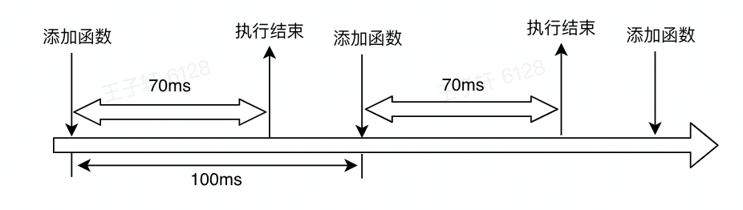

# setTimeout

设置一个定时器，当定时器结束后，将相应的函数添加到任务队列中

当任务队列空闲时执行任务、但无法保证何时执行回调

因此从某种程度上来讲，它并不是完全精确

# setInterval

本质上是每隔一定间隔像任务队列中添加回调函数

而当在添加的过程中任务队列中还存在上次的回调函数没有被执行，本次将不会再添加

setInterval只负责添加回调函数，不负责执行，因此当回调函数执行时间较长时，可能出现如下情况：



我们希望在看到结果后再隔100ms执行下一次函数，而setInterval只能做到每隔100ms开始执行新的函数

因此在大多数时候我们习惯用setTimeout模拟setInterval

# 模拟循环任务

```js
let timer;
function fun1(){
  ...
  timer = setTimeout(fun1,1000)
}
timer = setTimeout(fun1,1000)
```

# 注意

当给setTimeout传入的延迟时间为0时，并不代表回调函数会立即执行。实际上浏览器规定的有一个默认的最短计时时间，对于现代浏览器，这个时间一般为4毫秒

