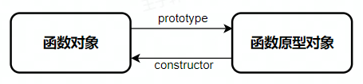
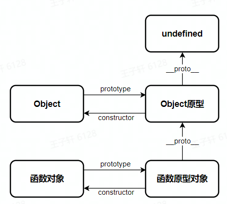

# 原型链

> 箭头函数没有原型链

## prototype

prototype指向函数的原型对象，这是一个显式原型属性，只有函数才拥有该属性。

## constructor

constructor指向原型对象的构造函数。

创建的每个函数都有一个prototype（原型）对象，这个属性是一个指针，指向一个对象。在默认情况下，所有原型对象都会自动获得一个constructor（构造函数）属性，这个属性是一个指向prototype属性所在函数的指针。当调用构造函数创建一个新实例后，该实例的内部将包含一个指针（继承自构造函数的prototype），指向构造函数的原型对象。注意当将构造函数的prototype设置为等于一个以对象字面量形式创建的新对象时，constructor属性不再指向该构造函数。

## \__proto__

每个原型对象串在一起

## 特点

每个函数对象都对应一个原型对象，双方通过如下方式访问



```js
// 可以思考一下的打印结果，它们分别指向谁
function Foo() {}

console.log(Foo.prototype) //{}
console.log(Foo.prototype.constructor) //function Foo(){}
```

构造函数的原型对象的\__proto__指向Object的原型对象



```js
console.log(Foo.__proto__) // function () { [native code] }
console.log(Foo.prototype.__proto__) // {}
console.log(Foo.prototype.__proto__.constructor) //  function Object() { [native code] }
```

当我们创造一个实例时，实例的\__proto__指向构造函数的原型对象


```js
function Foo(){}
let foo = new Foo()
console.log(foo.prototype) //undefined
console.log(foo.constructor) // function Foo(){} 这里具体原因是foo继承了他原型对象__proto__的属性
console.log(foo.__proto__) // {}
console.log(foo.__proto__.constructor)// function Foo(){}
```

带有Function的图


所有函数的\__proto__都指向Function的原型对象

