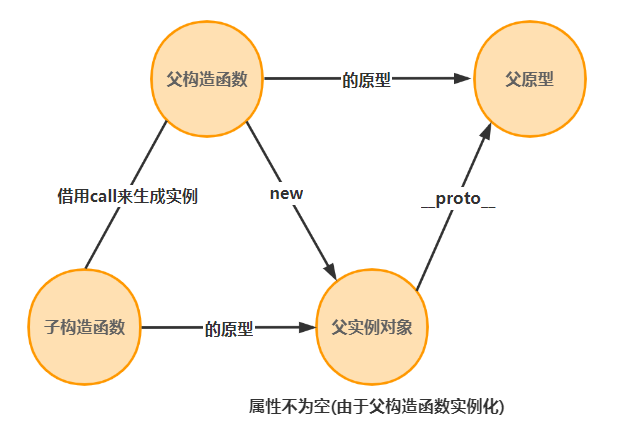
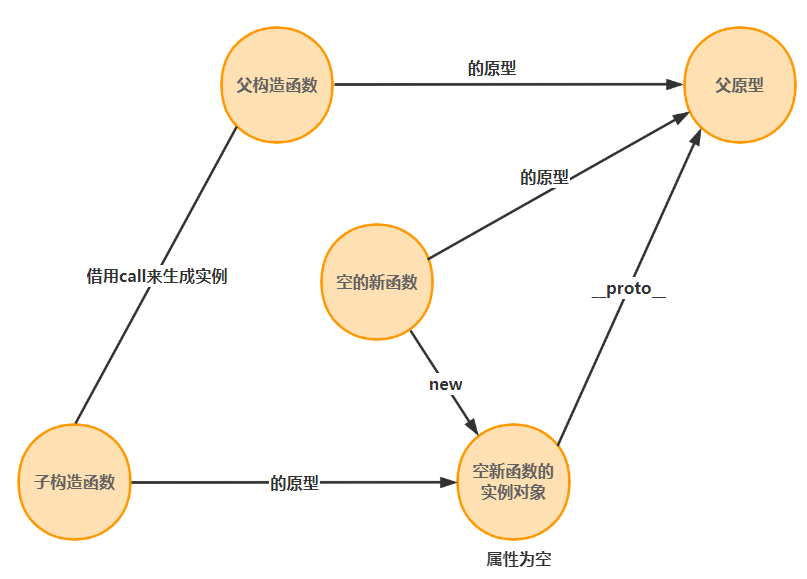

# 继承特点

- 继承的好处
  - a：提高了代码的复用性
  - b：提高了代码的维护性
  - c：让类与类之间产生了关系，是多态的前提
- 继承的弊端
  - 类的耦合性增强了,但是开发的原则：高内聚，低耦合。

# 继承方法

## 1.原型链继承

**实现方式**

将子类的原型链指向父类的对象实例

**实现**

```js
//1.原型链继承
    //实现方式：将子类的原型链指向父类的对象实例
    console.log("原型链继承")
    function Parent(){
        this.name = "parent"
        this.list = ['a']
    }
    Parent.prototype.sayHi = function (){
        console.log('hi')
    }
    function Child(){
    }
    Child.prototype = new Parent();
    let child = new Child()
    console.log(child.name)
    child.sayHi()
    //测试引用属性
    let a = new Child();
    let b = new Child();
    a.list.push('b');
    console.log(b.list===a.list); // true  解释:['a','b']
```

**原理**

子类实例child的\_\_proto\__指向Child的原型链prototype，而Child.prototype指向Parent类的对象实例，该父类对象实例的\_\_proto\_\_指向Parent.prototype,所以Child可继承Parent的构造函数属性、方法和原型链属性、方法

**优点**

可继承构造函数的属性，父类构造函数的属性，父类原型的属性
**缺点**

无法向父类构造函数传参；且所有实例共享父类实例的属性，若父类共有属性为引用类型，一个子类实例更改父类构造函数共有属性时会导致继承的共有属性发生变化；

## 2.构造函数继承

**实现方式**

在子类构造函数中使用call或者apply劫持父类构造函数方法，并传入参数

**实现**

```js
//2.构造函数继承
    //实现方式：在子类构造函数中使用call或者apply劫持父类构造函数方法，并传入参数
    console.log("构造函数继承")
    function Animal(name,age){
        this.name = name
        this.age = age
        this.list = ['a'];
        this.printName = function(){
            console.log(this.name)
        }
    }
    Animal.prototype.sayName=function () {
        console.log(this.name)
    }
    function Dog(name,id){
        Animal.call(this,name,id)
    }
    let dog = new Dog('小刘',10)
    let dog1 = new Dog('小金',8)
    dog.list = ['c']
    console.log(dog.list === dog1.list) //false ['c']!==['a']
    dog.printName()//小刘
    dog.sayName()//Uncaught TypeError: dog.sayName is not a function 可以看出并没有继承父类原型链方法
```

**原理**

使用call或者apply更改子类函数的作用域，使this执行父类构造函数，子类因此可以继承父类共有属性

**优点**

可解决原型链继承的缺点

**缺点**

不可继承父类的原型链方法，构造函数不可复用

## 3.组合继承

**原理**

综合使用构造函数继承和原型链继承

```js
//3.组合继承
    //原理：综合使用构造函数继承和原型链继承
    console.log('组合继承')
    function Dad(name, id){
        this.id = id;
        this.name = name;
        this.list = ['a'];
        this.printName = function(){
            console.log(this.name);
        }
    }
    Dad.prototype.sayName = function(){
        console.log(this.name);
    };
    function Son(name, id){
        Dad.call(this, name, id);
        // Parent.apply(this, arguments);
    }
    Son.prototype = new Dad();
    let son = new Son("jin", "1");
    son.printName(); // jin
    son.sayName() // jin    //可以用父类原型上的方法

    let son1 = new Son();
    let son2 = new Son();
    son1.list.push('b');
    console.log(son1.list === son2.list); // false  ['a']!==['b']

```

**优点**

可继承父类原型上的属性，且可传参；每个新实例引入的构造函数是私有的

**缺点**

会执行两次父类的构造函数，消耗较大内存，子类的构造函数会代替原型上的那个父类构造函数

## 4.原型式继承

**原理**

类似Object.create，用一个函数包装一个对象，然后返回这个函数的调用，这个函数就变成了个可以随意增添属性的实例或对象，结果是将子对象的_\_proto\_\_指向父对象

```js
//4.原型式继承
    let cat = {
        names: ['a']
    }
    function copy(object) {
        function F() {}
        F.prototype = object;
        return new F();
    }
    let cat1 = copy(cat);
    console.log(cat1.__proto__)//cat
    cat.name = ['b']
    console.log(cat1.name)//['b']
```

**缺点**

共享引用类型

## 5.寄生式继承

**原理**

二次封装原型式继承，并拓展

```js
//5.寄生式继承
    function createObject(obj) {
        let o = copy(obj);
        o.getNames = function() {
            console.log(this.names);
            return this.names;
        }
        return o;
    }
```

**优点**

可添加新的属性和方法

## 6.寄生组合式继承

原理：改进组合继承，利用寄生式继承的思想继承原型

```js
function inheritPrototype(subClass, superClass) {
  // 复制一份父类的原型
  var p = copy(superClass.prototype);
  // 修正构造函数
  p.constructor = subClass;
  // 设置子类原型
  subClass.prototype = p;
}
 
function Parent(name, id){
  this.id = id;
  this.name = name;
  this.list = ['a'];
  this.printName = function(){
    console.log(this.name);
  }
}
Parent.prototype.sayName = function(){
  console.log(this.name);
};
function Child(name, id){
  Parent.call(this, name, id);
  // Parent.apply(this, arguments);
}
inheritPrototype(Child, Parent);
```

# 总结

1. 最普通的式原型链继承，顾名思义，就是将子构造函数的原型绑定为父构造函数的实例，因此当实例化一个子类实例时，由于他的原型链中存在夫构造函数的实例，因此会使用父构造函数来实例化，但是这样却没办法向父构造函数传参，且如果有引用类型，两个子类实例将会指向同一个地址。
2. 这时，我们就考虑用构造函数继承的方法，这里具体的做法就是在子类中调用父类构造函数并且通过call改变this指向来实例化对象，这样就可以生成新的实例，但是这样的做法无法使用父构造函数中原型上的方法。
3. 为了解决上面的问题，我们何不先利用构造函数继承的方法来初始化一个实例，再将它的原型指向父构造函数？这就是组合式继承。
4. 当然，如果我们有一个对象实例，想根据它来创建一个新的对象，那么可以采用类似于Object.create的方法，搞一个copy函数，在函数里搞一个原型为obj的新函数，每次调用copy时就返回一个新函数的实例就行。缺点的话还是共享引用类型。
5. 基于上面的想法，我们可以对copy再次封装，再新的函数里初始化一个原型式继承的实例，并允许再上面添加属性和方法，这就是一个寄生式继承
6. 寄生组合的方法可以考虑再寄生的基础上用构造函数继承的方法解决引用类型的问题，即先copy一份父构造函数的原型实例来生成全新的实例对象，然后把这个原型实例子构造函数的


寄生组合是最理想的继承方式，我一开始以为寄生组合和组合一样，其实还是有一点点区别的，寄生组合搞出来的子类的原型对象上没有多余的属性

组合原理图：



寄生组合原理图：



