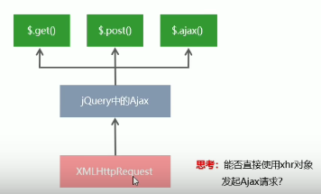
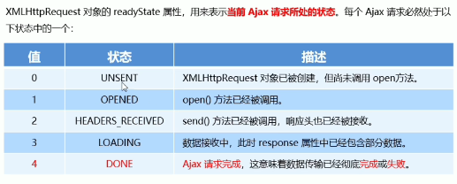
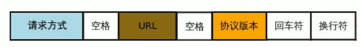
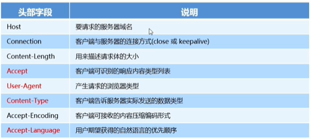
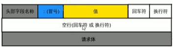
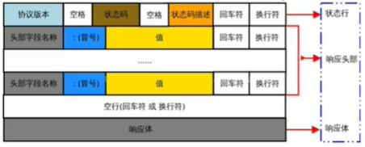
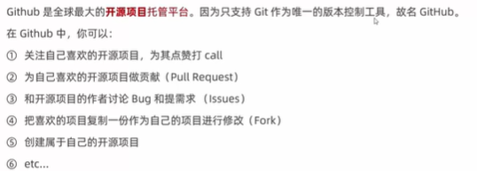

### 资源请求方式

- get：获取资源

  根据URL地址，从服务器获取HTML文件、css文件、js文件、图片文件、数据资源等

- post：发送资源

  例如:登录时向服务器提交的登录信息、注册时向服务器提交的注册信息、添加用户时向服务器提交的用户信息等各种数据提交操作

### Ajax

Ajax 的全称是Asynchronous Javascript And XML(异步JavaScript和XML) .

通俗的理解:在网页中利用XMLHttpRequest对象和服务器进行数据交互的方式，就是Ajax,

### jquery中的Ajax

汶览器中提供的XMLHttpRequest用法比较复杂，所以jQuery对 XMLHttpRequest进行了封装，提供了一系列Ajax相关的函数，极大地降低了Ajax的使用难度。

jQuery 中发起Ajax请求最常用的三个方法如下:

- $.get()

  ```js
  //可以带参数，可以不带
  $.get('http://www....',{id:1},function(res){
  	console.log(res)
  })
  ```

- $.post()

  ```js
  $.post('http....',{bookname:'shinaian',author:'taylor'},function(res){
      console.log(res)
  })
  ```

- $.ajax()

  相比于\$.get()和\$.post()函数，jQuery 中提供的$.ajax()函数，是一个功能比较综合的函数，它允许我们对Ajax 请求进行更详细的配置。

  ```js
  $(function(){
      $('#btnGET').on('click',function(){
          $ajax({
              type:'GET',
              url:'http://....',
              data:{
                  id:1
              },
              success:function(res){
                  console.log(res)
              }
          })
      })
       $('#btnPOST').on('click',function(){
          $ajax({
              type:'POST',
              url:'http://....',
              data:{
                  bookname:'shuihu',
                  author:'shinaian'
              },
              success:function(res){
                  console.log(res)
              }
          })
      })
  })
  ```

  URL地址叫做接口

### 模板引擎

模板引擎，顾名思义，它可以根据程序员指定的模板结构和数据，自动生成一个完整的HTML页面。

优点：

- 减少了字符串的拼接操作
- 使代码结构更清晰
- 使代码更易于阅读与组护

### XMLHttpRequest

XMLHttpRequest(简称xhr)是浏览器提供的Javascript对象，通过它，可以请求服务器上的数据资源。之前所学的jQuery中的Ajax函数，就是基于xhr 对象封装出来的。



#### xhr发起get请求

步骤:

- 创建xhr 对象

- 调用xhr.open()函数

- 调用xhr.send()函数

- 监听xhr.qnreadystatechange事件

  ```js
  var xhr = new XMLHttpRequest()
  xhr.open('GET'，'http:....')
  xhr.send()
  xhr.onreadystatechange = function()	{
  	if(xhr.readyState===4 &&xhr.status ===200){
  		console.log(xhr.responseText)
  	}
  }
  ```

  readyState属性：

  

#### **xhr发起post请求**

步骤：

- 创建xhr对象

- 调用xhr.open()函数

- 设置Content-Type属性(固定写法)

- 调用xhr.send()函数。同时指定要发送的数据

- 监听xhr.onreadystatechange事件

  ```js
  var xhr = new XMLHttpRequest()
  xhr.open('POST'，'http:....')
  xhr.setRequestHeader('Content-Type','application/x-www-form-urlencoded')
  xhr.send('bookname=水浒传&publish=天津出版社')
  xhr.onreadystatechange = function()	{
  	if(xhr.readyState===4 &&xhr.status ===200){
  		console.log(xhr.responseText)
  	}
  }
  ```

### JSON结构

{key:value,key:value....}

英文双引号

**JSON和JS相互转化**

```js
var obj = JSON.parse('{"a":"Hello","b":"world"}')
```

```js
var json = JSON.stringify(obj)
```

### axios

Axios 是专注于网络数据请求的库。

相比于原生的XMLHttpRequest 对象，axios简单易用。

相比于jQuery，axios更加轻量化，只专注于网络数据请求。

```js
var url = 'http://...'
var paramsObj = {name:'z',age:20}
var dataObj = {name:'z',age:20}
axios.get(url,{params:paramsObj}).then(function(res){
    var result = res.data
    console.log(res)
})
axios.post(url,dataObj).then(function(res){
    var result = res.data
    console.log(res)
})
axios({
	method:'GET',
    url:url,
    params:paramsObj,   //注意
}).then(function(res){
    console.log(res.data)
})
axios({
	method:'POST',
    url:url,
    data:dataObj,   //注意
}).then(function(res){
    console.log(res.data)
})
```

### JSONP

现如今，实现跨域数据请求，最主要的两种解决方案，分别是JSONP和CORS.

JSONP:出现的早，兼容性好(兼容低版本IE)。是前端程序员为了解决跨域问题，被迫想出来的一种临时解决方案。缺点是只支持GET请求，不支持POST 请求。

CORS:出现的较晚，它是W3C标准，属于跨域Ajax请求的根本解决方案。支持GET和POST请求。缺点是不兼容章些低版本的浏览器

**jsonp实现原理**

由于浏览器同源策略的限制，网页中无法通过Ajiax请求非同源的接口数据。但是\<script>标签不受浏览器

同源策略的影响。可以通过src属性，请求非同源的js脚本。

### 防抖

防抖策略(debounce)是当事件被触发后，延迟n秒后再执行回调，如果在这n秒内事件又被触发，则更新计时（王者回城）

用广在输入框中连续输入一串字符时，可以通过防抖策略，只在输入完后，才执行查询的请求，这样可以有效减少请求次数，节约请求资源;

```js
// 1.定义延时器id
var timer =null
//2.定义防抖函数
function debounceSearch(kw){
	timer = setTimeout(function(){
		函数
	},500)
}
$('#id').on('keyup',function(){
	//清空延时器
	clearTimerout(timer)
	事件
	//重新调用延时器
	debounceSearch(keywords);
})
```

### 缓存

搞个全局的缓存对象

将输入内容当成键，将渲染的内容当作值进行缓存

每次请求先从缓存里查找

### 节流

可以减少一定时间内事件的触发频率，王者普攻，鼠标连续不断的点击事件

节流阀

```js
var timer = null//预定义节流阀
$documnet.on('mousemove',function(e){
	if(timer){return}
	timer = setTimeout(function(){
		事件
		timer = null;//清空节流阀
	}，16)
})
```

### HTTP

请求信息组成：

**请求行**

由请求方式、URL和HTTP协议版本3个部分组成，他们之间使用空格隔开



**请求头部**

请求头部用来描述客户端的基本信息，从而把客户端相关的信息告知服务器。比如:

- User-Agent用来说明当前是什么类型的浏览器;
- Content-Type用来描述发送到服务器的数据格式; 
- Accept用来描述客户端能够接收什么类型的返回内容;
- Accept-Language用来描述客户端期望接收哪种人类语言的文本内容。



**空行**

最后一个请求头字段的后面是一个空行，通知服务器请求头部至此结束。

请求消息中的空行。用来分隔请求头部与请求体。



**请求体**

只用post请求才有请求体，get请求没有请求体


响应信息组成：

HTTP响应信息由状态行，状态头部，和响应体4个部分组成



状态行由HTTP协议版本、状态码和状态码的描述文本3个部分组成，他们间使用空格隔开;


响应头部：描述服务器的基本信息

空行：分隔头部和响应体

响应体：存放服务器响应给客户端的内容

**请求方法**

get、post、put、delete

查、增、改、删

**状态码**

5种类型：

1. 信息

2. 成功
   - 200\ok\请求成功
   - 201\Created\已创建
3. 重定向
   - 301\永久移动
   - 302\Found\临时移动
   - 303\Not Modified\未修改
4. 客户端错误
   - 400\Bad Request\语义有误，请求参数有误
   - 401\Unauthorized\当前请求需要用户验证
   - 403\Forbidden\服务器已经理解请求，但拒绝执行
   - 404\Not Found\服务器找不到资源
   - 408\Request Timeout\请求超时
5. 服务器错误
   - 500\Internal Server Error\服务器内部错误
   - 501\Not Implemented\服务器不支持该请求方法，无法完成请求，只有GET，HEAD请求方法事要求每个服务器必须支持的
   - 503\Service Unavailable\由于超载或者系统维护，服务器暂时的无法处理客户端的请求

### git

**开源许可协议**

GPL

- 具有传染性的一种开源协议，不允许修改后和衍生的代码作为闭源的商业软件发布
- Linux

MIT

- 是目前限制最少的协议，唯一的条件:在修改后的代码或者发行包中，必须包含原作者的许可信息
- jquery、nodejs



生成SSH Key

- 打开Git Bash
- 粘贴如下的命令，并将`your_email@example.com`替换为注册Github账号时填写的邮箱:
  - ssh-keygen -t rsa -b 4096 -c "`your_email@example.com`"
- 连续敲击3次回车，即可在C:\Users\用户名文件夹\.ssh,目录中生成id_rsa和 id_rsa.pub两个文件

- 使用记事本打开id_rsa.pub文件，复制里面的文本内容
- 在浏览器中登录 Github，点击头像-> Settings -> SSH and GPG Keys -> New SSH key
- 将id_rsa.pub文件中的内容，粘贴到Key对应的文本框中
- 在Title文本框中任意填写一个名称，来标识这个Key 从何而来

