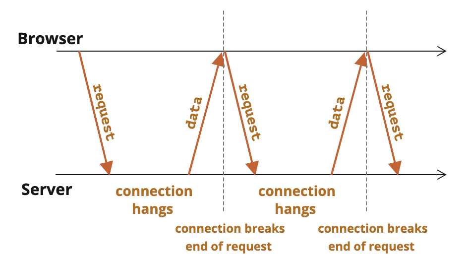

# 长轮询

长轮询（long polling）是与服务器保持就链接的最简单的方式，他很容易实现，在很多场景下页很好用。

其流程为：

1. 请求发送到服务器。
2. 服务器在有消息之前不会关闭连接。
3. 当消息出现时 —— 服务器将对其请求作出响应。
4. 浏览器立即发出一个新的请求。



```js
async function subscribe() {
  let response = await fetch("/subscribe");

  if (response.status == 502) {
    // 状态 502 是连接超时错误，
    // 连接挂起时间过长时可能会发生，
    // 远程服务器或代理会关闭它
    // 让我们重新连接
    await subscribe();
  } else if (response.status != 200) {
    // 一个 error —— 让我们显示它
    showMessage(response.statusText);
    // 一秒后重新连接
    await new Promise(resolve => setTimeout(resolve, 1000));
    await subscribe();
  } else {
    // 获取并显示消息
    let message = await response.text();
    showMessage(message);
    // 再次调用 subscribe() 以获取下一条消息
    await subscribe();
  }
}

subscribe();
```

## 使用场景

在消息很少的情况下，长轮询很有效。

如果消息比较频繁，那么上面描绘的请求-接收（requesting-receiving）消息的图表就会变成锯状状（saw-like）。

每个消息都是一个单独的请求，并带有 header，身份验证开销（authentication overhead）等。

因此，在这种情况下，首选另一种方法，例如：websockets

我所接触过的一个典型的长轮询例子是**扫码登录**

# webSockets

支持服务端主动给客户端发送信息

请求uri(统一资源标识符)用的是ws和wss

> uri用来唯一标识一个资源

## 使用方式

在请求首部中添加如下字段：

connection：upgrade

upgrade：websocket

Sec-WebSocket-Key:

Sec-WebSocket-Version:

响应首部如下：

101 Switch Protocols

connection：upgrade

upgrade：websocket

Sec-WebSocket-Accept:
