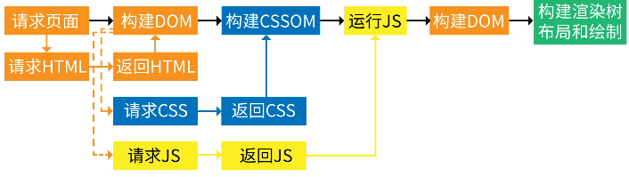

# 字节一面

1. 浏览器存储静态资源，如何判断要存储哪些资源

2. cookie每次向后端发送的内容都一样吗，cookie具体存储在HTTP报文的哪个地方

   [HTTP 报文详解-简易百科 (isolves.com)](https://www.isolves.com/it/wl/zs/2021-12-27/47905.html#:~:text=HTTP 报文是在应用程序之间发送的数据块%2C这些数据块将通过以文本形式的元信息开头，用于 HTTP 协议交互。 请求端 (客户端)的 HTTP,报文叫做请求报文，响应端 (服务器端)的叫做响应报文。 HTTP 报文本身是由多行 (用 CR%2BLF 作换行符)数据构成的字符串文本。)

3. 事件冒泡，blur没办法触发怎么办

4. 精度丢失的原因

   [js精度丢失问题-看这篇文章就够了(通俗易懂) - 知乎 (zhihu.com)](https://zhuanlan.zhihu.com/p/100353781)

5. window.location对象有哪些属性

- hash:""

- host:"www.runoob.com"

- hostname:"www.runoob.com"
- href:"https://www.runoob.com/try/try.php?filename=tryjquery_hide_p"
- port:""

这里做个总结：

​	BOM对象有以下这些：

- window

- Navigator：浏览器相关信息
- screen：屏幕信息
- history：访问过url的历史记录
- location：当前url的信息

6. 同源策略√

7. 如何解决跨域问题√

8. 有没有可能script标签在某种情况下也没办法跨域

9. 手写防抖函数√

10. 判断回文链表√

11. npm时的package.json中的dependencies和devDependencies怎么选择性的安装

    [dependencies和devDependencies的区别？ - 简书 (jianshu.com)](https://www.jianshu.com/p/afb171cac890)

12. position有哪些属性,absolute定位相对于谁说√

​	sticky，static

13. cookie的数据有没有可能被窃取

    [cookie安全性问题 - 简书 (jianshu.com)](https://www.jianshu.com/p/3104e83dea8d)

    [cookie,token验证的区别 - 简书 (jianshu.com)](https://www.jianshu.com/p/c33f5777c2eb)

    [浅谈cookie安全 - 知乎 (zhihu.com)](https://zhuanlan.zhihu.com/p/58666986)

14. 在js中什么时候换行必须写分号

    这个存疑

15. position默认属性

    ​	static标准流

    ​	relative是相对定位，脱离标准流了，但留位置了，用top和left调位置

    ​	absolute脱标并不留位置，top和left相对于第一个脱标的父定位

# 字节二面	

1. [1]==[1]

2. 动画上浮

3. 回流

4. this指向内容

5. 异步执行输出

6. 闭包的实现原理

7. 用户鉴权

8. 界面渲染

   1. 请求html网页，搭建框架结构，但一开始拿到的是已字节为材料的文件，需要转换成字符，浏览器把字符在转换为token(符号标签)，再转化为节点对象，最后连成dom

   2. css通过外链加入到link标签中，碰到link标签向服务器提出请求，获取到css文件，还是上面的步骤转化成节点，再将节点转化为cssom

   3. 根据dom和cssom来生成渲染树，某些dom标签和cssom样式不会被渲染出来，比如meta、link以及display：none

   4. dom可以部分解析，但是cssom不能部分解析

   5. js会阻塞dom的解析

   6. CSS阻塞渲染意味着，在CSSOM完备前，页面将一直处理白屏状态，这就是为什么样式放在`head`中，仅仅是为了更快的解析CSS，保证更快的首次渲染。

      

      

9. 算法题遍历元素

10. 怎么窃取cookie

11. 项目做过哪些防范攻击

# 字节三面

1. 学过哪些核心课程
2. 能说一下数据结构的知识体系吗
3. 图怎么存储
4. 迪杰斯特拉算法实现一下
5. 进程是什么
6. 进程怎么从cpu调出来
7. 数据库的事务了解吗
8. inode了解吗
9. css选择器有哪些
10. 怎么解决css的浏览器兼容问题
11. 防抖是什么
12. 手写防抖
13. 手写xhr
14. 浏览器怎么和后端沟通
15. 状态码
16. 304是什么？http缓存
17. 实习时间

