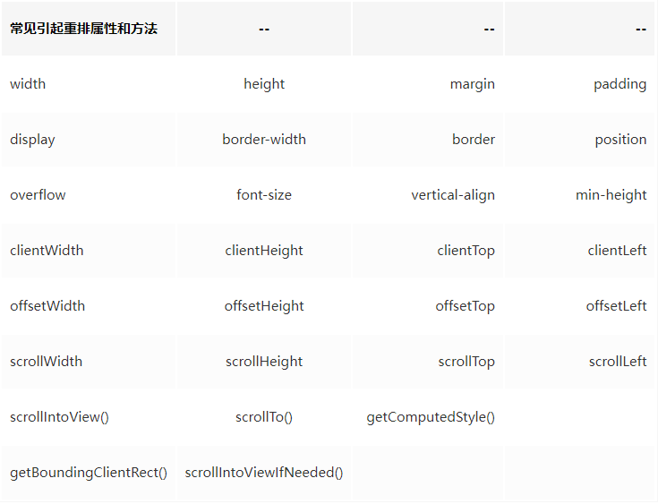
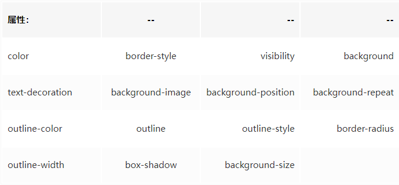

##### 1. object.assign的理解

##### 2. constructor理解

创建的每个函数都有一个prototype（原型）对象，这个属性是一个指针，指向一个对象。在默认情况下，所有原型对象都会自动获得一个constructor（构造函数）属性，这个属性是一个指向prototype属性所在函数的指针。当调用构造函数创建一个新实例后，该实例的内部将包含一个指针（继承自构造函数的prototype），指向构造函数的原型对象。注意当将构造函数的prototype设置为等于一个以对象字面量形式创建的新对象时，constructor属性不再指向该构造函数。

##### 3. iframe

\<iframe>标签是一个内联框架，即用来在当前 HTML 页面中嵌入另一个文档的，且所有主流浏览器都支持iframe标签

基本语法：`<iframe src="文件路径"></iframe>`

​	height可以设置框架显示的高度
​	width可以设置框架显示的宽度
​	name可以定义框架的名称
​	frameborder用来定义是否需要显示边框，取值为1表示需要边框
​	scrolling用来设置框架是否需要滚动条，取值可以是yes,no,auto
​	src用于设置框架的地址，可以使页面地址，也可以是图片地址
​	align用于设置元素对齐方式，取值可以是left，right，top，middle，bottom

优点：

1. iframe能够原封不动的把嵌入的网页展现出来。
2. 如果有多个网页引用iframe，那么你只需要修改iframe的内容，就可以实现调用的每一个页面内容的更改，方便快捷。
3. 网页如果为了统一风格，头部和版本都是一样的，就可以写成一个页面，用iframe来嵌套，可以增加代码的可重用。
4. 如果遇到加载缓慢的第三方内容如图标和广告，这些问题可以由iframe来解决。

缺点：

1. iframe会阻塞主页面的onload事件；
2. iframe和主页面共享连接池，而浏览器对相同域的连接有限制，所以会影响页面的并行加载。会产生很多页面，不容易管理。
3. iframe框架结构有时会让人感到迷惑，如果框架个数多的话，可能会出现上下、左右滚动条，会分散访问者的注意力，用户体验度差。
4. 代码复杂，无法被一些搜索引擎索引到，这一点很关键，现在的搜索引擎爬虫还不能很好的处理iframe中的内容，所以使用iframe会不利于搜索引擎优化（SEO）。
5. 很多的移动设备无法完全显示框架，设备兼容性差。
6. iframe框架页面会增加服务器的http请求，对于大型网站是不可取的。

##### 4. arguments

- 类数组数据

- Javascrip中每个函数都会有一个Arguments对象实例arguments，引用着函数的实参。它是寄生在js函数当中的，不能显式创建，arguments对象只有函数开始时才可用
- 有了arguments这个对象之后，我们可以不用给函数预先设定形参了，可以动态地通过arguments为函数加入参数

##### 5. instanceof手撕

```js
function _instanceof(obj1,obj2){
	let proto = obj1.__proto
	let prototype = obj2.prototype
	while(true){
		if(proto ===null)
            return false;
        if(prototype === proto)
            return true
        proto = proto.__proto__
	}
}
```

##### 6. 数组去重

1. es6：set

2. 双重遍历+splice

   双层循环，外层循环元素，内层循环时比较值。值相同时，则删去这个值。

3. indexOf去重

   新建一个空的结果数组，for 循环原数组，判断结果数组是否存在当前元素，如果有相同的值则跳过，不相同则push进数组。

4. 排序

   利用sort()排序方法，然后根据排序后的结果进行遍历及相邻元素比对。

##### 7. 类数组转换为数组

转换方法

- 使用Array.from()
- Object.values()
- 使用Array.prototype.slice.call()
- 使用Array.prototype.forEach()进行属性遍历并组成新的数组

转换须知

- 转换后的数组长度由length属性决定。索引不连续时转换结果是连续的，会自动补位。

##### 8. 手写发布订阅

##### 9. weakSet和WeakMap

- weakSet
  - 成员都是对象（引用）；
  - 成员都是弱引用，随时可以消失（不计入垃圾回收机制）。可以用来保存 DOM 节点，不容易造成内存泄露；
  - 不能遍历，方法有add、delete、has；

- weakMap
  - 只接收对象为键名（null 除外），不接受其他类型的值作为键名；
  - 键名指向的对象，不计入垃圾回收机制；
  - 不能遍历，方法同get、set、has、delete；

##### 10. 内存泄漏的情况

1. 意外的全局变量；

2. 闭包；

3. 未被清空的定时器；

4. 未被销毁的事件监听；

5. DOM 引用；

6. 循环引用

7. 自动类型装箱转换

   ```js
   var s="hhhhh";
   alert(s.length);
   ```

   "hhhhh"已经泄露了，关键问题出在s.length上，在js类型中，String类型并非对象，但是可以可以使用（.）运算符，因为js的默认类型转换机制，允许js在遇到（.）运算符时，自动将string类型转换为Object中对应的String对象。该临时转换的对象100%会泄露。

##### 11.跨域解决方案

- cors跨域资源共享

  是一种基于HTTP头的机制，该机制通过允许服务器标示除了它自己以外的其它origin（域，协议和端口），这样浏览器可以访问加载这些资源。跨源资源共享还通过一种机制来检查服务器是否会允许要发送的真实请求，该机制通过浏览器发起一个到服务器托管的跨源资源的"预检"请求。在预检中，浏览器发送的头中标示有HTTP方法和真实请求中会用到的头。

  在 node 中的设置响应头 Access-Control-Allow-Origin 为 指定同源策略的地（请求接口的站点）或者干脆来者不拒 设置为 *，同源策略默认地址是网页的本身。**只要浏览器检测到响应头带上了CORS，并且允许的源包括了本网站，那么就不会拦截请求响应**。

- jsonp

  JSONP的原型：**创建一个回调函数，然后在远程服务上调用这个函数并且将JSON 数据形式作为参数传递，完成回调。**

- webSocket

  - 我们已经有了 HTTP 协议，为什么还需要另一个协议？

    HTTP 协议有一个缺陷：通信只能由客户端发起

    这种单向请求的特点，注定了如果服务器有连续的状态变化，客户端要获知就非常麻烦。我们只能使用"轮询"：每隔一段时候，就发出一个询问，了解服务器有没有新的信息。最典型的场景就是聊天室。

  - 服务器可以主动向客户端推送信息，客户端也可以主动向服务器发送信息，是真正的双向平等对话，属于服务器推送技术的一种。

  - 其他特点包括：

    （1）建立在 **TCP 协议**之上，服务器端的实现比较容易。

    （2）与 HTTP 协议有着良好的兼容性。默认端口也是80和443，并且握手阶段采用 HTTP 协议，因此握手时不容易屏蔽，能通过各种 HTTP 代理服务器。

    （3）数据格式比较轻量，性能开销小，通信高效。

    （4）可以发送文本，也可以发送**二进制数据**。

    （5）没有**同源限制**，客户端可以与任意服务器通信。

    （6）协议标识符是`ws`（如果加密，则为`wss`），服务器网址就是 URL。

    

    ```js
        var ws = new WebSocket('ws://echo.websocket.org/echo');
        console.log('ws连接状态：' + ws.readyState);
        //监听是否连接成功
        ws.onopen = function () {
            console.log('ws连接状态：' + ws.readyState);
            //连接成功则发送一个数据
            ws.send('test1');
        }
        //接听服务器发回的信息并处理展示
        ws.onmessage = function (data) {
            console.log('接收到来自服务器的消息：');
            console.log(data);
            //完成通信后关闭WebSocket连接
            ws.close();
        }
        //监听连接关闭事件
        ws.onclose = function () {
            //监听整个过程中websocket的状态
            console.log('ws连接状态：' + ws.readyState);
        }
        //监听并处理error事件
        ws.onerror = function (error) {
            console.log(error);
        }
    ```

    

  - Mqtt:和WebSocket类似，不过比他复杂很多，要发布消息和订阅消息

##### 12.cookie，localstorage, sessionStorage的区别

1.webStorage

- localStorage

  localStorage生命周期是永久，这意味着除非用户显示在浏览器提供的UI上清除localStorage信息，否则这些信息将永远存在。存放数据大小为一般为5MB,而且它仅在客户端（即浏览器）中保存，不参与和服务器的通信

  

- sessionStorage

  sessionStorage仅在当前会话下有效，关闭页面或浏览器后被清除。存放数据大小为一般为5MB,而且它仅在客户端（即浏览器）中保存，不参与和服务器的通信。源生接口可以接受，亦可再次封装来对Object和Array有更好的支持

- 区别：

  相同浏览器的不同页面间可以共享相同的 localStorage（页面属于相同域名和端口）,不同页面或标签页间无法共享sessionStorage的信息

  localStorage和sessionStorage只能存储字符串类型，对于复杂的对象可以使用ECMAScript提供的JSON对象的stringify和parse来处理

  localStoragese：常用于长期登录（+判断用户是否已登录），适合长期保存在本地的数据，而sessionStorage：敏感账号一次性登录

- 特点：

  - 安全性：WebStorage不会随着HTTP header发送到服务器端，所以安全性相对于cookie来说比较高一些，不会担心截获，但是仍然存在伪造问题

  - WebStorage提供了一些方法，数据操作比cookie方便
    setItem (key, value) —— 保存数据，以键值对的方式储存信息。
    getItem (key) —— 获取数据，将键值传入，即可获取到对应的value值。
    removeItem (key) —— 删除单个数据，根据键值移除对应的信息。
    clear () —— 删除所有的数据
    key (index) —— 获取某个索引的key
  - 存储空间更大：cookie为4KB，而WebStorage是5MB

- cookie

  失效时间:一般默认是浏览器关闭失效,可以自己设置失效时间

  cookie的作用:主要用于保存登录信息

  生命期为只在设置的cookie过期时间之前一直有效，即使窗口或浏览器关闭。 存放数据大小为4K左右 。有个数限制（各浏览器不同），一般不能超过20个。与服务器端通信：每次都会携带在HTTP头中，如果使用cookie保存过多数据会带来性能问题

  通过良好的编程，控制保存在cookie中的session对象的大小
  通过加密和安全传输技术，减少cookie被破解的可能性
  只有在cookie中存放不敏感的数据，即使被盗取也不会有很大的损失
  控制cookie的生命期，使之不会永远有效。这样的话偷盗者很可能拿到的就 是一个过期的cookie

- session

  1）cookie数据存放在客户的浏览器上，session数据放在服务器上
  2）cookie不是很安全，别人可以分析存放在本地的cookie并进行cookie欺骗，考虑到安全应当使用session
  3）session会在一定时间内保存在服务器上，当访问增多，会比较占用你服务器的性能，考虑到减轻服务器性能方面，应当使用cookie
  4）单个cookie保存的数*据不能超过4K，很多浏览器都限制一个站点最多保存20个cookie
  5）建议将登录信息等重要信息存放为session，其他信息如果需要保留，可以放在cookie中
  6）session保存在服务器，客户端不知道其中的信心；cookie保存在客户端，服务器能够知道其中的信息
  7）session中保存的是对象，cookie中保存的是字符串
  8）session不能区分路径，同一个用户在访问一个网站期间，所有的session在任何一个地方都可以访问到，而cookie中如果设置了路径参数，那么同一个网站中不同路径下的cookie互相是访问不到的

  服务器和浏览器之间仅需传递session id即可，服务器根据session id找到对应用户的session对象，会话数据仅在一段时间内有效，这个时间就是server端设置的session有效期

- cookie中的session-id给服务器，服务器在里面找到对应的数据

##### 13.flex布局

让所有弹性盒模型对象的子元素都有相同的长度，且忽略它们内部的内容：

```css
#main div { flex:1; }
```

属性：

- *flex-basis*

  长度，合法值："auto"、"inherit" 或一个后跟 "%"、"px"、"em" 或任何其他长度单位的数字。

- *flex-grow*

  flex-grow 属性用于设置或检索弹性盒子的扩展比率。

- *flex-shrink*

  flex-shrink 属性指定了 flex 元素的收缩规则。flex 元素仅在默认宽度之和大于容器的时候才会发生收缩，其收缩的大小是依据 flex-shrink 的值。

- *flex-direction*

  排列方向：row水平、row-reverse反向水平、column垂直显示、column-reverse反向垂直

- flex-wrap

  必要时换行

  ###### 三栏布局

  1. flex

     ```html
     <div class="Grid">
        <div class="Grid-cell">1/3</div>
        <div class="Grid-cell">1/3</div>
        <div class="Grid-cell">1/3</div>
      </div>
     <style>
     .Grid {
       display: flex;
     }
      
     .Grid-cell {
       flex: 1;
       background: #eee;
       margin: 10px;
     }
     </style>
     ```

   2. float

      ```html
      <div class="left">1/3</div>
      <div class="right">1/3</div>
      <div class="main">1/3</div>
      <style>
      body,html{
      height: 100%;
      padding:0;
      margin: 0;
      }
      /*左边栏左浮动*/
      .left{
      float:left;
      height:100%;
      width:100px;
      background:#ff69b4;
      }
      /*中间栏自适应*/
      .main{
      height:100%;
      margin:0 200px 0 100px;
      background: #659;
      }
      /*右边栏右浮动*/
      .right{
      float:right;
      height:100%;
      width:200px;
      background:#ff69b4;
      }
      </style>
      ```

  3. absolute

     ```html
     
     <div class="left">1/3</div>
     <div class="right">1/3</div>
     <div class="main">1/3</div>
     <style>
         body,html{
             height: 100%;
             padding: 0;
             margin: 0;
             overflow: hidden;
         }
         /*左右进行绝对定位*/
         .left,.right{
             position: absolute;
             height:100%;
             top: 0;
             background: #ff69b4;
         }
         .left{
             left: 0;
             width: 100px;
         }
         .right{
             right: 0;
             width: 200px;
         }
         /*中间用margin空出左右元素所占的空间*/
         .main{
     
             height:100%;
             margin: 0 100px 200px 0;
             background: #659;
         }
     </style>
     ```

  4. table

     ```html
     <div class="container">
         <div class="left">left</div>
         <div class="main">center</div>
         <div class="right">right</div>
     </div>
     <style>
         .container{
             display: table;
             width:100%;
             height: 100%;
         }
         .container>div{
             display: table-cell;
         }
         .left{
             width: 100px;
             background: red;
         }
         .main{
             background: blue;
         }
         .right{
             width: 200px;
             background: red;
         }
     
     </style>
     ```

     

##### 14.用户鉴权

- Cookie Session

  1、使用浏览器访问服务端页面；

  2、服务端收到该客户端第一次请求后，会创建一个 session ，生产一个唯一 sessionId ；

  3、同时在响应请求中设置 cookie ，属性名为sessionid；

  4、客户端收到后会保存 sessionid ，再次请求时，会在 header 中设置，服务端可从请求头中获取；

  5、服务端验证获取的 sessionId 是否存在，即可验证是否是同一用户；

  缺点：

  当浏览器禁用 cookie 后，基于 cookie 的 session 将不能正常工作，每次都将创建一个新的 session ，可通过url重写传递 sessionid。

  当用户量太多的时候，比方微博这种，一个系统保存上亿的 seessionId， 这么多用了系统均衡，也是很容易出现单点失败的可能性，那个负责 session 的机器挂了就全惨了

- JWT，Token 认证

  - 用户输入用户名和密码，发送给服务器。

  - 服务器验证用户名和密码，正确的话就返回一个签名过的Token（Token 可以认为就是个长长的字符串），浏览器客户端拿到这个Token。

  - 后续每次请求中，浏览器会把 Token 作为 HTTP Header 发送给服务器，服务器验证签名是否有效，如果有效那么认证就成功，可以返回客户端需要的数据。 特点： 这种方式的特点就是客户端的Token中自己保留有大量信息，服务器没有存储这些信息。

  

  - JWT

    JWT是 Json Web Token 缩写。它将用户信息加密到Token里，服务器不保存任何用户信息。服务器通过使用保存的密钥验证Token的正确性，只要正确即通过验证。

    JWT包含三个部分： Header头部，Payload负载和Signature签名。由三部分生成Token，三部分之间用“.”号做分割

    大致流程

    - 在头部信息中声明加密算法和常量，然后把Header使用Json转化为字符串
    - 在负载中声明用户信息，同时还有一些其他的内容，再次使用Json把在和部分进行转化，转化为字符串
    - 使用在Header中声明的加密算法来进行加密，把第一部分字符串和第二部分的字符串结合和每个项目随机生成的Secret字符串进行加密，生成新的字符串，此字符串是独一无二的
    - 解密的时候，只要客户端带着JWT来发起请求，服务端就直接使用Secret进行解密，解签证解出第一部分和第二部分，然后比对第二部分的信息和客户端穿过来的信息是否一致。如果一致验证成功，否则验证失败。

  - 总结

    JWT 适合做一次行验证，比方邮箱激活账号，Token 适合做 API 请求认证
    我们移动端主要还是用的是 API 请求认证。

- OAuth2 认证

  OAuth（开放授权）是一个开放标准，允许用户让第三方应用访问该用户在某一网站上存储的私密的资源（如照片，视频，联系人列表），而无需将用户名和密码提供给第三方应用。

  - 先去第三方注册，获取类似 client_id，client_secret， redirect_uri 东东
  - 用户在页面点击登录后，后端会拿着上面这三样东西，拼接一个地址，跳转到第三方
  - 第三方校验 client_id，client_secret，redirect_uri
  - 通过后，第三方回调 redirect_uri，在url后面带上 token
  - 拿着 token 和client_secret，去第三方获取 acccessToken，
  - 然后系统就可以拿着 acccessToken 去第三方获取用户信息，然后就可以关联了

  我们的系统不需要一个维护用户登录的的数据库表，系统多起来了，就非常方便，大家都去一个地方获取用户信息，后面衍生的 网关的概念，是把用户的权限都管理起来了

- SSO 单点登录

  单点登录 英文全称是 Single Sign On，简称就是 SSO，解释就是说：在多个应用系统中，只需要登录一次，就可以访问其他相互信任的应用系统，是为了解决 内部系统 一次登录 到处使用，共享 session 的问题

  - SSO 是解决 只需要登录一次，就可以访问其他相互信任的应用系统
  - SSO 适合公司内部多系统

- 扫码认证

  网页端的二维码 本质是一个 url，比方是 https:/xxx?uuid=xxxxx, 这个uuid是生成的当前pc的唯一标示，

  然后会定时请求后端的API，假设这个请求叫 A 请求，根据返回的状态来做下一步动作

  当手机扫码后,会带上这个uuid和用户信息，发送一个请求给后端，后端拿到这个 uuid，就知道用户已经登录来，然后上面的 A 接口

  就会返回一个已经登录的状态，同时返回用户信息，这样 二维码页面会跳转到用户列表页，整个扫码登录流程完成。

##### 15.原型链和作用域链

原型链
 当访问一个对象的属性时， 会在这个对象的属性上去找，如果没有找到就会去这个对象的--proto--  上去找，即构造函数prototype 上找，如果没有会一直在--proto-- 上找，直到最顶层，不到即为undefined 。这样一层一层地向上，就彷佛一条链子串起来，所以就叫原型链。

作用域链
变量取值会到创建这个变量的函数的作用域中取值，如果找不到，就会向上级作用域去查，直到查到全局作用域，这么一个查找过程形成的链条就叫做作用域链。

##### 16.resquest与response解读

[(44条消息) request和response的区别!!!_经理，天台风好大的博客-CSDN博客_request和response](https://blog.csdn.net/qq1808814025/article/details/106199159)

##### 17.使用原生js写一个http请求

xhr发起请求

步骤:

- 创建xhr 对象

- 调用xhr.open()函数

- 调用xhr.send()函数

- 监听xhr.qnreadystatechange事件

- 发post请求的话需要设置Content-Type属性，并且在send函数中指定要发送的数据

  ```js
  var xhr = new XMLHttpRequest()
  xhr.open('GET','URL')
  xhr.send()
  xhr.onreadystatechange = function(){
  	if(xhr.readyState===4&&xhr.status===200)
  		console.log(xhr.responseText)
  }
  ```

  ```js
  xhr.open('POST'，'http:....')
  xhr.setRequestHeader('Content-Type','application/x-www-form-urlencoded')
  xhr.send('bookname=水浒传&publish=天津出版社')
  ```

##### 18.js 箭头函数

**箭头函数表达式**的语法比函数表达式更简洁，并且没有自己的this，arguments，super或new.target。箭头函数表达式更适用于那些本来需要匿名函数的地方，并且它不能用作构造函数。

##### 19.js对象的寄生组合继承

```js
//先搞个copy函数,用来返回一个全新的实例对象，这个对象的prototype是一个全新的函数，只不过这个函数的prototype指向原函数的prototype
function copy(target){
	function fn(){}
    fn.prototype = target
    return new fn()
}

//然后将
function createNew(Child,Parent){
    let p = copy(parent.prototype)
    p.constructor = child
    child.prototype = p
}

function Parent(){}

function Child(){
    Parent.apply(this,arguments)
}
```

##### 20.vue双向绑定

Object.definProperty

**我们已经知道实现数据的双向绑定，首先要对数据进行劫持监听，所以我们需要设置一个监听器Observer，用来监听所有属性。如果属性发上变化了，就需要告诉订阅者Watcher看是否需要更新。**

利用Object.defineProperty劫持对象的访问器,在属性值发生变化时我们可以获取变化,从而进行进一步操作。

响应式系统简述:

- 任何一个 Vue Component 都有一个与之对应的 Watcher 实例。
- Vue 的 data 上的属性会被添加 getter 和 setter 属性。
- 当 Vue Component render 函数被执行的时候, data 上会被 触碰(touch), 即被读, getter 方法会被调用, 此时 Vue 会去记录此 Vue component 所依赖的所有 data。(这一过程被称为依赖收集)
- data 被改动时（主要是用户操作）, 即被写, setter 方法会被调用, 此时 Vue 会去通知所有依赖于此 data 的组件去调用他们的 render 函数进行更新。

其实这里只实现了单项数据绑定，即从数据向视图的绑定，想要实现双向，只需要捕捉元素的事件即可，例如oninput事件

##### 21. 9宫格

```html
<style>
    .block {
        padding-top: 30%;
        margin-top: 3%;
        /*border-radius: 10%;*/
        background-color: orange;
        padding-left: 30%;
    }
    .container-flex2  {
        display: flex;
        flex-wrap: wrap;
        justify-content: space-around;
    }
</style>
<body>
<div class="container-flex2">
    <div class="block"></div>
    <div class="block"></div>
    <div class="block"></div>
    <div class="block"></div>
    <div class="block"></div>
    <div class="block"></div>
    <div class="block"></div>
    <div class="block"></div>
    <div class="block"></div>
</div>
</body>
```

##### 22.实现等边三角形

```html
<style>
    .triangle{
        width: 0px;
        height: 0px;
        border-left: 10px solid transparent;
        border-right: 10px solid transparent;;
        border-top: 17.32px solid transparent;
        border-bottom: 17.32px solid #A962CE;
    }
</style>
<div class="triangle"></div>
```

##### 23.路由模式

1.hash模式

www.test.com/#/就是 Hash URL，当#后面的哈希值发生变化时，可以通过hashchange事件来监听到 URL 的变化，从而进行跳转页面，并且无论哈希值如何变化，服务端接收到的 URL 请求永远是www.test.com。Hash 模式相对来说更简单，并且兼容性也更好。每一次改变#后的部分，都会在浏览器的访问历史中增加一个记录，使用"后退"按钮，就可以回到上一个位置。

2.history模式

History模式是HTML5 新推出的功能，主要使用history.pushState和history.replaceState改变 URL。通过 History 模式改变 URL 同样不会引起页面的刷新，只会更新浏览器的历史记录。当用户做出浏览器动作时，比如点击后退按钮时会触发popState事件。

两种路由模式的区别

1.Hash 模式只可以更改 # 后面的内容，History 模式可以通过 API 设置任意的同源 URL

2.History 模式可以通过 API 添加任意类型的数据到历史记录中，Hash 模式只能更改哈希值，也就是字符串

3.Hash模式下， 多次刷新为通一个页面的话，记录只添加一次

4.Hash 模式无需后端配置，并且兼容性好。History 模式在用户手动输入地址或者刷新页面的时候会发起 URL 请求，后端需要配置 index.html 页面用于匹配不到静态资源的时候

##### 24.首屏优化

减少首屏渲染时间的方法有很多，总的来讲可以分成两大部分 ：**资源加载优化**和**页面渲染优化**


##### 25.vue的data属性

引用类型会共享

- 根实例对象`data`可以是对象也可以是函数（根实例是单例），不会产生数据污染情况

- 组件实例对象`data`必须为函数，目的是为了防止多个组件实例对象之间共用一个`data`，产生数据污染。采用函数的形式，`initData`时会将其作为工厂函数都会返回全新`data`对象

##### 26.nextTick

```js
{{num}}
for(let i=0; i<100000; i++){
    num = i
}
```

如果没有 `nextTick` 更新机制，那么 `num` 每次更新值都会触发视图更新(上面这段代码也就是会更新10万次视图)，有了`nextTick`机制，只需要更新一次，所以`nextTick`本质是一种优化策略

##### 27.虚拟dom

实际上它只是一层对真实`DOM`的抽象，以`JavaScript` 对象 (`VNode` 节点) 作为基础的树，用对象的属性来描述节点，最终可以通过一系列操作使这棵树映射到真实环境上

在`Javascript`对象中，虚拟`DOM` 表现为一个 `Object`对象。并且最少包含标签名 (`tag`)、属性 (`attrs`) 和子元素对象 (`children`) 三个属性，不同框架对这三个属性的名命可能会有差别

创建虚拟`DOM`就是为了更好将虚拟的节点渲染到页面视图中，所以虚拟`DOM`对象的节点与真实`DOM`的属性一一照应

通过`VNode`，`vue`可以对这颗抽象树进行创建节点,删除节点以及修改节点的操作， 经过`diff`算法得出一些需要修改的最小单位,再更新视图，减少了`dom`操作，提高了性能

why？

`DOM`是很慢的，其元素非常庞大，页面的性能问题，大部分都是由`DOM`操作引起的

真实的`DOM`节点，哪怕一个最简单的`div`也包含着很多属性，可以打印出来直观感受一下

你用传统的原生`api`或`jQuery`去操作`DOM`时，浏览器会从构建`DOM`树开始从头到尾执行一遍流程

当你在一次操作时，需要更新10个`DOM`节点，浏览器没这么智能，收到第一个更新`DOM`请求后，并不知道后续还有9次更新操作，因此会马上执行流程，最终执行10次流程

而通过`VNode`，同样更新10个`DOM`节点，虚拟`DOM`不会立即操作`DOM`，而是将这10次更新的`diff`内容保存到本地的一个`js`对象中，最终将这个`js`对象一次性`attach`到`DOM`树上，避免大量的无谓计算

> 很多人认为虚拟 DOM 最大的优势是 diff 算法，减少 JavaScript 操作真实 DOM 的带来的性能消耗。虽然这一个虚拟 DOM 带来的一个优势，但并不是全部。虚拟 DOM 最大的优势在于抽象了原本的渲染过程，实现了跨平台的能力，而不仅仅局限于浏览器的 DOM，可以是安卓和 IOS 的原生组件，可以是近期很火热的小程序，也可以是各种GUI

**小结**

`createElement` 创建 `VNode` 的过程，每个 `VNode` 有 `children`，`children` 每个元素也是一个`VNode`，这样就形成了一个虚拟树结构，用于描述真实的`DOM`树结构

##### 28.浅拷贝和深拷贝

- 浅拷贝：

  ```js
  function shallowClone(obj) {
      const newObj = {};
      for(let prop in obj) {
          if(obj.hasOwnProperty(prop)){
              newObj[prop] = obj[prop];
          }
      }
      return newObj;
  }
  ```

  在`JavaScript`中，存在浅拷贝的现象有：

  - Object.assign

    ```js
    var obj = {
        age: 18,
        nature: ['smart', 'good'],
        names: {
            name1: 'fx',
            name2: 'xka'
        },
        love: function () {
            console.log('fx is a great girl')
        }
    }
    var newObj = Object.assign({}, Obj);
    ```

  - Array.prototype.slice()

    ```js
    const fxArr = ["One", "Two", "Three"]
    const fxArrs = fxArr.slice(0)
    fxArrs[1] = "love";
    console.log(fxArr) // ["One", "Two", "Three"]
    console.log(fxArrs) // ["One", "love", "Three"]
    ```

  - Array.prototype.concat()

    ```js
    const fxArr = ["One", "Two", "Three"]
    const fxArrs = fxArr.concat()
    fxArrs[1] = "love";
    console.log(fxArr) // ["One", "Two", "Three"]
    console.log(fxArrs) // ["One", "love", "Three"]
    ```

  - 使用拓展运算符实现的复制

    ```js
    const fxArr = ["One", "Two", "Three"]
    const fxArrs = [...fxArr]
    fxArrs[1] = "love";
    console.log(fxArr) // ["One", "Two", "Three"]
    console.log(fxArrs) // ["One", "love", "Three"]
    ```

- 深拷贝：
  - _.cloneDeep()

    ```js
    const _ = require('lodash');
    const obj1 = {
        a: 1,
        b: { f: { g: 1 } },
        c: [1, 2, 3]
    };
    const obj2 = _.cloneDeep(obj1);
    console.log(obj1.b.f === obj2.b.f);// false
    ```

  - jQuery.extend()

    ```js
    const $ = require('jquery');
    const obj1 = {
        a: 1,
        b: { f: { g: 1 } },
        c: [1, 2, 3]
    };
    const obj2 = $.extend(true, {}, obj1);
    console.log(obj1.b.f === obj2.b.f); // false
    ```

  - JSON.stringify()

    ```js
    const obj2=JSON.parse(JSON.stringify(obj1));
    ```

    但是这种方式存在弊端，会忽略`undefined`、`symbol`和`函数`

    ```js
    const obj = {
        name: 'A',
        name1: undefined,
        name3: function() {},
        name4:  Symbol('A')
    }
    const obj2 = JSON.parse(JSON.stringify(obj));
    console.log(obj2); // {name: "A"}
    ```

  - 手写循环递归

    ```js
    function deepClone(obj,hash = new WeakMap()){
        if(obj === null)return obj;
        if(obj instanceof Date) return new Date(obj)
        if(obj instanceof RegExp) return new RegExp
        if(typeof obj !== "object") return obj;
        if(hash.get(obj)) return hash.get(obj)
        let cloneObj = new obj.constructor();
        hash.set(obj,cloneObj);
        for(let key in obj){
            if(obj.hasOwnProperty(key)){
                cloneObj[key] = deepClone(obj[key],hash)
            }
            return cloneObj;
        }
    }
    ```


##### 29.url发送到服务端过程

- 域名解析

  先查浏览器缓存，没有再查寻系统缓存，即本地host文件，再没有向ISP的DNS服务器请求解析域名得到IP地址的映射关系

- TCP连接

  通过socket发送HTTP请求；发送端从应用层往链路层，接收端从链路层往应用层。

- 浏览器发送http请求

- 服务器处理请求

- 浏览器解析渲染页面

  1）浏览器显示HTML
  2）浏览器向服务器发送请求获取嵌入在HTML中的对象
  3）浏览器发送异步（AJAX）请求

- 关闭TCP

  当数据完成请求到返回的过程之后，根据Connection的Keep-Alive属性可以选择是否断开TCP连接。

  TCP的断开与连接不一样，断开可以分为主动关闭和被动关闭，需要经过4次握手。

#####   30.重绘和重排的区别，什么情况导致重绘或重排

 页面生成的过程：

- html被html解析器解析成dom树

- css被css解析器解析成cssom树

- 结合dom和CSSOM 树，生成一棵渲染树(Render Tree)，这一过程称为 Attachment

- 生成布局(flow)，浏览器在屏幕上“画”出渲染树中的所有节点

- 将布局绘制(paint)在屏幕上，显示出整个页面

  

 **网页生成的时候，至少会渲染一次。在用户访问的过程中，还会不断触发重排(reflow)和重绘(repaint)**，不管页面发生了重绘还是重排，都会影响性能，最可怕的是重排，会使我们付出高额的性能代价，所以我们应尽量避免。





优化：

​		局部重排，absolute和fixed脱离文档流的影响较小，读写分离

##### 31.dom如何添加元素的 

createElement()方法能够根据参数指定的标签名称创建一个新元素，并返回新建元素的引用，用法如下

var element=document.createElement("tagName");

其中element表示新建元素的引用，createElement()是document对象的一个方法，该方法只有一个参数，用来指定创建元素的标签名称。

使用createElement()方法创建的新元素不会被自动添加到文档中，因为新元素还没有nodeParent属性，仅在javascript上下文中有效，如果要把这个元素添加到文档中，还需要使用appendChild()、insertBefore()或replaceChild()方法实现。

##### 32.你能想到的this场景有哪些 

①普通函数的调用，this指向的是window
②对象方法的调用，this指的是该对象，且是最近的对象
③构造函数的调用，this指的是实例化的新对象
④apply和call调用，this指向参数中的对象
⑤匿名函数的调用，this指向的是全局对象window
⑥定时器中的调用，this指向的是全局变量window 

##### 33.向UI中插入100个元素如何实现 

1.innerHTML使用字符串拼接创建元素时效率低于createElement()
2.当innerHTML使用数组创建元素效率高于createElement()

```html
    <ul >
        <li class="ul"></li>
        <li></li>
    </ul>
    <script>
        var ul=document.querySelector('.ul')
        //innerHTML使用拼接字符串的方式创建新的元素
        for(var i=0;i<100;i++){
            ul.innerHTML+='<a href="#">百度</a>'
        }
        //innerHTML使用数组的方式创建新的元素
        var arr=[];
        for( var i=0;i<100;i++) {
             arr.push('<a href="#">百度</a>');
             ul.innerHTML=arr.join('')
        }
        //createElement创建新元素
        for(var i=0;i<100;i++){
            var a=document.createElement('a');
            ul.appendChild(a)
        }
    </script>

```

##### 34.join方法

```js
const elements = ['Fire', 'Air', 'Water'];

console.log(elements.join());
// expected output: "Fire,Air,Water"

console.log(elements.join(''));
// expected output: "FireAirWater"

console.log(elements.join('-'));
// expected output: "Fire-Air-Water"
```

##### 35.前端缓存大全

[一文读懂http缓存（超详细） - 简书 (jianshu.com)](https://www.jianshu.com/p/227cee9c8d15)


##### 36.vue的less如何使用 

vue-cli默认不支持less，所以要导包，安装less和less-loader

```js
npm install less less-loader --save
```

 打开build->webpack.base.conf.js文件，添加如下代码：

`{ test: /\.less$/, loader: 'style-loader!css-loader!less-loader' },`
 位置如下：

```tsx
module.exports = {
  module: {
    rules: [
      // 此处省略一万个字
      {
        test: /\.less$/,
        loader: 'style-loader!css-loader!less-loader'
      }
    ]
  },
}
```

37.写一个eventEmitter，包括on emit 

38.观察者和发布/订阅者

##### 39.css居中

- 水平居中：

```css
margin:0 auto;
```

- 文字垂直居中：

  利用 line-height 设为 height 的一样即可：

  ```js
  .wrap{
      line-height: 200px;/*垂直居中关键*/
      text-align:center;
      height: 200px;
      font-size: 36px;
      background-color: #ccc;
  }
  ```

-  利用padding填充

  利用 `padding` 和 `background-clip` 配合实现div的水平垂直居中： 

  通过 `background-clip` 设置为 `content-box`, 将背景裁剪到内容区外沿，再利用 `padding `设为外 div 减去内 div 的差的一半，来实现：

  ```css
  <style>
      .parent{
       margin:0 auto;
       width:200px;
       height:200px;
       background-color:red;
      }
      .children {
       width: 100px;
       height: 100px;
       padding: 50px;
       background-color: black;
       background-clip:content-box;/*居中的关键*/
  </style>
  <body>
      <div class="parent">
          <div class="children"></div>
      </div>
      
  </body>
  ```

- translate(-50%,-50%)

  用 `position` 加` translate(-50%,-50%) `比较奇特，百分比计算不是以父元素为基准，而是以自己为基准。

  示例：

  ```css
  #ex3_content{
      left:50%; 
      top:50%; 
      transform:translate(-50%,-50%);
      -webkit-transform:translate(-50%,-50%);
      background-color:gray; 
      color:white; position:absolute; 
  }
  ```

- 图片居中：

  一般的图片居中都是和` text-align` 一样，将图片包装在一个 div 中，将该 div 的 `text-align` 设为 `center` 即可。 

  有一种特殊的方式，利用了一个图片进行占位，以让父容器获得高宽，从而让进行 -50% 偏移的图片能有一个参照容器作百分比计算。优点是可以不知道图片的大小，随便放张尺寸不超过父容器的图片上去都能做到居中。另外，兼容性好，IE6 都是能顺利兼容的。代码如下：

  ```css
  p {
      position:absolute;
      top:50%;
      left:50%;
  }
  .show-img {
      position:absolute;
      right:50%;
      bottom:50%;
   }
  ```

- flex居中

  ```css
  .parent {
       display:flex;
       align-items: center;/*垂直居中*/
       justify-content: center;/*水平居中*/
       width:100%;
       height:100%;
       background-color:red;
  }
  ```

##### 40.flex ：1；是哪三个的集合，代表了啥 

 promise 状态 api 

42. 发100个异步请求，每次最多发10个，不使用发完10个再发10个的情况下怎么进行实现 

[(44条消息) 使用Promise.all实现限制并发请求函数_胡聊前端的博客-CSDN博客](https://blog.csdn.net/weixin_43459866/article/details/113029220)

 数组和[链表]()区别。js申请一个空数组时空数组的占据空间是多大，如何插入元素splice 

​    输入输出题：   

 [复制代码](#)`var` `promise = ``new` `Promise((resolve,reject)=>{``  ``console.log(``'1'``);``  ``resolve(``'2'``);``  ``console.log(``'3'``);``});``promise.then(res=>{``  ``console.log(``'res'``,res);``  ``setTimeout(()=>{``    ``console.log(``'4'``)``  ``},0)``})``setTimeout(()=>{``  ``console.log(``'5'``)``},0)``console.log(``'6'``)` 

 js设计模式，发布订阅模式和观察者模式的区别 

 vue和react有什么优缺点，vue版本 ，是否改过配置 

 ts是否了解 type interface 

 手机端页面。样式响应式布局。纯手机端设计rem设计。 

 rem em相对设置。 vh vw 

- ​      有个设计，根字体设置很不合理，换算不过来的情况下，怎么只改变自己写的组件的字体设置而不该变总的根字体的设置。  （最后是说可以用less的函数来计算什么的.....）     
-  less函数，webpack 

 如何中断已发出请求。比如怎么终端已经发送出去的ajax请求。 

 比较http，websocket。用http模拟websocket 

#####  两个页面如何通信（跨浏览器通信，不是同源政策的跨域通信）

[面试官：前端跨页面通信，你知道哪些方法？ - 掘金 (juejin.cn)](https://juejin.cn/post/6844903811232825357)


 流行的权限设计方案 

1.  beforeEnter 全局拦截，采用了响应拦截 

 权限设计在页面有什么方案 

 一个完整 web 应用包含哪些模块？（从0搭建项目） 

1.  有哪些模块？ 
2.  数据怎么设计的？ 

 后端方面有了解吗？主要还是前端这一块对吧 

 前端权限操作是什么方案？ 

1.  axios 自己封装了 XML，再次封装进行请求/响应拦截，发数据中间多了一层拦截 

 实际的权限管理是后端对吗？前端是根据状态进行路由跳转吗？ 

 路由跳转？ 

1.   

 提到了 axios 拦截器对吧，axios的相关特性有完整的了解吗？ 

1.  .all 同时发很多个然后返回 
2.  底层还是 XML 

 超时？ 

1.  timeout 属性来指定请求自动终止的毫秒数，也定义了timeout事件用于超时发生时触发 
2.  设置 timeout，baseurl设置基础路径 

 常见 axios 有哪几个阶段？readyState？ 

 怎么取消一个 axios 请求？（上传文件的请求打断） 

1.  axios 封装取消的模块 
2.  原生的 XHR 取消一个请求？pending 的状态去掉？ 
   1.  abor 中止请求，xhr.abort() 

 vue3 组合式 API 有了解吗？ 

 vue2 封装一个组件，有哪些方法？提供了哪些可以封装，自定义组件的方法？vue 里面定义一个全局的组件？transision components 怎么实现的？ 

 component 组件的用法和使用场景？vue3 里面直接使用 component 标签 

 vue 里面定义一个异步组件？减少一些加载的耗时 

1.  vue-router 里懒加载，import 箭头函数按需引入 
2.  它的语法叫什么？箭头函数里面呢？怎么引入的 
3.  为什么会有动态加载的特性？ 

 vue-router 里面常见的导航守卫方法 

1.  全局 beforeEach afterEach from to next 
2.  单个 beforeEnter 
3.  组件 beforeRouterEnter beforeRouterUpdata beforeRouterLeave 

 主题换肤怎么实现？ 

1.  组件间通信，发送地址，改变背景 
2.  包含哪些换肤？ 
3.  只改变了背景 
4.  深色模式的适配有了解过吗？ 

 怎么样去通过媒体查询的能力去适应宽高的边界？ 

1.  meta 限制屏幕的宽度 
2.  除了宽高的适配以外，meta还有其他的吗？媒体查询除了设置媒体的宽高等还有什么别的能力？ 

 移动端适配会做哪些事情？ 

1.  rem em 

 rem 和 em 的关系 

1.  根标签一般指什么？ 
2.  通过哪个API获取根节点？除了document上面的element方法获取的是哪个 

 标准 HTML 的组成部分？ 

 head 这个标签里一般会放什么？ 

1.  title, link, style, script, meta, base默认地址 

 用的标准的webSocket API？ 

1.  会用重连的机制吗？ 
   1.  设了一个定时器，发现断网会自己重连 
2.  前端主要做了什么？ 
   1.  对外暴露接口，在 vue 组件里面调用然后传输 

 websocket 完整通信的流程？ 

 第三方库的实现了解过吗？ 

 OSI 七层模型？ 

 webSocket 是哪一层？ 

1.  用了TCP，传输层 

 前端 npm 以外，常见的包管理器 

1.  yarn， pnmp


\1. 原型链、作用域输出题 

  \2. 事件循环输出题 

  \3. 伪类、伪元素 

  \4. 盒模型、 box-sizing 

  \5. BFC与清除浮动 

  \6. 选择器优先级 

  \7. min-width、max-width、width的包含(优先级)关系 

  \9. 8中哪些阶段可以优化提升效率 


  \13. vue router 和 route的区别 

  \14. vue单向数据流的特点、vueX使用方式 

  \15. es6 set和map特点和区别 

  \17. js异步处理发展史 

  \18. async await 原理 

  \19. 手写题：Promise.all


  \4. websocket如何建立连接，手写websocket建立过程 

  \8. ["1","2","3"].map(parseInt)结果，并解释原因 

  \9. 如何让8返回[1,2,3] 用你能想到的最简单的方案(要求使用[].map()) 

  \10. 怎么实现接口防刷 

  \11. DOS、 DDOS攻击原理和防范 

  \12. JWT 

4，vue的文件目录 
5，vue获取数据在那个周期函数 
7，vue-router有什么组件 

11，前端性能优化有了解吗 


闭包和变量提升，为什么有闭包 

迭代器，以及怎么用的（手写了个 [Symbol.iterator] 挂载属性） 

generator 实现 async await （写了个原生 ajax 回调函数转串

行） 

Object.keys 遍历按照顺序吗 ）

vue-sfc 如何编译   

- 讲了 runtime only runtime complier 
- vue-loader 

vuex state 如何进行页面渲染 

ts 的 interface 和 type 区别 

ts 如何声明全局的类型 `declare` 

枚举类型，以及打印出来还有哪些属性（没说出来） 

react 常用 hook （简历上没写，就说了2个） 

项目切片如何实现 

多文件的项目切片如何实现 

设计一个 Blob 类来存储多文件切片上传 

content-type 作用以及常用的有哪些 

问下了了解 koa express 吗（说了项目就是用 koa ，没往下问了） 


  5.哪些方式解决跨域？跨域被阻止的时候有没有发请求到后端？都有哪些请求头？ 

  6.Vue插槽怎么使用 

  7.使用过Vuex吗，简单介绍一下 

  8.登录状态你是怎么控制的，介绍一下cookie，都有哪些属性 

  9.Vue的$set有使用过吗，回答没有，然后让我谈一下vue双向绑定原理 

  10.vue能监听到数组的变化吗，比如把数组的长度变为0，computed和watch有啥区别 

  5、一个页面加载过程中卡住啦，咋处理？ 

  6、页面加载更多怎么处理？ 

 


## 手写数组扁平化 

[复制代码](#)

```
function` `flatten( arr ) {``  ``while``(arr.some(item =>Array.isArray(item))){``    ``arr = [].concat(...arr)``  ``}``  ``return` `arr``}
```

